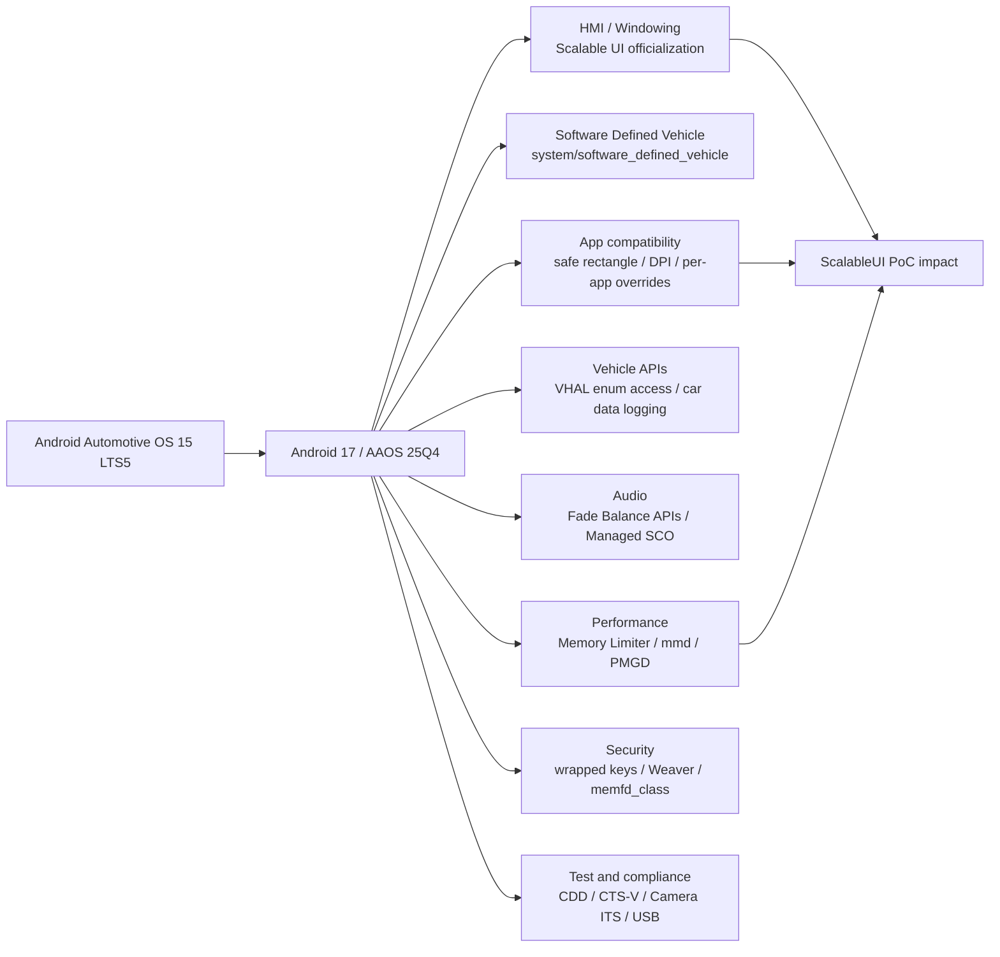

# AAOS17 / Android 17 新規・変更機能整理

本資料は、Android 17 / AAOS 25Q4 で追加・変更された機能を、Android Automotive OS 15 LTS5 を比較対象として整理する。

比較対象は以下とした。

- Android 17: `android-17.0.0_r1`
  - Manifest: https://android.googlesource.com/platform/manifest/+/refs/tags/android-17.0.0_r1
  - tag: `7a9e46ba6ed424f922a3457f4964e67e0b966201`
  - manifest commit: `5bc9a7ce1cd78dd53613bbfd0ebf506e1e4adb0f`
- Android Automotive OS 15 LTS5: `android-automotiveos-15.0.0_lts5`
  - Manifest: https://android.googlesource.com/platform/manifest/+/refs/tags/android-automotiveos-15.0.0_lts5
  - tag: `d42c291196d5e1a339d8a41d14f437a1134eccbd`
  - manifest commit: `caf4a19f82dc560274d08155fcbbfe47eb52392e`
- Android 17 release notes
  - https://source.android.com/docs/whatsnew/android-17-release
- AAOS 25Q4 release notes
  - https://source.android.com/docs/automotive/start/releases/aaos-25q4

注意: 本資料は「manifest 差分」と「公式リリースノート」をベースにした一次整理である。各機能の量産適用可否、既存 PoC への直接影響、サプライヤー BSP との差分は、個別リポジトリのソースコード差分、ビルド、実機またはエミュレータ検証で別途確認する必要がある。

関連資料:

- `docs/android17_scalableui_delta_ja.md`
  - Android 17 の ScalableUI / WMShell / CarSystemUI 差分を、現在の Android 16 PoC ブランチと比較した資料。
- `docs/aaos_app_layer_scalableui_scope_ja.md`
  - 自社アプリケーションレイヤーで ScalableUI HMI をどこまで内製できるか、サプライヤーへ何を依頼すべきかを整理した資料。

## Executive Summary

Android 17 / AAOS 25Q4 は、Android 15 LTS5 から見ると、単なるマイナーバージョン更新ではなく、車載 HMI、SDV、アプリ互換、メモリ管理、セキュリティ、テスト要件の更新がまとまって入る大きな移行になる。

特に AAOS として重要なのは次の 5 点である。

1. Scalable UI が AAOS の公式な advanced windowing framework として前面に出ている。
2. `system/software_defined_vehicle/*` を中心に SDV 関連プロジェクト群が新規追加されている。
3. Car Ready Mobile Apps を意識した安全領域、DPI、per-app override、Activity Blocking Activity などのアプリ互換機能が強化されている。
4. Memory Limiter、memory management daemon、Process Memory Guardian Daemon など、アプリプロセスのメモリ制御・監視系が追加されている。
5. CDD / CTS / CTS-V、audio、camera ITS、USB、ranging などの互換性試験が更新されており、移植後の検証観点が増えている。

manifest 差分としては、Android 17 側の project 数は `1087`、Android Automotive OS 15 LTS5 側は `1369` だった。単純比較では Android 17 に `179` project が追加され、`461` project が削除され、共通 path のうち `80` project で manifest 属性差分があった。

ただし、削除 project 数が多いことは「機能削除」を直接意味しない。AOSP の release 構成、外部依存、project 分割・統合、prebuilt 化、branch/tag 構成の違いを含むため、機能影響は project 単位で追加確認する必要がある。

## 全体像

## Manifest 差分サマリ

| 観点 | Android Automotive OS 15 LTS5 | Android 17 r1 | 差分 |
| --- | ---: | ---: | ---: |
| project 数 | 1369 | 1087 | -282 |
| 追加 project | - | 179 | Android 17 で新規 |
| 削除 project | 461 | - | Android 17 manifest から消滅 |
| 共通 path の属性差分 | - | 80 | groups 等の manifest 属性差分 |

追加 project の top-level 分布は以下である。

| top-level | 追加数 | 主な意味 |
| --- | ---: | --- |
| `external` | 86 | 外部ライブラリ、テスト/ツール依存の更新 |
| `system` | 33 | SDV、メモリ管理、secure element、USB、zygote など |
| `packages` | 23 | Car 関連、Contact Picker、DeviceDiagnostics、NFC/Telecom など |
| `prebuilts` | 12 | toolchain / SDK / API 関連 prebuilt |
| `kernel` | 10 | 6.12 / 6.18 系 kernel prebuilt |
| `tools` | 6 | lint、mainline、test support など |
| `trusty` | 4 | Trusty device / authmgr / desktop 関連 |
| `hardware` | 3 | SDV interfaces など |
| `device` | 2 | SDV / display safety 参照 device |

AAOS・車載観点で目立つ新規 project は以下である。

| project path | 説明 |
| --- | --- |
| `system/software_defined_vehicle/automotive_services` | SDV の automotive services 領域 |
| `system/software_defined_vehicle/common` | SDV 共通コード |
| `system/software_defined_vehicle/health_monitor` | SDV 健全性監視 |
| `system/software_defined_vehicle/lifecycle_management` | SDV service / bundle lifecycle 管理 |
| `system/software_defined_vehicle/middleware` | SDV middleware |
| `system/software_defined_vehicle/orchestration` | SDV orchestration |
| `system/software_defined_vehicle/platform` | SDV platform |
| `system/software_defined_vehicle/samples` | SDV samples |
| `system/software_defined_vehicle/sdv_gateway` | SDV gateway |
| `system/software_defined_vehicle/service_bundles_registry` | service bundle registry |
| `system/software_defined_vehicle/some_ip` | SOME/IP 関連 |
| `system/software_defined_vehicle/telemetry` | SDV telemetry |
| `system/software_defined_vehicle/tools` | SDV tools |
| `system/software_defined_vehicle/update_manager` | SDV update management |
| `system/software_defined_vehicle/vpm` | Vehicle platform management 系と考えられる領域 |
| `system/software_defined_vehicle/vsidl` | vehicle service interface definition language 系と考えられる領域 |
| `hardware/sdv/interfaces` | SDV 向け hardware interface |
| `device/google/sdv` | Google SDV 参照 device |
| `device/google/sdv_display_safety` | display safety 参照 device |
| `external/automotive-design-compose-protos` | Automotive 向け Design Compose proto |
| `packages/apps/Car/References` | Car app reference 実装 |
| `packages/apps/Car/RotaryImePrebuilt` | Rotary IME prebuilt |
| `packages/apps/Car/TemplatesPrebuilt` | Car templates prebuilt |

## 1. Scalable UI / Advanced Windowing

### 何が変わったか

AAOS 25Q4 では、Scalable UI が automotive-specific windowing solution として説明されている。XML の declarative language で windowing structure を設計する仕組みとして位置付けられ、multi-panel HMI を構成するための公式機能になっている。

Android 17 release notes でも、Android 17 以降では Scalable UI を使って dynamic / multi-panel な車載 UX を構築できると説明されている。

### 具体的な追加・変更点

- Task focus in Scalable UI
  - multi-window 環境でどの task が focus を受け取るかを決める rule が追加されている。
  - `Focus` tag に `onTransition` attribute が追加され、transition と focus 制御の連動を細かく定義できる。
- Automatic restart mechanism
  - panel 内アプリが crash / unexpected termination した場合に、Scalable UI 側で relaunch する仕組みが追加されている。
  - XML の `<Restart>` tag で restart policy と retry 回数を定義する。
- Decor panel drag performance
  - decor panel の drag animation 性能改善と instrumentation が追加されている。
- OEM Perfetto trace metadata
  - windowing / Scalable UI library の状態を Perfetto trace に載せる metadata が追加されている。
- Theme change support
  - panel decor view が light/dark mode など SysUI theme 変更に追従する。
- Debug commands
  - `adb shell cmd statusbar carsysui-dispatch-event close_app_grid`
  - `adb shell cmd statusbar carsysui-dump-panelstates`

### 自社 PoC への影響

現在の ScalableUI PoC は Android 16 ベースに ScalableUI の panel / TaskPanel / transition / All Apps / fullscreen panel 挙動を移植している。Android 17 へ移る場合、既存 PoC で独自実装していた一部の安定化要素は、AAOS 25Q4 の公式 Scalable UI 機能に寄せられる可能性がある。

特に確認すべき点は以下である。

- 既存 XML の `Focus` / transition 定義を Android 17 の `onTransition` に寄せられるか。
- app crash 時の復帰を PoC 独自処理ではなく `<Restart>` に寄せられるか。
- All Apps 開閉や panel state 遷移を `carsysui-dispatch-event` / `carsysui-dump-panelstates` で検証できるか。
- panel drag / fullscreen 化 animation の評価に Perfetto metadata を使えるか。
- theme 変更に応じた decor panel の見え方を RRO / theme 設計に反映できるか。

## 2. Software Defined Vehicle

### 何が変わったか

Android 17 release notes では、Software Defined Vehicle が Android 17 以降で利用できる機能として追加されている。AAOS 25Q4 manifest でも `system/software_defined_vehicle/*` がまとまって追加されており、今回の manifest 差分で最も目立つ AAOS 全体の新規領域である。

### 具体的な追加 project 群

`system/software_defined_vehicle` 配下には、middleware、orchestration、telemetry、SOME/IP、update manager、lifecycle management、service bundle registry などが追加されている。

これは、従来の IVI / HMI 中心の AAOS だけでなく、車両内サービス、車両ソフトウェア更新、サービス bundle 管理、車両データ連携を含む広い software platform 化を進める方向と見てよい。

### 自社・サプライヤーへの影響

アプリケーションレイヤーの開発だけで完結する領域ではない。SDV は platform / middleware / vehicle service / network protocol / update / telemetry を含むため、OEM・サプライヤー・SoC/BSP 側の責務分界を明確にする必要がある。

自社 HMI 開発への直接影響は、短期的には以下になる。

- HMI が参照する vehicle data source が変わる可能性がある。
- telemetry / health monitor と HMI 状態収集の接続点が増える可能性がある。
- SOME/IP や SDV gateway 経由で扱う車両サービスが増える可能性がある。
- SDV update / lifecycle management により、アプリや service bundle の配布・更新設計が変わる可能性がある。

## 3. Core Apps / Third-party App Compatibility

### 何が変わったか

AAOS 25Q4 では、Car Ready Mobile Apps の CDD / CTS compliance を検証しやすくするため、third-party apps の automotive 環境向け互換性と usability が強化されている。

### 主な変更点

- Activity Blocking Activity enhancements
  - `OnStop` 周辺の lifecycle management が見直されている。
- Safe rectangle for app rendering
  - アプリの描画領域として安全矩形を定義し、system bar、panel、occlusion で重要 UI が隠れないようにする。
- DPI Scaling
  - 画面解像度や視距離に応じて UI 要素を最適化する。
- Per-app overrides
  - orientation、aspect ratio など、アプリごとの挙動を制御できる。
- Compatibility improvements
  - DocumentsUI など core Android functionality を含む third-party app-facing compatibility が改善されている。
- Alternative app controls
  - driving 中に communication app など non-media center audio を扱うための代替 control が追加されている。

### 自社 PoC への影響

ScalableUI の panel に third-party app を表示する場合、単に task を panel に入れるだけでは量産品質にはならない。Android 17 / AAOS 25Q4 では、次の観点を HMI 仕様・検証仕様に入れる必要がある。

- panel 内でアプリの重要 UI が隠れないか。
- fullscreen panel 化したときの safe rectangle が正しいか。
- 地図、カレンダー、通話、メディア、設定などで DPI / aspect ratio が破綻しないか。
- 既存 app を再起動せず task reuse / reparent する場合、Activity lifecycle が正しく処理されるか。
- Activity Blocking Activity によって運転中制限や safety policy が正しく表示されるか。

## 4. VHAL / Vehicle Property

### 何が変わったか

AAOS 25Q4 では、third-party app からアクセス可能として指定された property について、property enum の `@SystemApi` tag により enum へのアクセスが可能になると説明されている。

### 影響

アプリケーションレイヤーから車両情報を扱う場合、利用できる property enum の見通しが改善する可能性がある。ただし、これは「すべての VHAL property に自由にアクセスできる」という意味ではない。

引き続き以下の確認が必要である。

- 対象 property が third-party app accessible として定義されているか。
- permission / signature / privileged app 条件がどうなるか。
- サプライヤー実装の VHAL が該当 property を提供しているか。
- エミュレータ、reference device、量産 BSP で property availability が一致するか。

## 5. Audio

### AAOS 固有の変更

AAOS 25Q4 では Fade and Balance APIs が追加され、first-party apps が現在の fade / balance settings を取得できるようになる。これらの audio level は user ごとに ignition cycle をまたいで保持される。

### Android 17 全体の変更

Android 17 では Audio Managed SCO rearchitecture が追加されている。採用 device では、従来 Bluetooth framework が扱っていた SCO routing を Android audio framework が管理する方向になる。

### 影響

車載 HMI では、音量・フェード・バランス・Bluetooth 通話・通信アプリ音声の扱いが UI と密接に関係する。Android 17 へ移行する場合、以下を検証対象に入れるべきである。

- Audio settings UI が fade / balance API と整合しているか。
- user switch / ignition cycle 後に設定が期待通り復元されるか。
- Bluetooth 通話や通信アプリ音声の routing が既存仕様と変わらないか。
- driving 中の alternative app controls が HMI 上で適切に出るか。

## 6. Privacy / Logging / Data Tracking

### AAOS 固有の変更

AAOS 25Q4 では、car data subscription events への logging が追加され、OEM user connectivity logging が有効化されると説明されている。

また Google Terms of Service gating が追加されており、ユーザーが Google Terms of Service を承諾するまでアプリを disabled 状態にできる。Scalable UI の background panel に persistent Google experience を配置する構成にも対応すると説明されている。

### Android 17 全体の変更

Android 17 では Contact Picker と location indicators が追加されている。Contact Picker は選択された連絡先情報だけをアプリに渡し、location indicators は foreground の nonsystem app が location にアクセスしていることを status bar に表示する。

### 影響

自社で操作ログ、起動アプリ、panel 使用状況、車両データ購読状況を収集する場合、Android 17 / AAOS 25Q4 では privacy / consent / user visibility の設計がより重要になる。

ScalableUI で「どの panel にどの task が表示されたか」「どの transition が実行されたか」を収集することは、SystemUI 側に統合すれば実現可能性がある。一方で、ユーザー操作や位置情報、通信、連絡先などに関わる情報は、OS 標準の privacy 表示、permission、OEM logging policy と衝突しない設計にする必要がある。

## 7. Performance / System Health

### 何が変わったか

Android 17 では、アプリプロセスやメモリに関する system health 機能が強化されている。

- Memory Limiter
  - cgroup v2 を使って application process の memory usage を監視・制限する system service。
- Memory management daemon
  - `mmd`。ZRAM 関連 maintenance task を設定・管理する system daemon。
- Process Memory Guardian Daemon
  - PMGD。process ごとに memory ceiling を管理し、局所的な memory leak / spike が system-wide degradation につながらないようにする。
- General health information
  - trade-in mode の system health diagnostics に camera geometry や UICC slot information が追加される。

AAOS 25Q4 では、user switch latency と memory footprint を下げるため、previous user の app を user switch process の早い段階で stop する変更も説明されている。

### 自社 PoC への影響

multi-panel HMI は複数 app / task を同時表示しやすいため、Android 17 の memory 制御は直接影響する。

検証すべき観点は以下である。

- 複数 panel に map / media / settings / third-party app を表示したとき、Memory Limiter や PMGD により app が止められないか。
- user switching 後に panel state と task state が期待通り復帰するか。
- Scalable UI の `<Restart>` policy と Android 17 の memory/process 制御が競合しないか。
- process death 後の relaunch が UX として自然か。
- Perfetto trace と panel state dump を組み合わせて、animation / memory / task lifecycle を追えるか。

## 8. Security / Storage / Kernel Interface

### 主な変更点

- ION deprecation
  - Android 17 では ION memory allocator が support されない。vendor code が ION を使っている場合は除去が必要。
- Hardware-wrapped key improvements
  - storage encryption の hardware-wrapped keys 実装が Linux kernel ioctl ベースに整理される。
  - 新規 launch device では `wrappedkey` を使う。既存 device の `wrappedkey_v0` は継続利用。
- Lock screen rate-limiting UX
  - lockout 表示、recovery shortlink、duplicate attempt feedback などが改善される。
- Policy compatibility
  - `memfd_class` policy capability と `memfd_file` class object への SELinux policy 対応が必要になる。
- Secure element prewarming
  - Weaver HAL に prewarm method が追加され、PIN / pattern / password 入力開始時の認証 latency を下げる。

### 影響

この領域はアプリレイヤーではなく、BSP、kernel、vendor code、SELinux、storage encryption、lockscreen / credential UI に関わる。自社 HMI としては、直接実装するよりもサプライヤーへの確認項目に入れるべきである。

特に AAOS 15 LTS5 から Android 17 へ移植する場合、以下をチェックする。

- vendor / BSP に ION 依存が残っていないか。
- kernel が hardware-wrapped key の新 ioctl に対応しているか。
- SELinux policy が `memfd_class` / `memfd_file` に対応しているか。
- lockscreen / user switching / credential prompt が AAOS HMI と衝突しないか。

## 9. Display / Windowing

### Android 17 全体の変更

Android 17 では per-display desktop windowing を enable できるようになっている。また large screen app compatibility overlay として、camera compatibility や internal display 間の self-kill recovery に関する config が追加されている。

### AAOS への読み替え

AAOS の HMI では desktop windowing そのものをそのまま使うとは限らないが、multi-display、multi-window、task focus、system decoration、large screen compatibility の基盤変更として影響する可能性がある。

ScalableUI PoC では以下を確認すべきである。

- driver display / passenger display / cluster など multi-display 構成で task routing が崩れないか。
- panel fullscreen 化と desktop/windowing 系の task bounds が競合しないか。
- large screen compatibility overlay が third-party app の orientation / aspect ratio に影響しないか。

## 10. Build / Test / Compliance

### 何が変わったか

Android 17 では CDD が更新され、CTS-V / host-side / media / audio / camera ITS などの test が追加・更新されている。

また、Android 17 以降では AOSP source tree が read-only として扱われ、product config や build 中に source tree を変更しようとすると build が失敗すると説明されている。

### 影響

PoC 移植やサプライヤー折り込みでは、従来の「ビルド中に生成物を source tree に書く」タイプの処理が問題になる可能性がある。

確認すべき観点は以下である。

- RRO / XML / generated config の生成先が out directory 側になっているか。
- build script が source tree を変更しないか。
- CTS-V の browser role setup、USB host-side test、ranging / telecom multidevice test など追加手順を検証計画に含めるか。
- Camera ITS / audio workload / media playback tests の更新が車載ターゲットに影響するか。

## 自社開発・サプライヤー折り込みへの影響分類

| 領域 | 自社で主導しやすいこと | サプライヤー連携が必要なこと |
| --- | --- | --- |
| ScalableUI HMI | panel XML、RRO、HMI spec、transition 設計、app picker、PoC 検証 | CarSystemUI 統合、署名、privileged permission、SELinux、product package、実機 BSP 統合 |
| SDV | HMI が必要とする vehicle data / telemetry 要件定義 | SDV platform、middleware、SOME/IP、update manager、vehicle services 実装 |
| App compatibility | 対象 app の HMI 表示仕様、safe rectangle 要件、DPI 確認 | platform overlay、per-app override 統合、CDD/CTS 対応 |
| Audio | UI / UX、設定画面、ユーザー操作仕様 | car audio API、routing、Fade/Balance persistence、BT SCO 統合 |
| Privacy / logging | 取得したい HMI event、panel event、task event の仕様化 | OEM logging policy、permission、consent、Google ToS gating、監査ログ |
| Performance | Perfetto trace 分析、panel state dump、UX 性能評価 | Memory Limiter / PMGD policy、kernel/cgroup 設定、system health service |
| Security | アプリ設計上の依存確認 | ION 除去、wrappedkey、Weaver、SELinux `memfd_class` 対応 |
| Build / CI | PoC CI、RRO XML lint、manifest 差分監視 | vendor build、CTS/VTS/STS/ATS、BSP release integration |

## PoC に追加すべき検証観点

Android 17 / AAOS 25Q4 へ進める場合、既存の ScalableUI PoC には次の検証を追加する。

1. `carsysui-dump-panelstates` による panel state 記録。
2. `carsysui-dispatch-event` による transition event の外部制御確認。
3. `<Restart>` policy による panel 内 app crash 復帰確認。
4. `Focus onTransition` を使った fullscreen panel / All Apps / app picker の focus 制御確認。
5. safe rectangle / DPI / per-app override による third-party app 表示確認。
6. user switch 後の panel/task 復帰確認。
7. Memory Limiter / PMGD による task kill と ScalableUI restart の競合確認。
8. Perfetto trace で panel animation、Surface transaction、task lifecycle を記録する CI / manual test。
9. Google Terms of Service gating が background panel の Google app 表示と衝突しないかの確認。
10. Android 17 の read-only source tree build 制約に対して、PoC の patch / generation / CI が out directory 中心になっているかの確認。

## 次に深掘りすべき source diff

本資料の次フェーズでは、以下の project をソースコード単位で確認する。

| 優先度 | project | 理由 |
| --- | --- | --- |
| High | `packages/apps/Car/SystemUI` | ScalableUI、panel、transition、debug command、theme、focus の中心 |
| High | `packages/services/Car` | VHAL、car service、logging、user switching、audio API との接点 |
| High | `frameworks/base` | ActivityTaskManager、WindowManager、Task、TaskDisplayArea、desktop/windowing、safe area |
| High | `frameworks/base/libs/WindowManager/Shell` | TaskView、ShellTaskOrganizer、SurfaceControl、task reparent/bounds |
| High | `system/software_defined_vehicle/*` | SDV の新規 platform 領域 |
| Medium | `device/generic/car` | emulator/product config/RRO/product package 差分 |
| Medium | `hardware/interfaces` / `hardware/sdv/interfaces` | HAL / SDV interface 差分 |
| Medium | `system/sepolicy` | `memfd_class`、SystemUI/priv-app、SDV service policy |
| Medium | `packages/apps/Car/References` | Car app reference UI / compatibility sample |

## 結論

Android 17 / AAOS 25Q4 は、ScalableUI だけでなく、AAOS 全体として SDV platform、車載アプリ互換、メモリ管理、privacy/logging、audio、security、test compliance が大きく更新されている。

自社の ScalableUI PoC にとって最も重要なのは、Android 17 の ScalableUI を単なる UI レイアウト機能として扱わず、task focus、restart、debug tooling、Perfetto、safe rectangle、memory pressure、user switching まで含めた HMI platform として評価することである。

一方で、SDV、kernel/security、VHAL、SELinux、CTS/VTS/STS/ATS はアプリレイヤーだけでは完結しない。Android 17 への本格移行では、自社が HMI/RRO/XML/アプリ/検証仕様を主導し、サプライヤーが platform integration / BSP / compliance を担う分担で進めるのが現実的である。
