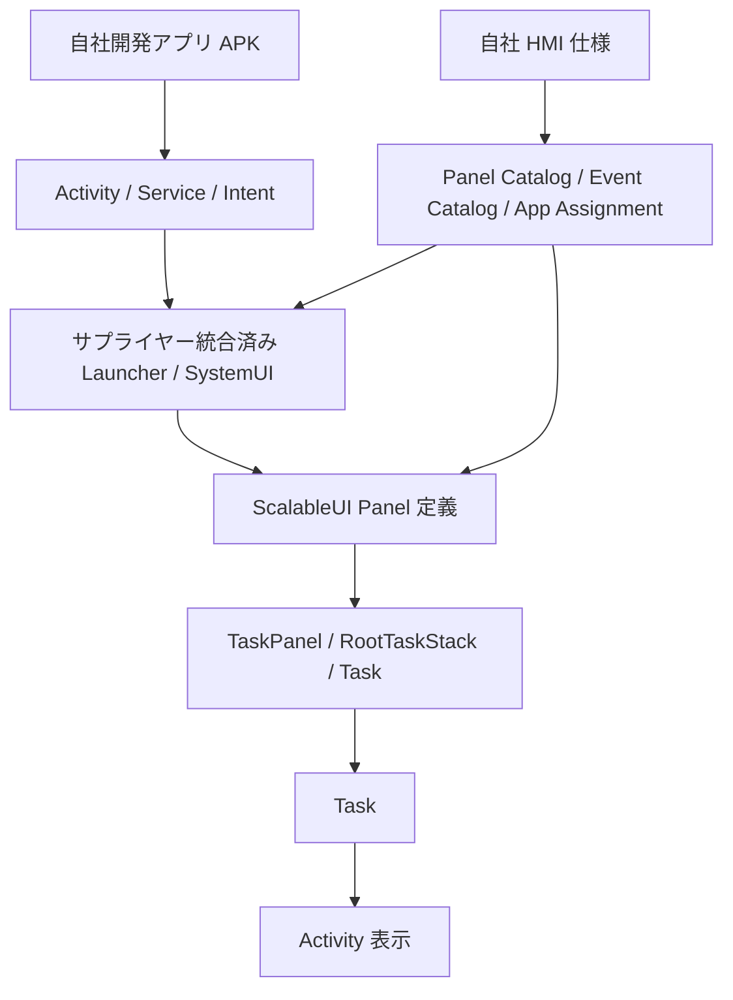
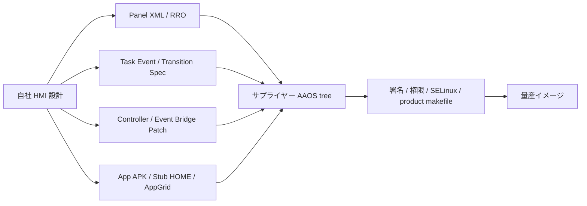
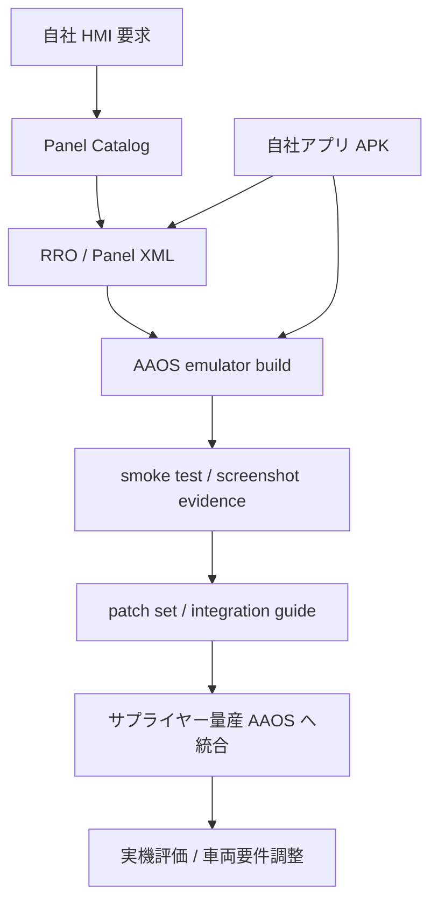
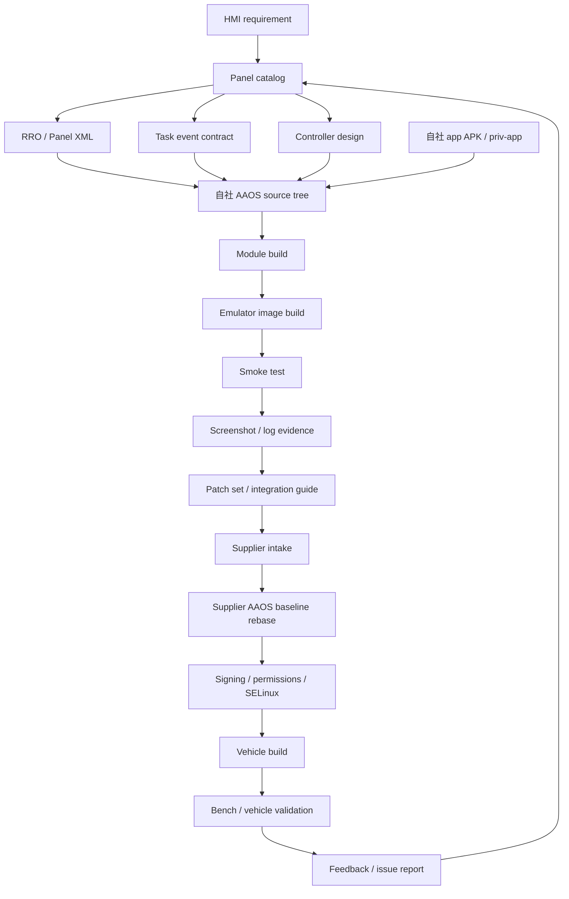
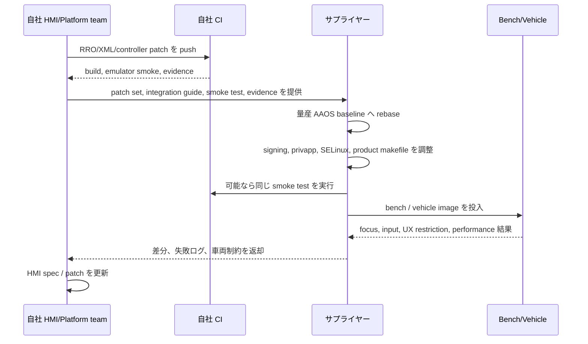
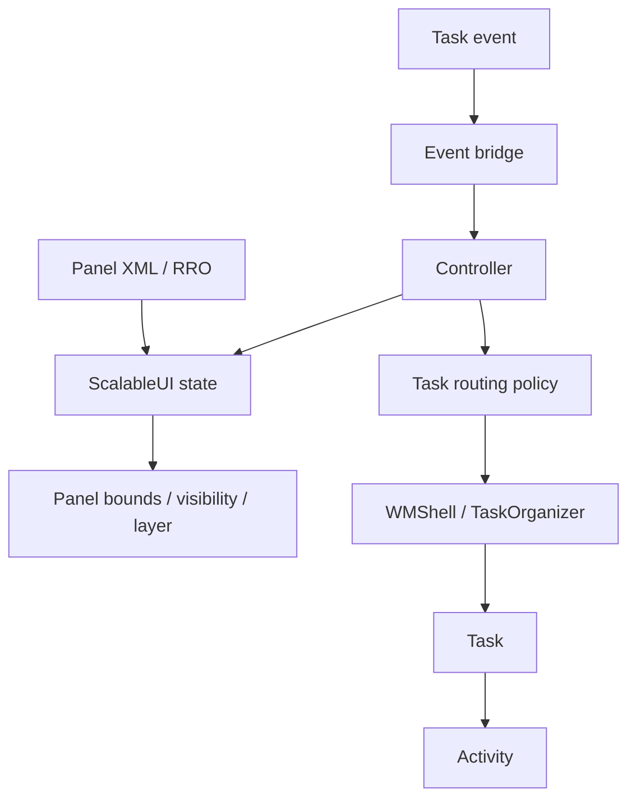
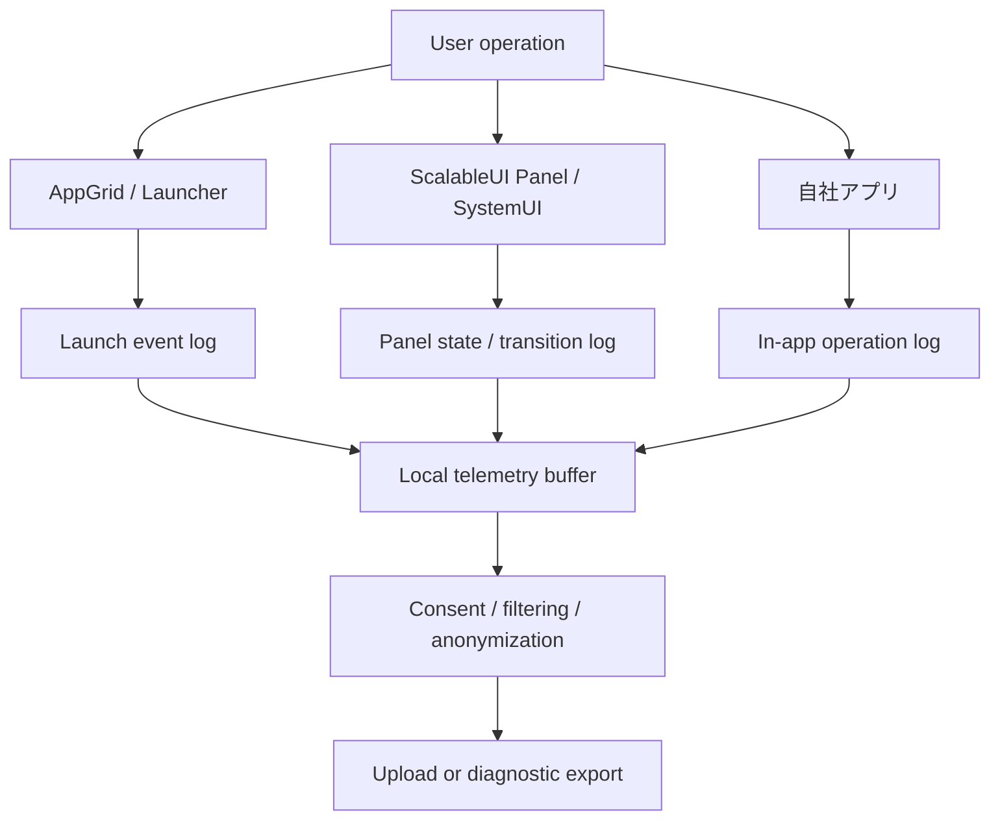
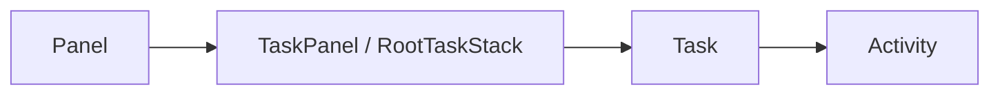

# AAOS アプリレイヤーから見た ScalableUI カスタマイズ範囲

## 前提

本資料は、OEM/企画側が AAOS 上で動作するアプリケーションを開発し、サプライヤーが AAOS システムイメージへ実装・統合する体制を前提に、ScalableUI を使った HMI カスタマイズの責務境界を整理する。

ここでいう「アプリケーションレイヤー」は、通常 APK として提供できる Activity、Service、設定、アプリ内 UI、アプリ間 Intent 連携を指す。一方、ScalableUI の有効化、Panel 定義、TaskPanel への Activity 配置、SystemUI/CarLauncher/WMShell 連携は、AAOS システム側の統合領域である。

## 結論

アプリケーションレイヤーだけで ScalableUI の HMI 全体を自由に構成することはできない。

ScalableUI は通常アプリ向け SDK ではなく、CarSystemUI / WMShell / root task stack / Task 管理と結びつく AAOS システム側の UI 制御機構である。そのため、量産環境で ScalableUI を利用するには、サプライヤー側で SystemUI、RRO、priv-app、署名、権限、CarLauncher、WindowManager 周辺を統合する必要がある。

一方で、ScalableUI 上に表示される各アプリの画面設計、パネルサイズ変化に追従する UI、パネル内での操作体験、アプリ選択や状態管理に必要なアプリ側のデータモデルは、自社側でかなり具体的に作り込める。

さらに、自社側で Panel XML、RRO、SystemUI 側の controller、transition handler、event bridge などを作成し、サプライヤーへ「AAOS プラットフォーム差分」として提供することも可能である。ただし、この場合の成果物は通常アプリ APK ではなく、AOSP/AAOS ソースツリーへ取り込む patch、RRO module、priv-app、product makefile 差分として扱う必要がある。

## 自社で作成してサプライヤーへ提供できるプラットフォーム成果物

アプリケーションレイヤーだけでは ScalableUI の Panel 制御は完結しないが、自社側に AOSP/AAOS ソースを編集・ビルドできる環境がある場合、ScalableUI 向けのプラットフォーム差分を自作してサプライヤーに渡すことはできる。

この場合、責務分担は「自社が設計と参照実装を作る」「サプライヤーが量産 AAOS ベースへ移植・検証・署名・権限統合する」という形になる。

| 提供物 | 自社作成可否 | できるようになること | サプライヤー側で必要な作業 |
| --- | --- | --- | --- |
| Panel 定義 XML | 可能 | Home 上の Panel 数、位置、サイズ、初期表示、表示 variant を自社 HMI 意図どおりに定義できる | 対象 AAOS ブランチの ScalableUI resource へ統合 |
| RRO module | 可能 | ScalableUI 有効化、Panel XML 差し替え、framework / SystemUI / CarService config の製品別 override を配布できる | product package 追加、overlay enable、優先度確認 |
| default activity assignment | 可能 | 地図、メディア、カレンダーなどをどの Panel に初期表示するかを自社アプリ package/class 単位で指定できる | 実車 package/class 名、署名、起動権限との整合確認 |
| transition XML / state 定義 | 可能 | All Apps 表示、Panel 最大化、Home 復帰、camera 優先表示などを状態遷移として表現できる | SystemUI 側 StateManager / Transition 実装との整合確認 |
| task event 名・extra 定義 | 可能 | 自社アプリや AppGrid から `SHOW_ALL_APPS`、`MAXIMIZE_PANEL` のような HMI イベントを送る契約を作れる | SystemUI event bridge、権限、送信元制限の実装 |
| Panel controller | 可能 | XML だけでは表現できない条件分岐、直前状態の保存、外側タップで dismiss、複数 Panel の連動制御を実装できる | CarSystemUI / WMShell / lifecycle / focus へ統合 |
| Task routing policy | 可能 | アプリ再起動時に既存 Task を再利用する、指定 Panel へ寄せる、最大化する、といった Task 表示ポリシーを定義できる | ActivityTaskManager / ShellTaskOrganizer 挙動との整合確認 |
| Stub HOME / AppGrid APK | 可能 | 標準 Launcher に依存しない Home host、All Apps、アプリ選択 UI、ScalableUI event 送信口を作れる | HOME role、priv-app、署名、permissions の付与 |
| build patch set | 可能 | サプライヤーが同じ HMI 差分を再現できる単位で提供でき、レビューや rebase の起点にできる | サプライヤーの AAOS baseline へ cherry-pick / rebase |
| validation script | 可能 | overlay 適用、Panel 表示、アプリ起動、All Apps、最大化、Home 復帰を受け入れ条件として自動確認できる | 実機・CI・emulator 環境に合わせて調整 |

### 提供形態

推奨する提供形態は以下である。

| 形式 | 内容 | できるようになること | 用途 |
| --- | --- | --- | --- |
| AOSP patch set | `packages/apps/Car`、`device/generic/car`、`frameworks/base` などへの差分 | サプライヤーが自社 HMI 実装をソース差分として取り込める | サプライヤー統合の起点 |
| RRO source module | ScalableUI 有効化、Panel XML、default activity 設定 | 製品・仕向け・画面サイズ別に HMI layout を切り替えられる | 製品別 HMI overlay |
| priv-app source | Stub HOME、AppGrid、event bridge client など | 通常アプリより強い権限で Home / All Apps / event 入口を実装できる | HMI 補助アプリ |
| HMI spec | Panel catalog、event catalog、transition spec | デザイン意図と実装差分を同じ粒度でレビューできる | 要件合意 |
| integration guide | 適用手順、依存ブランチ、権限、ビルド対象 | サプライヤー側の作業抜け、branch 取り違え、overlay 未適用を減らせる | サプライヤー作業指示 |
| smoke test | 起動確認、Panel 表示、event 動作確認 | 自社とサプライヤーで同じ合否基準を使える | 受け入れ基準 |

### 注意点

この提供方式では、自社側の成果物は「そのまま APK として入れれば動くもの」ではない。ScalableUI は SystemUI と WindowManager/Shell の上で動くため、サプライヤー側で次の確認が必要になる。

| 注意点 | 理由 |
| --- | --- |
| AAOS ブランチ差分 | Android 15 LTS と Android 16 release では CarSystemUI / WMShell 側 API が変わる可能性がある |
| ScalableUI 実装有無 | 対象ブランチに同じ ScalableUI class / resource / transition 機構が存在するとは限らない |
| 署名・priv-app | HOME、SystemUI 連携、task 制御は通常アプリ権限では足りない |
| SELinux | priv-app や system service 連携には sepolicy 調整が必要になる場合がある |
| focus / lifecycle | Panel 制御は見た目だけでなく入力、Back、Home、process death と結びつく |
| 車両要件 | 走行中制限、マルチユーザー、occupant zone、multi-display との整合が必要 |

したがって、自社で XML/RRO/controller/transition を作ることは可能だが、量産適用上は「サプライヤー統合を前提にした参照実装」として扱うのが安全である。

## RRO / Panel XML を内製開発するための進め方

現時点で RRO や Panel XML の量産統合はサプライヤー主担当になりやすいが、開発責任をすべてサプライヤーへ寄せる必要はない。自社側で ScalableUI 用の RRO、Panel XML、transition、event contract、controller の参照実装を作り、サプライヤーには量産 AAOS への取り込み、署名、権限、SELinux、実機検証を担当してもらう体制へ段階的に移行できる。

目標は「サプライヤーに HMI を考えて実装してもらう」状態から、「自社が HMI の実装単位まで定義し、サプライヤーは車両・量産環境へ統合する」状態へ移すことである。

### 内製化レベル

内製化は一気に SystemUI 全体を持つ必要はない。次の順で責務を広げるのが現実的である。

| レベル | 自社が持つ範囲 | サプライヤーが持つ範囲 | 到達状態 |
| --- | --- | --- | --- |
| Level 0 | HMI 仕様、画面遷移、アプリ UI | RRO/XML/controller 実装 | 従来型の仕様委託 |
| Level 1 | Panel catalog、package/class assignment、bounds 設計 | XML/RRO 実装、統合 | 自社が ScalableUI 構成をレビュー可能 |
| Level 2 | RRO module、Panel XML、default activity XML | product 組み込み、署名、overlay enable | 自社が表示構成を実装可能 |
| Level 3 | transition/state/event 定義、Stub HOME/AppGrid | SystemUI 接続、priv-app 権限、SELinux | 自社が HMI 動作を参照実装可能 |
| Level 4 | controller / event bridge / task routing patch | 量産 branch 追従、車両統合、実機検証 | 自社が ScalableUI HMI の実装主担当 |

推奨開始点は Level 2 である。RRO と Panel XML は比較的境界が明確で、HMI 意図をコード化しやすい。Level 3 以降は SystemUI と task 制御に入るため、サプライヤーとの API / patch contract を先に決める必要がある。

### 自社側に必要な開発環境

RRO / XML を内製するには、通常の Android アプリ開発環境だけでは足りない。最低限、AOSP/AAOS ソースツリーと emulator build 環境を自社側に持つ必要がある。

| 必要なもの | 目的 |
| --- | --- |
| 対象 AAOS baseline | サプライヤーと同じ branch / tag / manifest に合わせる |
| AOSP build 環境 | RRO、SystemUI、CarLauncher、product image をビルドする |
| emulator 起動環境 | Panel 表示、overlay 適用、task routing を自社で確認する |
| ScalableUI source knowledge | Panel XML、variant、transition、StateManager の理解 |
| patch export 手順 | サプライヤーへ渡せる差分に整える |
| smoke test | 受け入れ条件を自動化する |

### 自社リポジトリで管理すべき成果物

サプライヤーへ渡す前に、自社リポジトリ上では以下を一体で管理する。

| ディレクトリ / 成果物 | 役割 | できるようになること |
| --- | --- | --- |
| `docs/` | HMI 設計、責務分担、integration guide | サプライヤーと同じ前提で仕様・制約・責務をレビューできる |
| `variants/<name>/docs/` | Variant ごとの HMI 仕様、評価結果 | 仕向けやデザイン案ごとの HMI 差分を比較できる |
| `variants/<name>/patches/` | AOSP/AAOS へ適用する patch set | サプライヤーへソース差分としてそのまま渡せる |
| `variants/<name>/rro/` または patch 内 RRO | Panel XML、overlay config、dimens、strings | RRO/XML を自社で編集・レビューし、表示構成を再現できる |
| `scripts/` | patch export、build、smoke test、image build | 人手に依存せず build / validation を繰り返せる |
| `evidence/` または docs 配下 | emulator screenshot、ログ、評価メモ | 「動いたかどうか」を画面証跡とログで合意できる |

重要なのは、XML 単体ではなく「どの AAOS baseline に、どの patch を、どの順番で適用し、何を確認すればよいか」まで成果物に含めることである。

### サプライヤーへ渡す integration contract

自社が RRO/XML を主導する場合、サプライヤーへの依頼は曖昧な HMI 仕様ではなく、取り込み単位に分解する。

| Contract | 記載すべき内容 |
| --- | --- |
| Baseline | 対象 Android / AAOS branch、manifest、ビルド product |
| Product packages | 追加する RRO / APK / priv-app module 名 |
| Overlay target | `android`、`com.android.systemui`、`com.android.car.updatable` など |
| Overlay policy | static / dynamic、priority、partition、enable 方法 |
| Panel IDs | `map_panel`、`media_panel`、`app_panel` など |
| Activity assignment | package/class、launch mode、fallback |
| Event names | `SHOW_ALL_APPS`、`MAXIMIZE_PANEL` など |
| Required permissions | privapp permission、signature permission、PackageManager visibility |
| SELinux | 追加が必要な場合の policy 方針 |
| Test cases | 起動、Panel 表示、All Apps、最大化、Home 復帰 |

## 内製開発戦略と CI/CD フロー

RRO / Panel XML / controller を内製する場合、自社側のゴールは「HMI 仕様を作る」だけではなく、「AAOS emulator 上で再現できる patch set と検証証跡を作る」ことに置く。サプライヤーへの依頼は、その成果物を量産 AAOS baseline へ取り込み、車両依存要素を調整し、実機検証する作業として定義する。

### 検証環境の階層

自社内で持つべき検証環境は、アプリ単体、AAOS emulator、サプライヤー統合、実機の 4 層に分ける。

| 環境 | 自社で確認すること | サプライヤーで確認すること | 合格条件 |
| --- | --- | --- | --- |
| App local / Android Studio | 自社アプリの画面、レスポンシブ UI、基本操作 | 不要 | Panel サイズ相当の幅・高さで UI が破綻しない |
| 自社 AAOS emulator | RRO 適用、Panel 表示、default activity、All Apps、最大化、Home 復帰 | 任意で再実行 | HMI smoke test が pass し、証跡が残る |
| サプライヤー AAOS integration build | patch 適用、product package、privapp permission、overlay enable | 主担当 | 自社 emulator と同等の HMI smoke test が pass する |
| Bench / 実車 | focus、input、multi-display、user switching、走行中制限、性能 | 主担当 | 車両要件と安全要件を満たす |

### 自社 CI の推奨フロー

自社 CI では、RRO/XML の syntax だけでなく、AAOS image 上で実際に overlay と Panel が効いていることまで確認する。

```mermaid
flowchart LR
    A[Pull Request] --> B[Markdown / XML lint]
    B --> C[Patch apply check]
    C --> D[AAOS module build]
    D --> E[Emulator image build]
    E --> F[Boot emulator]
    F --> G[Overlay state check]
    G --> H[Panel smoke test]
    H --> I[Telemetry schema check]
    I --> J[Artifacts upload]
    J --> K[Review gate]
```

| CI step | 確認内容 | 失敗時に分かること |
| --- | --- | --- |
| Markdown / XML lint | docs、Panel XML、overlay XML の構文 | 仕様や XML の単純ミス |
| Patch apply check | 対象 AAOS baseline へ patch が当たるか | branch ずれ、conflict |
| AAOS module build | RRO、SystemUI、Stub HOME、AppGrid がビルドできるか | API 変更、依存 module 漏れ |
| Emulator image build | product image に module が入るか | product makefile、partition、package 漏れ |
| Boot emulator | image が起動するか | overlay や SystemUI crash |
| Overlay state check | RRO が install / enable されているか | targetPackage、priority、partition 問題 |
| Panel smoke test | Panel 表示、default activity、All Apps、最大化、復帰 | HMI 動作不良 |
| Telemetry schema check | event 名、属性、PII 混入有無 | データ収集仕様の破綻 |
| Artifacts upload | image、patch、log、screenshot を保存 | サプライヤーへの再現材料不足 |

### サプライヤー折り込み依頼フロー

サプライヤーへ渡すときは、HMI 仕様書だけでなく、CI が pass した patch set、適用手順、受け入れテスト、既知の未対応事項をセットで渡す。

### ブランチ運用

内製開発では、アプリ開発と AAOS platform 差分のライフサイクルを分ける。

| ブランチ | 用途 | merge 条件 |
| --- | --- | --- |
| `main` | サプライヤーへ渡せる安定版 | docs、patch、smoke evidence が揃っている |
| `feature/<hmi-topic>` | Panel layout、transition、controller 変更 | emulator smoke が pass |
| `android15/<variant>` | Android 15 LTS 向け差分 | Android 15 build / smoke が pass |
| `android16/<variant>` | Android 16 release 向け差分 | Android 16 build / smoke が pass |
| `supplier/<baseline>` | サプライヤー baseline への取り込み確認 | サプライヤー側 conflict と調整点が記録済み |

### サプライヤーへ渡す依頼パッケージ

| 成果物 | サプライヤーができること |
| --- | --- |
| patch set | 量産 AAOS tree へ差分を適用できる |
| integration guide | 追加 module、product package、overlay target、権限を確認できる |
| smoke test | 自社と同じ観点で最低限の合否判定ができる |
| screenshot / log evidence | 自社環境での正しい表示状態と比較できる |
| telemetry event catalog | ログ収集の項目、属性、プライバシー制約をレビューできる |
| open issue list | 車両依存、branch 差分、未実装範囲を切り分けできる |

## ScalableUI でできることと手を加えられる範囲

ScalableUI で扱うべき対象は、アプリの中身ではなく、アプリを表示する Panel、Task、状態遷移、表示レイヤー、起動経路である。自社で手を加えられる範囲は、RRO/XML、event contract、controller、task routing patch のどこまで持つかで変わる。

### 能力定義

| 領域 | ScalableUI としてできること | 自社で手を加えられる範囲 | 主な制約 |
| --- | --- | --- | --- |
| Panel 定義 | TaskPanel / DecorPanel / overlay Panel の ID、bounds、variant、初期表示を定義する | RRO/XML を内製すれば主担当化できる | target resource と AAOS branch に依存 |
| Variant | normal、hidden、fullscreen、compact などの表示状態を定義する | XML/RRO で追加・調整できる | runtime 追加には controller 側実装が必要 |
| Default activity | 起動時にどの Activity をどの Panel へ載せるかを指定する | package/class を自社アプリに合わせて定義できる | 実機 package 名、署名、起動権限との整合が必要 |
| Transition | event に応じて Panel の表示、非表示、サイズ、優先度を変える | static transition は XML、複雑なものは controller で実装できる | WMShell / Surface / focus と整合が必要 |
| Task event | All Apps、最大化、復帰、アプリ割当などの HMI 意図をイベント化する | event 名、extra、送信元、受信先を自社で設計できる | event bridge と送信元制限が必要 |
| Controller | event を解釈し、状態保存、条件分岐、Panel 連動、dismiss、telemetry を実行する | SystemUI patch として参照実装できる | priv-app / SystemUI 統合、branch 追従が必要 |
| Task routing | 起動済み Task の再利用、指定 Panel への表示、最大化時の扱いを決める | policy と一部実装を自社で作れる | ActivityTaskManager / WMShell 権限が必要 |
| Layer / z-order | All Apps overlay、scrim、camera priority などの前後関係を制御する | XML と controller で設計できる | Surface layer、input、focus の実機検証が必要 |
| Telemetry | Panel event、app launch request、transition 成功/失敗を記録する | event schema と記録ポイントを自社で定義できる | privacy、consent、security 設計が必要 |

### Controller で具体的に実装できること

Controller は、XML だけでは表現しにくい「判断」と「記憶」と「複数コンポーネントの連動」を担う。ScalableUI を HMI として使い込む場合、controller は自社 HMI ロジックの中心になり得る。

| 実装例 | 具体的にできること | 典型 event |
| --- | --- | --- |
| All Apps overlay 制御 | 画面中央に表示、最前面化、外側タップで閉じる、再タップで閉じる | `SHOW_ALL_APPS`, `DISMISS_ALL_APPS` |
| Panel 最大化 | 既存 Panel を fullscreen variant へ切り替え、他 Panel を退避させる | `MAXIMIZE_PANEL` |
| Home 復帰 | 最大化前の Panel 配置、visibility、z-order を保存して復元する | `RESTORE_HOME` |
| App assignment | ユーザーが選んだアプリを customizable panel の target component として保存する | `ASSIGN_APP_TO_PANEL` |
| Task reuse | 既に起動済みのアプリなら新規起動せず、既存 Task を前面化または対象 Panel へ寄せる | `LAUNCH_OR_FOCUS_APP` |
| Priority overlay | rear camera、call、warning などを通常 Panel より優先表示する | `SHOW_PRIORITY_PANEL` |
| Mode switching | Drive、Park、Charge、ADAS 状態で Panel layout を切り替える | `SET_HMI_MODE` |
| Dismiss policy | outside tap、Back、Home、timeout でどの Panel を閉じるか決める | `DISMISS_TOP_PANEL` |
| Telemetry | event、Panel ID、target package、transition result を記録する | all events |

### Task event で具体的に実装できること

Task event は、アプリや Launcher から SystemUI / ScalableUI controller へ HMI 意図を伝える契約である。通常アプリが直接 Task や Panel を操作するのではなく、event を送り、SystemUI 側が権限を持って解釈・実行する形にする。

| Event | できること | 主な extra | 実行主体 |
| --- | --- | --- | --- |
| `SHOW_ALL_APPS` | All Apps overlay を表示する | `source_panel`, `display_id` | Controller |
| `DISMISS_ALL_APPS` | All Apps overlay を閉じる | `reason` | Controller |
| `LAUNCH_APP_TO_PANEL` | 指定アプリを指定 Panel に表示する | `component`, `target_panel` | Controller / Task routing |
| `LAUNCH_OR_MAXIMIZE_APP` | 既に Panel 表示中のアプリなら最大化し、未起動なら起動する | `component`, `preferred_panel` | Controller / Task routing |
| `MAXIMIZE_PANEL` | 対象 Panel を最大化し、他 Panel を退避する | `panel_id`, `animation` | Controller / Transition |
| `RESTORE_HOME` | 最大化前または default Home layout へ戻す | `restore_token`, `reason` | Controller |
| `ASSIGN_APP_TO_PANEL` | customizable panel に表示するアプリを変更する | `panel_id`, `component` | Controller / persistence |
| `SET_HMI_MODE` | Drive / Park / Charge などの layout に切り替える | `mode`, `reason` | Controller / Transition |
| `SHOW_PRIORITY_PANEL` | camera、warning、call などの優先 Panel を表示する | `panel_id`, `priority` | Controller |

### 手を加える深さ

ScalableUI への手の入れ方は、RRO だけで完結する層と、SystemUI / WMShell まで入る層に分ける。

| 深さ | 触るもの | できること | リスク |
| --- | --- | --- | --- |
| RRO only | Panel XML、config、dimens、strings | 静的 layout、初期 Activity、基本 variant | 低い |
| RRO + event contract | XML、event 名、AppGrid intent | All Apps、最大化、復帰などの入口を設計 | 中 |
| RRO + controller | SystemUI controller、event bridge、state 保存 | 条件分岐、復帰、dismiss、telemetry、Panel 連動 | 中から高 |
| Controller + task routing | ShellTaskOrganizer、TaskPanel / RootTaskStack 周辺、launch policy | Task 再利用、reparent、focus、最大化 | 高い |
| Framework / WMShell 改修 | frameworks/base、WMShell | 既存 API で足りない挙動の追加 | 非常に高い |

量産向けには、まず `RRO only` と `RRO + event contract` を自社主担当にし、`RRO + controller` を参照実装として持つのが現実的である。`Controller + task routing` 以降は車両固有の focus、multi-display、process death、UX restriction との結合が強いため、サプライヤーと共同開発にする。

## ユーザー操作・アプリ利用データ収集の実現性

ScalableUI やその周辺の SystemUI / Launcher / ActivityTaskManager / WMShell の仕組みを使うと、ユーザーがどのアプリを起動したか、どの Panel を表示したか、どの HMI event が発火したか、といったデータ収集は実現可能である。

ただし、ScalableUI は analytics 基盤ではない。ScalableUI が直接提供するのは Panel 定義、Task 配置、状態遷移、表示制御であり、データ収集を行うには SystemUI 側 controller、Launcher/AppGrid、自社アプリ、必要に応じて CarService 側へ明示的に計測ポイントを入れる必要がある。

### 収集できる可能性が高いデータ

| データ | 実現性 | 収集ポイント | 備考 |
| --- | --- | --- | --- |
| All Apps を開いた | 高い | AppGrid button / SystemUI event bridge | 自社実装の event として取りやすい |
| どのアプリを起動要求したか | 高い | Launcher / AppGrid / launch intent 発行箇所 | package/class、起動元 Panel、時刻を記録できる |
| どの Panel が表示されたか | 高い | ScalableUI state transition / Panel controller | Panel ID、variant、visibility を記録できる |
| Panel 最大化・復帰 | 高い | transition handler / controller | `MAXIMIZE_PANEL`、`RESTORE_HOME` などの event と相性がよい |
| どの Task / Activity が前面に来たか | 中から高 | SystemUI / TaskOrganizer / ActivityTaskManager 側 callback | system 側権限・実装が必要 |
| 自社アプリ内の操作 | 高い | 自社アプリ内 analytics / event log | 最も正確に取れる |
| 走行状態と HMI event の関係 | 中 | Car API / CarService / UX Restrictions 連携 | 車両権限とプライバシー設計が必要 |

### ScalableUI 単体では取りにくいデータ

| データ | 実現性 | 理由 |
| --- | --- | --- |
| 他社アプリ内でどのボタンを押したか | 低い | ScalableUI は他アプリ内部の View 操作を知らない |
| 地図アプリでどの目的地を検索したか | 低い | アプリ内部データであり、アプリ側連携が必要 |
| メディアアプリで何を再生したか | 中 | MediaSession から一部取れる可能性はあるが、権限とポリシーが必要 |
| 画面上の全タップ座標 | 技術的には可能だが非推奨 | raw input 収集は意味付けが難しく、プライバシー・安全上の懸念が大きい |
| 他アプリの UI 内容 | 非推奨 | Accessibility などに頼る設計は量産 HMI analytics として避けるべき |

### 実装方式

データ収集を行う場合は、ScalableUI の event / transition 設計と同時に telemetry event schema を定義する。

| 実装箇所 | 取れるデータ | 自社実装可否 | サプライヤー統合 |
| --- | --- | --- | --- |
| AppGrid / Launcher | app launch request、検索、カテゴリ選択 | 可能 | HOME role / priv-app 化が必要 |
| ScalableUI controller | Panel 表示、最大化、dismiss、Home 復帰 | 参照実装可能 | SystemUI 統合が必要 |
| TaskOrganizer / WMShell 連携 | Task appeared / vanished / focused、Activity 表示 | 参照実装可能 | platform 権限と branch 整合が必要 |
| 自社アプリ | 画面遷移、ボタン操作、設定変更 | 可能 | 通常 APK として実装可能 |
| CarService / UX restriction 連携 | 走行状態、ユーザー、display zone と HMI event の関係 | 一部可能 | 車両権限・実機統合が必要 |

### 最小構成

最初に実装するなら、以下の最小イベントから始めるのがよい。

| Event | 目的 | 主な属性 |
| --- | --- | --- |
| `app_grid_opened` | All Apps 利用回数を見る | source_panel, timestamp |
| `app_launch_requested` | ユーザーが起動したいアプリを見る | package, class, source_panel, target_panel |
| `panel_transition_started` | HMI 遷移の利用状況を見る | from_state, to_state, reason |
| `panel_transition_finished` | 遷移成功・失敗を見る | result, duration_ms |
| `panel_maximized` | どのアプリが集中操作されるかを見る | panel_id, package |
| `home_restored` | 最大化からの復帰経路を見る | reason, previous_state |
| `app_assignment_changed` | customizable panel の利用を見る | panel_id, old_component, new_component |

この範囲であれば、他アプリの内部操作を覗かずに、ScalableUI HMI として必要な利用実態を把握できる。

### 量産上の注意

利用状況データは HMI 改善に有用だが、量産では privacy、consent、retention、security を設計に含める必要がある。

| 観点 | 必要な対応 |
| --- | --- |
| ユーザー同意 | 利用目的、収集項目、送信有無を明示する |
| 最小化 | HMI 改善に必要な event だけを収集する |
| 匿名化 | driver identity、account、位置、目的地などと安易に結合しない |
| 保存期間 | local buffer と server 保存期間を定義する |
| 送信制御 | offline、工場診断、開発 build、量産 build を分ける |
| セキュリティ | ログ改ざん、過剰権限、第三者アプリからの event spoofing を防ぐ |
| 法規・地域差 | 市場ごとの privacy / data protection 要件を確認する |

実務的には、ScalableUI controller から取るのは「Panel と Task の状態」、Launcher/AppGrid から取るのは「アプリ起動要求」、自社アプリから取るのは「アプリ内操作」に分けるのがよい。他社アプリ内部の細かい操作を ScalableUI 側で横取りする設計は避けるべきである。

### 開発フロー

自社内では以下の流れで回す。

1. HMI 仕様を Panel catalog に分解する。
2. Panel ごとに TaskPanel / DecorPanel / overlay の種別を決める。
3. RRO と Panel XML を実装する。
4. default activity assignment を定義する。
5. AAOS emulator image をビルドする。
6. overlay 適用状態、Panel 表示、起動 Activity を確認する。
7. All Apps、最大化、Home 復帰などの event が必要なら controller / event bridge を追加する。
8. patch set と integration guide を生成する。
9. サプライヤー AAOS baseline との差分をレビューする。
10. 実機で focus、input、UX restriction、multi-user、multi-display を評価する。

このフローを自社側 CI に乗せられると、サプライヤーへ渡す前に HMI 仕様の破綻をかなり検出できる。

### まず内製すべき範囲

最初から task migration や controller まで持つと難易度が高い。まずは以下に絞るのがよい。

| 優先度 | 内製対象 | 理由 |
| --- | --- | --- |
| 1 | Panel catalog | HMI 意図そのものなので自社が持つべき |
| 2 | RRO / Panel XML | 画面構成を直接表現でき、差分も追いやすい |
| 3 | default activity assignment | 自社アプリとの接続点になる |
| 4 | static transition / state | 仕様と実装のズレを減らせる |
| 5 | smoke test | サプライヤー受け入れ条件にできる |
| 6 | event bridge | dynamic 制御が必要になった段階で追加 |
| 7 | controller / task routing | サプライヤーと共同設計してから着手 |

### サプライヤー主担当のまま残すべき範囲

内製化しても、次の領域はサプライヤー主担当として残すのが自然である。

| 領域 | 理由 |
| --- | --- |
| 実車用 product makefile 反映 | 車両構成、SKU、partition 設計に依存する |
| platform 署名 | サプライヤー / OEM の署名管理領域 |
| privapp-permissions | 量産セキュリティポリシーに依存する |
| SELinux | 実機 domain、vendor service、ログ方針に依存する |
| 車両状態連携 | VHAL、CarService、UX Restrictions に依存する |
| multi-display / occupant zone | 車両 display 構成に依存する |
| 性能・メモリ最適化 | 実機 SoC、GPU、メモリ構成に依存する |

### 責務分担の再定義案

RRO/XML 内製化を前提にするなら、責務分担は以下へ更新するのが望ましい。

| 項目 | 自社 | サプライヤー |
| --- | --- | --- |
| HMI 仕様 | 主担当 | レビュー |
| Panel catalog | 主担当 | レビュー |
| ScalableUI XML / RRO | 主担当 | 量産統合 |
| default activity assignment | 主担当 | 実機 package 整合確認 |
| transition / state 定義 | 主担当 | SystemUI 整合確認 |
| event contract | 主担当 | 権限・送信元制限実装 |
| controller 参照実装 | 必要に応じて主担当 | 量産 branch へ統合 |
| product makefile / image | 参照実装 | 主担当 |
| signing / privapp / SELinux | 要求定義 | 主担当 |
| emulator smoke | 主担当 | 再実行・確認 |
| 実機評価 | 共同 | 主担当 |

### 判断基準

RRO/XML を内製する価値が高いのは、次の条件に当てはまる場合である。

| 条件 | 判断 |
| --- | --- |
| HMI の試行錯誤が多い | 内製すべき |
| 自社アプリと Panel assignment の結合が強い | 内製すべき |
| サプライヤーの変更リードタイムが長い | 内製すべき |
| 量産 branch が頻繁に変わる | patch 管理体制が必要 |
| controller まで頻繁に変わる | 共同開発体制が必要 |
| 車両依存が非常に強い | サプライヤー主導を残す |

実務的には、まず自社で RRO/XML と emulator 検証を持ち、controller/task routing は PoC で必要な範囲だけ参照実装する。そのうえで、サプライヤーへ「この patch set を量産 baseline に取り込んでください」と渡せる状態を作るのが最も進めやすい。

## できること

### アプリ内 HMI の設計

自社アプリの Activity 内に表示される UI は自社で設計できる。例えば地図、メディア、カレンダー、空調、車両設定などのアプリについて、ScalableUI の Panel に収まることを前提にレスポンシブなレイアウトを作ることは可能である。

考慮すべき点は以下である。

| 項目 | 自社対応可否 | 備考 |
| --- | --- | --- |
| Activity 内の画面構成 | 可能 | 通常の Android アプリ開発範囲 |
| Panel サイズ変更に追従する UI | 可能 | `onConfigurationChanged`、WindowMetrics、レスポンシブ layout で対応 |
| ダーク/ライト、ブランドテーマ | 可能 | アプリ内 theme / resource で対応 |
| ロータリー、タッチ、ステアリング操作 | 一部可能 | 入力イベント対応は可能だが、フォーカス経路はシステム側統合も必要 |
| 走行中制限に応じた UI 切替 | 一部可能 | Car API と UX Restrictions 利用。権限や公開 API 範囲に依存 |

### パネルに表示される前提のアプリ設計

自社アプリは、全画面専用ではなく、複数サイズの Panel に配置される前提で作ることができる。

例:

| 表示状態 | アプリ側で準備できる UI |
| --- | --- |
| 小型 Panel | 要約、現在状態、主要操作だけを表示 |
| 中型 Panel | 一覧、簡易操作、補助情報を表示 |
| 大型 Panel | 詳細操作、検索、編集画面を表示 |
| 最大化 Panel | 通常アプリに近い全機能画面を表示 |

この設計は自社側で主導できる。ただし、Panel のサイズ、位置、最大化アニメーション、他 Panel の退避制御は SystemUI / ScalableUI 側の責務である。

### ScalableUI 向け HMI 仕様の作成

自社側で ScalableUI の仕様入力として以下を定義できる。

| 成果物 | 内容 | サプライヤーへの渡し方 |
| --- | --- | --- |
| Panel Catalog | Home 上に存在する Panel の種類、サイズ、優先度 | HMI 仕様書、XML 反映指示 |
| App Assignment | どの Panel にどの Activity を初期表示するか | package/class 名、Intent 定義 |
| Event Catalog | All Apps 表示、最大化、Home 復帰などのイベント | action 名、extra、状態遷移表 |
| Transition Spec | Panel の表示・非表示・最大化・復帰の動き | 状態遷移図、タイミング指定 |
| App Adaptation Guide | 各アプリが Panel サイズごとにどう振る舞うか | アプリ仕様、画面一覧 |

これはアプリレイヤーだけで完結する実装ではないが、自社が HMI の意図を具体化してサプライヤーへ渡すうえで重要である。

### アプリ選択 UI のプロトタイプ

Home の customizable panel に表示するアプリをユーザーが選択する仕様は、自社側でプロトタイプ可能である。

ただし、実際に選択したアプリを別 Panel の Task として表示するには、以下のどちらかが必要である。

| 方式 | 内容 | 量産適用 |
| --- | --- | --- |
| サプライヤー提供の ScalableUI bridge を呼ぶ | 自社アプリが選択結果を Intent / API で SystemUI に渡す | 推奨 |
| 自社アプリ内で疑似的に表示する | 同一 Activity 内でカードや Fragment として見せる | PoC 向け |

アプリレイヤーだけで、他アプリの Task を任意 Panel へ reparent することは通常できない。

## できないこと

### Panel 定義の自由な変更

Panel、TaskPanel、DecorPanel の定義は SystemUI / RRO / ScalableUI 設定側に属する。通常 APK として提供される自社アプリから、量産 AAOS の Panel XML を直接変更することはできない。

| 操作 | アプリレイヤー単独 | 理由 |
| --- | --- | --- |
| Panel の追加・削除 | 不可 | SystemUI / ScalableUI 側の定義が必要 |
| TaskPanel の bounds 変更 | 不可 | WindowManager / Shell 側制御 |
| DecorPanel の z-order 制御 | 不可 | SystemUI レイヤー制御 |
| Panel への default activity 割当 | 不可 | RRO / SystemUI 設定領域 |
| Panel 遷移アニメーション定義 | 不可 | ScalableUI state / transition 側 |

### 任意アプリの Task 移動

既に表示されているアプリを Panel A から Panel B へ移動する処理は、通常アプリの責務ではない。

実装上は Activity を直接 Panel に貼るのではなく、概念的には以下の経路になる。

そのため、アプリ側から `Panel -> Activity` のように直接制御できるわけではない。Task の reparent、task migration、launch root task、WindowContainerTransaction などは、SystemUI / WMShell / ActivityTaskManager と連携するシステム側処理である。

### All Apps の真のフローティング表示

All Apps を常に最前面のフローティング Panel として表示するには、アプリのリスト画面を作るだけでは不十分である。

必要になるのは以下である。

| 要素 | 自社アプリ | サプライヤー統合 |
| --- | --- | --- |
| All Apps の UI デザイン | 可能 | 不要または軽微 |
| 起動対象アプリ一覧の表示 | 可能 | PackageManager 権限・車載ポリシー確認 |
| 画面中央に浮かせる Panel 定義 | 不可 | ScalableUI Panel / z-order 設定が必要 |
| 外側タップで閉じる挙動 | 一部可能 | 背景 scrim / input layer は SystemUI 側が自然 |
| 他 Panel を隠さないレイヤー制御 | 不可 | SystemUI / Surface layer 制御 |

### Home 全体の復帰制御

「アプリを最大化した後、Home 操作で直前の Panel 構成に戻す」挙動は、単一アプリ内では完結しない。

必要なのは、ScalableUI 側で以下の状態を保持することである。

| 状態 | 内容 |
| --- | --- |
| 直前の Panel 配置 | 最大化前の bounds / visibility / z-order |
| 最大化対象 Task | どの Task / Activity を最大化したか |
| 他 Panel の退避状態 | 非表示、縮小、押し出し、背面化など |
| 復帰イベント | Home、Back、All Apps 再タップ、外側タップなど |

自社アプリは復帰イベントを要求する Intent を送れる可能性はあるが、実際の Panel 復帰は SystemUI / ScalableUI 側の実装である。

## サプライヤー統合が必要な領域

| 領域 | サプライヤーが必要な理由 |
| --- | --- |
| ScalableUI 有効化 | AAOS システムイメージ、SystemUI、RRO の統合が必要 |
| Panel XML 定義 | リソース overlay / system package 領域 |
| TaskPanel と Activity の関連付け | task launch / embedding / assignment が SystemUI 側 |
| CarLauncher 置換・拡張 | Home role、priv-app、署名、権限が必要 |
| WMShell 連携 | TaskPanel、RootTaskStack、TaskOrganizer、WindowContainerTransaction 連携が必要 |
| focus / input policy | 複数 Panel、ロータリー、Back、Home の制御が必要 |
| multi-display | DisplayArea、user、occupant zone との整合が必要 |
| process death / task persistence | システム再起動・アプリ再起動後の復元が必要 |
| SELinux / privapp-permissions | 量産イメージでの権限付与が必要 |

## 自社で織り込めるデザイン・カスタマイズ例

### 固定マルチパネル Home

地図、メディア、カレンダー、車両状態などを初期 Panel に配置する Home 画面。自社側は各アプリの画面と Panel 別表示モードを定義し、サプライヤー側が ScalableUI の Panel 定義と default activity assignment に反映する。

### All Apps フローティング Panel

All Apps を画面中央の overlay Panel として表示し、外側タップまたはグリッドアイコン再タップで閉じる仕様。自社側は All Apps UI と起動 Intent 仕様を定義し、サプライヤー側が overlay Panel、scrim、z-order、dismiss event を実装する。

### アプリ最大化と Home 復帰

既に Panel に表示されているアプリを再度選択した場合、その Panel を最大化し、他 Panel を押しのけるように退避させる仕様。自社側は最大化時のアプリ UI を準備し、サプライヤー側が ScalableUI transition と Home 復帰状態を実装する。

### customizable panel

ユーザーが表示アプリを選択できる Panel。自社側は選択 UI、候補アプリ、ユーザー設定のデータモデルを設計できる。選択結果を実際の TaskPanel に反映する処理は、サプライヤー側の ScalableUI bridge または SystemUI 拡張が必要である。

### モード別 HMI

Drive、Park、Charge、ADAS、Reverse などの状態に応じて Panel の表示・優先度・操作可否を変更する仕様。自社側は状態ごとの HMI 要求を定義し、サプライヤー側が車両状態、UX Restrictions、ScalableUI state transition と接続する。

## 推奨する進め方

### 1. 自社側で HMI 仕様を ScalableUI 前提に分解する

まず、画面を「アプリ画面」ではなく「Panel に配置される Task」として整理する。

| 定義対象 | 記載例 |
| --- | --- |
| Panel ID | `panel_map`, `panel_media`, `panel_calendar`, `panel_app_grid` |
| Panel 種別 | TaskPanel / DecorPanel / overlay |
| 初期表示 Activity | package/class |
| 表示状態 | normal / compact / expanded / fullscreen / hidden |
| 遷移イベント | app selected / home / back / outside tap |
| 復帰条件 | previous layout restore / default home |

### 2. サプライヤーに渡す integration contract を作る

自社アプリが SystemUI に依頼するイベントを明確にする。

| Event | 目的 | extra 例 |
| --- | --- | --- |
| `SHOW_ALL_APPS` | All Apps overlay 表示 | source panel |
| `DISMISS_ALL_APPS` | All Apps overlay 非表示 | reason |
| `MAXIMIZE_PANEL` | 指定 Panel / Task を最大化 | panel id, package |
| `RESTORE_HOME` | 最大化前の Home へ復帰 | restore token |
| `ASSIGN_APP_TO_PANEL` | customizable panel へアプリ割当 | panel id, component |

### 3. アプリは Panel サイズ変化に耐えるように作る

各アプリは以下を満たすように設計する。

| 条件 | 対応 |
| --- | --- |
| 小さい Panel | 情報を絞る |
| 大きい Panel | 操作と詳細を増やす |
| 最大化 | 通常アプリ相当の操作を出す |
| 再生成 | 状態を保存・復元する |
| フォーカス喪失 | 操作中断や一時停止を安全に扱う |

## 量産で不足しがちな検討事項

| 観点 | 必要な検討 |
| --- | --- |
| Focus | タッチ、ロータリー、キーボード、音声操作のフォーカス遷移 |
| Lifecycle | Panel resize、Activity recreate、process death、task restore |
| User switching | ユーザー別 app assignment、設定保存 |
| Multi-display | メーター、センター、助手席、リア席表示との整合 |
| Driving safety | UX Restrictions、走行中操作制限 |
| Persistence | 再起動後に Panel 配置や選択アプリを復元するか |
| Failure handling | アプリ未インストール、クラッシュ、起動失敗時の fallback |
| Permissions | Car API、priv-app、署名、PackageManager visibility |
| Performance | 複数 Task 同時表示時のメモリ、起動時間、描画負荷 |
| Testability | Panel state、transition、Back/Home、外側タップの自動テスト |

## 責務分担の目安

| 項目 | 自社 | サプライヤー |
| --- | --- | --- |
| アプリ UI | 主担当 | 受け入れ確認 |
| アプリ Activity / Intent 仕様 | 主担当 | 統合確認 |
| Panel 構成案 | 主担当 | レビュー |
| ScalableUI XML / RRO | 主担当化を推奨 | 量産統合 |
| SystemUI / CarLauncher 改修 | 参照実装または仕様提示 | 主担当 |
| TaskPanel assignment | 主担当化を推奨 | 実機整合確認 |
| All Apps overlay layer | UI 仕様 | 主担当 |
| app selection data model | 主担当 | 永続化・反映方式を共同設計 |
| focus / input policy | 要求定義 | 主担当 |
| 権限・署名・SELinux | 受け入れ確認 | 主担当 |
| 統合テスト | 共同 | 共同 |

## 実務上の判断

自社が ScalableUI を「直接使って HMI を完成させる」というより、ScalableUI を前提にした HMI 仕様、アプリ UI、イベント契約、アプリ適応方針を作り、サプライヤーが AAOS システム側へ統合する形が現実的である。

自社単独で完結できるのは、Panel に載る各アプリの体験品質と、ScalableUI へ渡すべき HMI 要求の具体化である。ScalableUI の Panel 生成、Task 配置、transition、layer、focus、Home 復帰などは、量産ではサプライヤー統合領域として扱うべきである。
