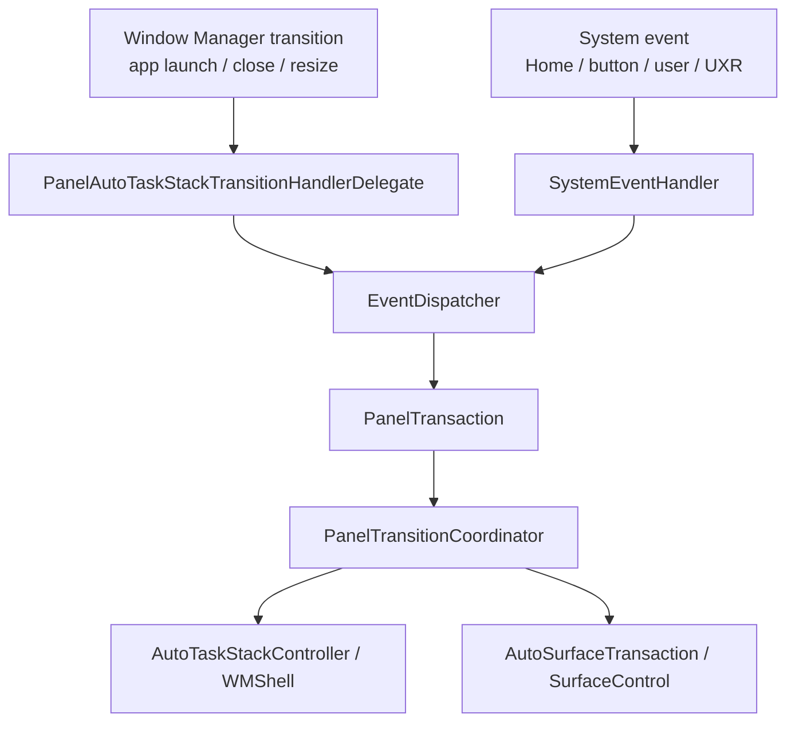
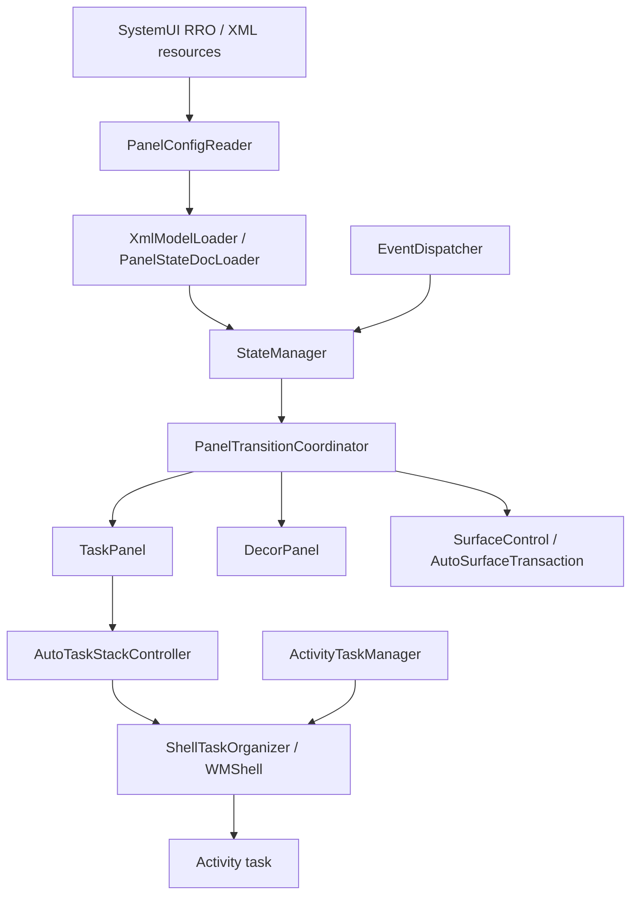
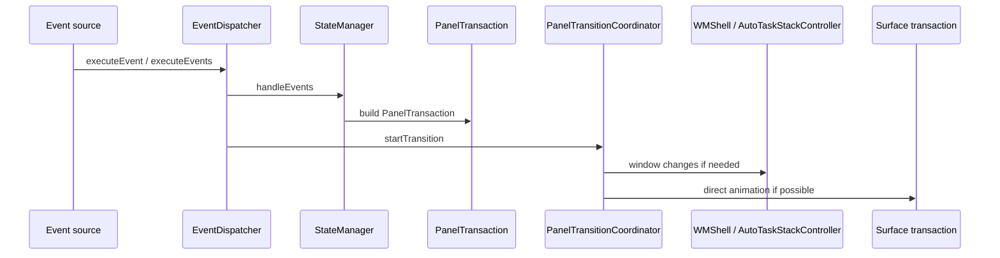
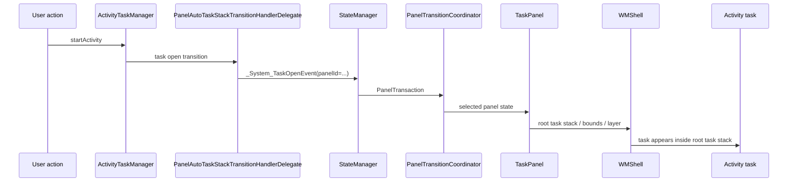

# AAOS17 ScalableUI As-Is Capability

## 目的

この文書は、Android 17 / AAOS17 の source code に存在する ScalableUI の実力を一枚で把握するための資料である。

対象は `android-17.0.0_r1` の AAOS source tree とする。説明の正は repository 内の説明文ではなく、AAOS/AOSP source code である。

この文書では、以下をまとめる。

- Panel / TaskPanel / DecorPanel の意味
- XML / RRO で定義できること
- Task event と Transition の使い方
- Controller でできること
- Task routing / Activity 表示の実体
- Runtime 変更の実力と限界
- TaskView / RemoteCarTaskView との違い
- 変更を入れる場合の拡張境界

## Executive Summary

AAOS17 の ScalableUI は、通常アプリの UI toolkit ではなく、CarSystemUI 内で WindowManager / WMShell / ActivityTaskManager と接続し、Panel 単位で task 表示、状態遷移、surface animation を扱う framework である。

重要な結論は以下である。

| 領域 | As-Is でできること | As-Is だけでは完結しないこと |
| --- | --- | --- |
| Panel 定義 | XML / DCF から PanelState を読み込む | 任意 UI から自由に panel を追加・保存・編集する完成機能 |
| TaskPanel | RootTaskStack を作り、Activity task を panel として表示する | TaskView / RemoteCarTaskView と同じ方式として扱うこと |
| Transition | event に応じて variant を切り替え、WM transition と surface animation を扱う | HMI 固有 event 設計、入力制御、永続化 policy の全自動化 |
| Controller | Panel ごとの初期 Activity、persistent Activity、package 変更追従などを扱う | XML だけで任意 Java/Kotlin controller を追加すること |
| Runtime 変更 | `StateManager.addState()` / `reloadPanelState()` の下回りはある | ユーザー操作での panel editor / app picker / layout persistence |
| App 表示 | `Panel -> TaskPanel -> RootTaskStack / Task -> Activity` として表示する | `Panel -> Activity` の直接モデル |
| Launcher | Home / AppGrid などの入口になれる | ScalableUI の panel 管理主体になること |

## Source Scope

主な確認対象は以下である。

| 領域 | Source path |
| --- | --- |
| ScalableUI runtime | `packages/apps/Car/SystemUI/src/com/android/systemui/car/wm/scalableui` |
| ScalableUI model / XML loader | `packages/apps/Car/systemlibs/car-scalable-ui-lib/src/com/android/car/scalableui` |
| Automotive WMShell support | `packages/services/Car/libs/car-wm-shell-lib/src/com/android/wm/shell/automotive` |
| Shell task organizer | `frameworks/base/libs/WindowManager/Shell/src/com/android/wm/shell/ShellTaskOrganizer.java` |
| ScalableUI codelab RRO examples | `packages/apps/Car/References/scalable-ui/codelab` |

## AAOS17 Source README

AAOS17 source には ScalableUI の README が存在する。

```text
packages/apps/Car/SystemUI/src/com/android/systemui/car/wm/scalableui/README.md
```

この README は、ScalableUI を Android Automotive SystemUI 内の framework として説明している。通常アプリ向け UI toolkit ではなく、AAOS SysUI 内で panel や system window の presentation / behavior を管理する abstraction layer という位置づけである。

README から読み取れる重要点は以下である。

| README の観点 | 内容 | 設計上の意味 |
| --- | --- | --- |
| Overview | ScalableUI は AAOS SysUI 内で panel / system window の表示と振る舞いを管理する framework | app layer ではなく CarSystemUI / WMShell 側の仕組みとして扱う |
| Window State | visibility、size、position、Z-order など、WindowManager が管理する重い状態 | app launch、close、resize、task placement は WM transition と結びつく |
| Surface | alpha、scale、translation、crop など、SurfaceFlinger 側で効率よく動かせる描画属性 | fade、drag 中の見た目、overlay animation は surface transaction で扱える |
| `PanelAutoTaskStackTransitionHandlerDelegate` | WM transition と ScalableUI event / PanelTransaction の橋渡し | app launch や task close を panel transition へ変換する入口 |
| `PanelTransitionCoordinator` | panel animation、state change、surface update、state reconciliation を統括 | Window State 変更と direct surface animation の分岐点 |
| `EventDispatcher` | system event を panel transaction に変換する | Home、task open、button 操作などを Transition に接続する |
| Panels | `TaskPanel`、`DecorPanel`、`SysUIPanel` などの UI container | Activity task 用 panel と装飾用 panel を分けて設計する |
| System Events | system-level event を受け取り dispatch する | user switch、keyguard、UXR、Home などと HMI state を連動できる |
| System Windows | HUN、System Bar などを扱う | app panel だけでなく system UI window も同じ framework の文脈で扱う |

README の workflow は、ScalableUI が二つの入口を持つことを示している。



この README の存在により、AAOS17 では ScalableUI の責務を source 内ドキュメントからも説明できる。特に、Window State と Surface を分けて考える点、delegate と coordinator の責務を分ける点は、XML や controller を設計するときの前提になる。

## Architecture Overview



ScalableUI の中心は、XML/DCF で定義された `PanelState` を `StateManager` に読み込ませ、event によって各 panel の `Variant` を切り替えることである。

アプリ表示の最短モデルは以下になる。

```text
TaskPanel
  -> RootTaskStack
  -> Task
  -> Activity
```

これは `TaskView` / `RemoteCarTaskView` のように View 内へ task を埋め込むモデルではない。

## Component Map

| 概念 | 主な class / method | Source path | 役割 |
| --- | --- | --- | --- |
| Config reader | `PanelConfigReader.init()` / `loadConfig()` / `loadFromXml()` / `reloadConfig(Configuration)` | `packages/apps/Car/SystemUI/src/com/android/systemui/car/wm/scalableui/PanelConfigReader.java` | RRO/XML または DCF から PanelState を読み込む |
| XML loader | `XmlModelLoader.createPanelState(int)` | `packages/apps/Car/systemlibs/car-scalable-ui-lib/src/com/android/car/scalableui/loader/xml/XmlModelLoader.java` | XML resource を PanelState model に変換する |
| State manager | `StateManager.addState()` / `handleEvents()` / `reloadPanelState()` | `packages/apps/Car/systemlibs/car-scalable-ui-lib/src/com/android/car/scalableui/manager/StateManager.java` | panel state と event-to-variant 変換を管理する |
| Event dispatcher | `EventDispatcher.executeEvent()` / `executeEvents()` / `getTransaction()` | `packages/apps/Car/SystemUI/src/com/android/systemui/car/wm/scalableui/EventDispatcher.java` | event を PanelTransaction に変換し transition を開始する |
| Transition | `PanelTransitionCoordinator.startTransition()` / `startDirectAnimation()` / `createAutoTaskStackTransaction()` | `packages/apps/Car/SystemUI/src/com/android/systemui/car/wm/scalableui/PanelTransitionCoordinator.java` | WM transition と surface animation を制御する |
| Task panel | `TaskPanel.init()` | `packages/apps/Car/SystemUI/src/com/android/systemui/car/wm/scalableui/panel/TaskPanel.java` | panel 用 RootTaskStack を作る |
| Root task stack | `AutoTaskStackController.createRootTaskStack()` | `packages/services/Car/libs/car-wm-shell-lib/src/com/android/wm/shell/automotive/AutoTaskStackController.kt` | automotive 向け root task stack を作る API |
| Task creation | `AutoTaskStackControllerImpl.createRootTaskStack()` | `packages/services/Car/libs/car-wm-shell-lib/src/com/android/wm/shell/automotive/AutoTaskStackControllerImpl.kt` | `TaskCreationParams` を作り ShellTaskOrganizer へ渡す |
| Shell task | `ShellTaskOrganizer.createTask(TaskCreationParams, TaskListener)` | `frameworks/base/libs/WindowManager/Shell/src/com/android/wm/shell/ShellTaskOrganizer.java` | root task / task appeared info を作る |
| Controller init | `PanelControllerInitializer.createTaskPanelController()` / `createDecorPanelController()` | `packages/apps/Car/SystemUI/src/com/android/systemui/car/wm/scalableui/panel/controller/PanelControllerInitializer.java` | XML metadata の controller class 名から controller を作る |
| Controller binding | `PanelControllerModule` | `packages/apps/Car/SystemUI/src/com/android/systemui/car/wm/scalableui/panel/controller/PanelControllerModule.java` | controller factory を Dagger map に登録する |
| System events | `SystemEventConstants` / `SystemEventHandler` | `packages/apps/Car/SystemUI/src/com/android/systemui/car/wm/scalableui/systemevents` | Home、task open、user switch、UXR などの system event を発火する |

## Panel の種類

### SysUIPanel

`SysUIPanel` は Android17 の CarSystemUI 側 panel 実装の土台である。

確認対象:

- `packages/apps/Car/SystemUI/src/com/android/systemui/car/wm/scalableui/panel/SysUIPanel.kt`
- `packages/apps/Car/SystemUI/src/com/android/systemui/car/wm/scalableui/panel/TaskPanel.java`
- `packages/apps/Car/SystemUI/src/com/android/systemui/car/wm/scalableui/panel/DecorPanel.java`

`TaskPanel` は `SysUIPanel` を継承する。Android17 source を説明するときは、古い `BasePanel` 前提で断定しない。

### TaskPanel

`TaskPanel` は Activity task を表示する panel である。

根拠:

- `TaskPanel` の class comment は `RootTaskStack based implementation of a Panel` である。
- `TaskPanel.init()` は `AutoTaskStackController.createRootTaskStack(getDisplayId(), getPanelId(), ...)` を呼ぶ。
- `AutoTaskStackControllerImpl.createRootTaskStack()` は `ShellTaskOrganizer.createTask(...)` を呼ぶ。

つまり、TaskPanel は Activity を直接持つのではなく、panel ごとの root task stack を持つ。

### DecorPanel

`DecorPanel` はアプリ task ではなく、grip bar、scrim、overlay、app style view などの SystemUI 装飾要素を扱う panel である。

関連 controller / view:

- `GripBarViewController`
- `PanelOverlayController`
- `AppStyledViewController`
- `DecorPanelControllerBase`

DecorPanel は TaskPanel の補助 UI として、タップ、ドラッグ、scrim、overlay 表現などを担える。

## XML / RRO で定義できること

AAOS17 では `PanelConfigReader.loadFromXml()` が `R.array.window_states` を読み、各 XML を `XmlModelLoader.createPanelState(xmlResId)` に渡す。

最小構成は以下である。

```xml
<resources>
    <array name="window_states">
        <item>@xml/app_panel</item>
        <item>@xml/map_panel</item>
    </array>
</resources>
```

source example:

- `packages/apps/Car/References/scalable-ui/codelab/TwoPanelRROCast/res/values/config.xml`

### TaskPanel XML

TaskPanel XML では、panel id、初期 variant、role、display id、variant、layer、visibility、alpha、bounds、transition を定義できる。

```xml
<TaskPanel
    id="app_panel"
    defaultVariant="@id/closed"
    role="@string/default_config"
    displayId="0">

    <Variant id="@+id/opened">
        <Layer layer="@integer/app_panel_layer"/>
        <Visibility isVisible="true"/>
        <Alpha alpha="1.0"/>
        <Bounds left="0" top="@dimen/map_height" width="100%" height="@dimen/app_height"/>
    </Variant>

    <Variant id="@+id/closed">
        <Layer layer="@integer/app_panel_layer"/>
        <Alpha alpha="0.0"/>
        <Visibility isVisible="false"/>
        <Bounds left="0" top="@dimen/screen_height" width="100%" height="@dimen/app_height"/>
    </Variant>

    <Transitions>
        <Transition
            onEvent="_System_TaskOpenEvent"
            onEventTokens="panelId=app_panel"
            toVariant="@id/opened"/>
        <Transition
            onEvent="_System_OnHomeEvent"
            toVariant="@id/closed"/>
    </Transitions>
</TaskPanel>
```

source example:

- `packages/apps/Car/References/scalable-ui/codelab/TwoPanelRROCast/res/xml/app_panel.xml`

### Variant

`Variant` は panel の状態である。典型的には以下を持つ。

| XML 要素 | 意味 |
| --- | --- |
| `Layer` | z-order / layer |
| `Visibility` | 表示 / 非表示 |
| `Alpha` | surface alpha |
| `Bounds` | panel の位置とサイズ |
| `parent` | 共通定義を継承する variant |

`map_panel.xml` のように、共通 layer を `map_base` に置き、`opened` / `closed` で visibility と bounds だけを変える構成も取れる。

### Bounds

`Bounds` では `left`、`top`、`right`、`bottom`、`width`、`height` などを使い、数値や dimension、`100%` のような相対値を使える。

source examples:

- `packages/apps/Car/References/scalable-ui/codelab/BoundsExampleRRO/res/xml/background_panel.xml`
- `packages/apps/Car/References/scalable-ui/codelab/TwoPanelRROSafeBounds/res/xml/app_panel.xml`

### Layer

`Layer` は panel の前後関係を決める。たとえば codelab では `map_panel_layer` と `app_panel_layer` を分け、app panel を map panel より前に置く構成がある。

source example:

- `packages/apps/Car/References/scalable-ui/codelab/TwoPanelRROCast/res/values/integers.xml`

### config_default_activities

`config_default_activities` は panel id と default Activity component の紐付けに使われる。

```xml
<string-array name="config_default_activities" translatable="false">
    <item>map_panel;com.android.car.portraitlauncher/.homeactivities.BackgroundPanelBaseActivity</item>
</string-array>
```

source example:

- `packages/apps/Car/References/scalable-ui/codelab/TwoPanelRROCast/res/values/config.xml`

## XML / RRO でできること・できないこと

| 項目 | XML / RRO で可能か | 補足 |
| --- | --- | --- |
| panel を宣言する | 可能 | `window_states` に XML を列挙する |
| panel type を選ぶ | 可能 | `TaskPanel` / `DecorPanel` 系 XML |
| 初期 variant を決める | 可能 | `defaultVariant` |
| panel の layer を決める | 可能 | `Layer` |
| panel の表示 / 非表示を決める | 可能 | `Visibility` |
| panel の bounds を決める | 可能 | `Bounds` |
| event による variant 遷移を定義する | 可能 | `Transitions` / `Transition` |
| default Activity を紐付ける | 可能 | `config_default_activities` や controller metadata |
| custom controller を指定する | 条件付きで可能 | controller class が SystemUI 側に存在し、Dagger map に binding されている必要がある |
| 任意 UI から panel を追加・削除する | XML/RRO だけでは不可 | `StateManager.addState()` はあるが、UI / policy / persistence は別途必要 |
| 任意アプリを任意 panel に保存付きで割り当てる | XML/RRO だけでは不可 | app picker、保存、権限、routing policy が必要 |
| task を Panel A から Panel B へ移動する UX を完成させる | XML/RRO だけでは不可 | task reuse / reparent / focus / lifecycle の設計が必要 |

## AAOS17 Source 内の ScalableUI サンプル

AAOS17 source には ScalableUI を使った codelab RRO サンプルが存在する。

```text
packages/apps/Car/References/scalable-ui/codelab
```

これらはアプリ本体ではなく、SystemUI 向け RRO と XML 定義のサンプルである。主に `window_states`、`TaskPanel`、`DecorPanel`、`Variant`、`Transition`、`Controller`、`config_default_activities` の書き方を示している。

各 sample / demo の画面構成、trigger、実行時遷移、source 上の class / method、素の AAOS17 emulator への取り込み条件は、demo 別資料として [scalableui_demos/README.md](scalableui_demos/README.md) に分離している。この章は全体把握用で、実装単位の確認は demo 別資料を参照する。

### サンプル一覧

| Sample module | Package | 画面構成 | 主に学べること |
| --- | --- | --- | --- |
| `OnePanelRRO` | `com.android.systemui.rro.scalableUI.onePanel.codelab` | `app_panel` だけの 1 panel 構成 | 最小 `TaskPanel`、open / close、Home で閉じる基本形 |
| `TwoPanelRRO` | `com.android.systemui.rro.scalableUI.twoPanel.codelab` | `map_panel` + `app_panel` | 背景 map panel と app panel の 2 panel 構成、default activity |
| `TwoPanelRROCast` | `com.android.systemui.rro.scalableUI.twoPanelCast.codelab` | `map_panel` + `app_panel` | 2 panel の基本構成を別 package として提供する例 |
| `TwoPanelRROSafeBounds` | `com.android.systemui.rro.scalableUI.twoPanelSafeBounds.codelab` | `map_panel` + `app_panel` | safe bounds を意識した app panel 表示 |
| `TwoPanelWithInsetsRRO` | `com.android.systemui.rro.scalableUI.twoPanelWithInset.codelab` | `map_panel` + `app_panel` | inset と panel bounds の関係 |
| `BoundsExampleRRO` | `com.android.systemui.rro.scalableUI.bounds.example.codelab` | `background_panel` + `app_panel` | fullscreen / half-screen / system bar 付き bounds の切替 |
| `DDPanelRRO` | `com.android.systemui.rro.scalableUI.dd` | `nav_panel` + `app_panel` | nav 用 panel と app 用 panel を別々に閉じ開きする構成 |
| `SplitPanelHorzRRO` | `com.android.systemui.rro.scalableUI.splitPanel.horz.codelab` | `map_panel` + `app_panel` + grip / overlay decor panels | 横方向 split、drag event、overlay、grip bar |
| `SplitPanelLandRRO` | `com.android.systemui.rro.scalableUI.splitLand.codelab` | `map_panel` + `app_panel` + split decor panels | landscape split layout、drag frame、overlay |
| `ThreePanelRRO` | `com.android.systemui.rro.scalableUI.threePanel.codelab` | `map_panel` + `paintbooth_panel` + `kitchen_sink_panel` + decor panels | 3 task panel と task switch / split grip |
| `SplitPanelRRO` | `com.android.systemui.rro.scalableUI.splitPanel.codelab` | `map_panel` + `app_panel` + `paintbooth_panel` + `themeplayground_panel` + `kitchen_sink_panel` + decor panels | 複数 task panel、task switch、drag split、overlay、frost overlay の総合例 |

### 最小 1 panel: `OnePanelRRO`

`OnePanelRRO` は `window_states` に `@xml/app_panel` だけを登録する最小構成である。

画面構成:

```text
Display
└── app_panel
    ├── closed variant
    └── opened variant
```

制御:

- `_System_TaskOpenEvent` + `panelId=app_panel` で `opened` へ遷移する。
- `_System_OnHomeEvent` で `closed` へ戻る。

このサンプルは、ScalableUI の最小単位が `window_states` と `TaskPanel` XML であることを示す。

### 2 panel: `TwoPanelRRO` / `TwoPanelRROCast`

`TwoPanelRRO` と `TwoPanelRROCast` は、背景になる `map_panel` と、アプリ表示用の `app_panel` を持つ。

画面構成:

```text
Display
├── map_panel
│   └── default activity
└── app_panel
    ├── closed
    └── opened
```

`config_default_activities` では、`map_panel` に `com.android.car.portraitlauncher/.homeactivities.BackgroundPanelBaseActivity` を割り当てている。

制御:

- `map_panel` は `defaultVariant="@id/opened"` で Home 背景として開いた状態を持つ。
- `app_panel` は `_System_TaskOpenEvent` + `panelId=app_panel` で開く。
- `_System_OnHomeEvent` で `app_panel` を閉じ、`map_panel` を開いた状態に戻す。

このサンプルは、背景 panel と foreground app panel の分離を示す。

### Safe bounds / Insets: `TwoPanelRROSafeBounds` / `TwoPanelWithInsetsRRO`

これらは 2 panel 構成をベースに、system bar や inset と panel bounds の関係を確認するためのサンプルである。

画面構成:

```text
Display
├── system bar / inset area
├── map_panel
└── app_panel
```

制御:

- app panel の bounds を system UI 領域に対して安全に配置する。
- `map_panel` と `app_panel` の transition を system event に連動させる。
- `TwoPanelWithInsetsRRO` では `map_panel` 側にも `_System_TaskOpenEvent` を持たせ、app panel と map panel の関係を変えられる。

このサンプルは、ScalableUI の bounds 設計では単に画面全体を分割するのではなく、system bar / inset / safe area を考慮する必要があることを示す。

### Bounds 切替: `BoundsExampleRRO`

`BoundsExampleRRO` は `background_panel` と `app_panel` を持ち、app panel に複数の bounds variant を定義する。

画面構成:

```text
Display
├── background_panel
│   └── fullscreen background
└── app_panel
    ├── fullscreen
    ├── fullscreenStatusNav
    ├── fullscreenWithNavBar
    ├── fullscreenWithSystem
    ├── halfScreen
    ├── closed
    └── other bounds variants
```

制御:

- `_Product_FullScreen`
- `_Product_FullScreenWithNavBar`
- `_Product_FullScreenWithSystem`
- `_Product_HalfScreen`
- `_System_OnHomeEvent`
- `_System_TaskOpenEvent`

のような event で app panel の bounds variant を切り替える。

`background_panel` は `controller="@xml/background_stub_controller"` を持ち、`BaseTaskPanelController` と `PersistentActivity` の使い方も示している。

このサンプルは、同じ TaskPanel を複数サイズへ変形させるための XML パターンを示す。

### Navigation + app: `DDPanelRRO`

`DDPanelRRO` は `nav_panel` と `app_panel` を持つ。

画面構成:

```text
Display
├── nav_panel
│   ├── closed
│   └── opened
└── app_panel
    ├── closed
    └── opened
```

制御:

- `_System_TaskOpenEvent` + `panelId=nav_panel` で nav panel を開く。
- `_System_TaskOpenEvent` + `panelId=app_panel` で app panel を開く。
- `_System_OnHomeEvent` で両方を閉じる、または Home 向け状態へ戻す。

`nav_panel` には `map_panel_controller` が指定されており、panel 固有 controller の参照例にもなっている。

### 横 split: `SplitPanelHorzRRO`

`SplitPanelHorzRRO` は task panel と decor panel を組み合わせ、横方向 split と drag 操作を表現する。

画面構成:

```text
Display
├── map_panel
├── app_panel
├── decor_grip_bar_split_task
├── decor_split_nav_overlay
└── decor_split_app_overlay
```

主な controller:

- `GripBarViewController`
- `PanelOverlayController`

制御:

- `_System_TaskOpenEvent` で app / map panel の表示状態を変える。
- `_User_DragEvent_split` や `_Drag_TaskSplitEvent_f0` / `f50` / `f100` で split 位置の段階を表現する。
- overlay decor panel を使い、drag 中の対象領域や補助表示を重ねる。
- `_System_EnterSuwEvent` / `_System_ExitSuwEvent` で setup wizard 状態とも連動する。

このサンプルは、TaskPanel だけではなく DecorPanel を組み合わせて、操作ハンドルと overlay を構成する例である。

### Landscape split: `SplitPanelLandRRO`

`SplitPanelLandRRO` は landscape 向け split の例で、`map_panel` と `app_panel` に複数の split variant を持たせる。

画面構成:

```text
Display
├── map_panel
├── app_panel
├── decor_grip_bar_split_task
├── decor_split_nav_overlay
└── decor_split_theme_overlay
```

制御:

- `_Drag_TaskSplitEvent_f0`
- `_Drag_TaskSplitEvent_f50`
- `_Drag_TaskSplitEvent_f100`
- `_User_DragEvent_split` + `direction=increase/decrease`

などを使い、drag による split ratio 変化を表現する。

このサンプルは、同じ split コンセプトでも画面向きや layout によって variant 設計が変わることを示す。

### 3 panel: `ThreePanelRRO`

`ThreePanelRRO` は `map_panel`、`paintbooth_panel`、`kitchen_sink_panel` を中心に、decor panel を組み合わせる。

画面構成:

```text
Display
├── map_panel
├── paintbooth_panel
├── kitchen_sink_panel
├── decor_split_nav_overlay
├── decor_grip_bar_switch_task
└── decor_split_grip_bar
```

default activities:

- `paintbooth_panel;com.android.car.ui.paintbooth/com.android.car.ui.paintbooth.MainActivity`
- `map_panel;com.android.car.portraitlauncher/.homeactivities.BackgroundPanelBaseActivity`
- `kitchen_sink_panel;com.google.android.car.kitchensink/com.google.android.car.kitchensink.KitchenSinkActivity`

制御:

- `_System_TaskOpenEvent` で各 task panel を開く。
- `_Drag_TaskSwitchEvent_top` / `_Drag_TaskSwitchEvent_bottom` で task switch 系の遷移を行う。
- `GripBarViewController` と `PanelOverlayController` を使い、split / switch 操作の UI を重ねる。

このサンプルは、複数 task panel を同時に扱い、task switch と split を XML transition で組み合わせる例である。

### 総合 split: `SplitPanelRRO`

`SplitPanelRRO` は codelab の中で最も大きい構成である。task panel と decor panel を多数持ち、task switch、drag split、overlay、frost overlay をまとめて扱う。

画面構成:

```text
Display
├── map_panel
├── app_panel
├── paintbooth_panel
├── themeplayground_panel
├── kitchen_sink_panel
├── decor_grip_bar_switch_task
├── decor_grip_bar_split_task
├── decor_split_nav_overlay
├── decor_split_theme_overlay
└── decor_frost_overlay
```

default activities:

- `paintbooth_panel;com.android.car.ui.paintbooth/com.android.car.ui.paintbooth.MainActivity`
- `map_panel;com.android.car.portraitlauncher/.homeactivities.BackgroundPanelBaseActivity`
- `kitchen_sink_panel;com.google.android.car.kitchensink/com.google.android.car.kitchensink.KitchenSinkActivity`

主な制御:

- `_System_TaskOpenEvent` で対象 panel を開き、他 panel を閉じる。
- `_System_OnHomeEvent` で Home 状態へ戻る。
- `_User_DragEvent_switch` と `_Drag_TaskSwitchEvent_top/bottom` で上下 task switch を扱う。
- `_User_DragEvent_split` と `_Drag_TaskSplitEvent_*` で split 状態を扱う。
- `_System_OnAnimationEndEvent` + `panelToVariantId` token で animation 後の連動遷移を行う。
- DecorPanel の overlay と grip bar controller により、操作面と視覚補助を分離する。

このサンプルは、ScalableUI が単なる fixed panel 配置だけでなく、event-driven な task panel / decor panel の連動を XML と controller で構成できることを示す。

### サンプルから分かること

| 観点 | サンプルが示すこと |
| --- | --- |
| `window_states` | 複数 panel XML を SystemUI RRO で列挙する |
| `TaskPanel` | Activity task を置く panel を定義する |
| `DecorPanel` | grip bar、overlay、frost、scrim などの装飾・操作面を定義する |
| `Variant` | opened / closed / split frame / fullscreen などを状態として表す |
| `Transition` | system event、drag event、animation end event で状態遷移する |
| `onEventTokens` | `panelId`、`direction`、`panelToVariantId` などで transition 対象を絞る |
| `Controller` | `GripBarViewController`、`PanelOverlayController`、`BaseTaskPanelController` などを XML から参照する |
| `config_default_activities` | panel id と起動する Activity component を関連づける |
| Layer | TaskPanel と DecorPanel の前後関係を制御する |

### サンプルが示していないこと

サンプル RRO は ScalableUI の XML / controller / transition の使い方を示すが、以下を完成機能として示すものではない。

| 項目 | 理由 |
| --- | --- |
| 任意 app picker | サンプルは事前定義 component / role / default activity が中心 |
| user layout persistence | XML 定義の variant はあるが、ユーザー編集結果の保存設計は別 |
| panel editor | runtime UI で panel を追加・削除・保存する機能ではない |
| task lifecycle policy 全体 | task open / close event はあるが、process death、user switching、multi-display の本格 policy は別途確認が必要 |
| 通常 APK だけでの制御 | RRO と CarSystemUI controller 前提の構成である |

## Task Event

ScalableUI の transition は event によって発火する。

`Event` は id と token を持つ model であり、`Event.isMatch(...)` は id と token を比較して transition に一致するか判断する。

確認対象:

- `packages/apps/Car/systemlibs/car-scalable-ui-lib/src/com/android/car/scalableui/model/Event.java`
- `packages/apps/Car/systemlibs/car-scalable-ui-lib/src/com/android/car/scalableui/loader/xml/parser/TransitionParser.java`
- `packages/apps/Car/SystemUI/src/com/android/systemui/car/wm/scalableui/EventDispatcher.java`

### Event の基本形

XML 側:

```xml
<Transition
    onEvent="_System_TaskOpenEvent"
    onEventTokens="panelId=app_panel"
    toVariant="@id/opened"/>
```

runtime 側:

```text
Event id: _System_TaskOpenEvent
tokens:
  panelId=app_panel
```

event id が一致し、XML に指定された token が runtime event に含まれる場合、その transition が適用対象になる。

### System Event

AAOS17 source で確認できる主な system event は以下である。

| Event | 用途 |
| --- | --- |
| `_System_OnHomeEvent` | Home 操作 |
| `_System_TaskOpenEvent` | task open |
| `_System_TaskCloseEvent` | task close |
| `_System_TaskPanelEmptyEvent` | task panel が空になった状態 |
| `_System_EnterSuwEvent` | setup wizard へ入る |
| `_System_ExitSuwEvent` | setup wizard から出る |
| `_System_BeforeUserSwitch` | user switch 前 |
| `_System_UserSwitchComplete` | user switch 完了 |
| `_System_KeyguardShown` | keyguard 表示 |
| `_System_KeyguardHidden` | keyguard 非表示 |
| `_System_UserAuthenticated` | display on / user storage unlocked / keyguard hidden を満たす |
| `_System_EnterImmersiveMode` | immersive mode へ入る |
| `_System_ExitImmersiveMode` | immersive mode から出る |
| `_System_UxrStateChanged` | UX restrictions 変更 |
| `_System_Show_Panel` | panel 表示 |
| `_System_Hide_Panel` | panel 非表示 |

source:

- `packages/apps/Car/SystemUI/src/com/android/systemui/car/wm/scalableui/systemevents/SystemEventConstants.java`

### Event token

`Event.java` で確認できる代表的 token は以下である。

| Token | 意味 |
| --- | --- |
| `panelId` | 対象 panel id |
| `component` | Activity component |
| `package` | package name |
| `panelToVariantId` | 遷移先 variant id |

`SystemEventConstants` では、UX restrictions 用の `restricted`、user authenticated 用の `userSwitch`、drag direction 用の `direction` も確認できる。

## Transition

`StateManager.handleEvents(...)` は event list を受け取り、各 `PanelState` に定義された transition を評価して `PanelTransaction` を作る。

`EventDispatcher.executeEvents(...)` は `PanelTransitionCoordinator.startTransition(...)` を呼ぶ。



重要なのは、ScalableUI が Window State と Surface の両方を扱う点である。

| 種類 | 例 | 主な処理 |
| --- | --- | --- |
| Window State | visibility、bounds、task open、task close、z-order | `AutoTaskStackController` / WMShell transition |
| Surface | alpha、scale、translation、crop | `AutoSurfaceTransaction` / direct animation |

## Controller

Controller は XML だけでは表現しにくい panel 固有の判断や初期化を担う。

AAOS17 では、panel XML に controller metadata を書き、`PanelControllerInitializer` が `PanelControllerMetadata.getControllerName()` の class 名を読み、Dagger map に登録された factory から controller を作る。

source:

- `packages/apps/Car/SystemUI/src/com/android/systemui/car/wm/scalableui/panel/controller/PanelControllerInitializer.java`
- `packages/apps/Car/SystemUI/src/com/android/systemui/car/wm/scalableui/panel/controller/PanelControllerModule.java`
- `packages/apps/Car/systemlibs/car-scalable-ui-lib/src/com/android/car/scalableui/loader/xml/parser/PanelControllerParser.java`

### Controller XML

source example:

```xml
<TaskPanel
    id="background_panel"
    defaultVariant="@id/fullscreen"
    role="@string/background_panel_array"
    displayId="0"
    controller="@xml/background_stub_controller">
    ...
</TaskPanel>
```

```xml
<Controller id="background_stub_controller">
    <ControllerName>com.android.systemui.car.wm.scalableui.panel.controller.BaseTaskPanelController</ControllerName>
    <PersistentActivity>com.android.systemui/.TestActivity</PersistentActivity>
</Controller>
```

source:

- `packages/apps/Car/References/scalable-ui/codelab/BoundsExampleRRO/res/xml/background_panel.xml`
- `packages/apps/Car/References/scalable-ui/codelab/BoundsExampleRRO/res/xml/background_stub_controller.xml`

### Built-in TaskPanel controller

AAOS17 source では以下の TaskPanel controller factory が binding されている。

| Controller | Source path | 主な用途 |
| --- | --- | --- |
| `BaseTaskPanelController` | `packages/apps/Car/SystemUI/src/com/android/systemui/car/wm/scalableui/panel/controller/BaseTaskPanelController.java` | default component / default intent / persistent activities / install-uninstall 追従 |
| `MapsPanelController` | `packages/apps/Car/SystemUI/src/com/android/systemui/car/wm/scalableui/panel/controller/MapsPanelController.java` | maps panel 向け制御 |
| `SetupPanelController` | `packages/apps/Car/SystemUI/src/com/android/systemui/car/wm/scalableui/panel/controller/SetupPanelController.java` | setup panel 向け制御 |

`PanelControllerModule` に binding がない class 名を XML に書いても、`PanelControllerInitializer` は factory を取得できず controller を作れない。

### Built-in DecorPanel controller

AAOS17 source では以下の DecorPanel controller factory が binding されている。

| Controller | Source path | 主な用途 |
| --- | --- | --- |
| `GripBarViewController` | `packages/apps/Car/SystemUI/src/com/android/systemui/car/wm/scalableui/view/GripBarViewController.java` | grip bar 操作 |
| `AppStyledViewController` | `packages/apps/Car/SystemUI/src/com/android/systemui/car/wm/scalableui/view/AppStyledViewController.java` | app style view |
| `PanelOverlayController` | `packages/apps/Car/SystemUI/src/com/android/systemui/car/wm/scalableui/view/PanelOverlayController.java` | overlay 表示 |

### Controller でできること

| できること | 根拠 |
| --- | --- |
| default component / default intent を解釈する | `BaseTaskPanelController.parseDefaultComponent()` / `parseDefaultIntent()` |
| package install / uninstall / changed / replaced に追従する | `BaseTaskPanelController.registerApplicationInstallUninstallReceiver()` |
| persistent activities を扱う | `BaseTaskPanelController.updatePersistentActivities()` |
| panel 固有の reset / init を追加する | `BaseTaskPanelController` subclass |
| DecorPanel から event を送る | `GripBarViewController` / `AppStyledViewController` が `EventDispatcher.executeEvent(...)` を呼ぶ |
| toolbar controller を差し替える | `PanelControllerInitializer.createTaskToolBarController()` |

### Controller で注意すること

Controller は XML resource だけで完結する拡張点ではない。新しい controller class を使うには、少なくとも以下が必要になる。

1. SystemUI 側に controller class を実装する。
2. `TaskPanelController.Factory` または `DecorPanelController.Factory` を用意する。
3. `PanelControllerModule` の Dagger map に class key で binding する。
4. XML の `<ControllerName>` に class 名を書く。
5. build / boot / event dispatch / dumpsys で初期化を確認する。

## Task Routing

ScalableUI の app 表示は、Activity 起動と panel 配置が分かれている。



`PanelAutoTaskStackTransitionHandlerDelegate.handleRequest(...)` は WM transition request から ScalableUI event を作り、`EventDispatcher.getTransaction(...)` と `PanelTransitionCoordinator.createAutoTaskStackTransaction(...)` に接続する。

このため、説明上は以下のように切り分ける。

| 領域 | 主体 |
| --- | --- |
| Activity の起動・task lifecycle | ActivityTaskManager |
| task appeared / root task stack creation | WMShell / ShellTaskOrganizer |
| panel id と variant の選択 | ScalableUI / StateManager / transition XML |
| bounds / layer / visibility / surface animation | PanelTransitionCoordinator / AutoTaskStackController / AutoSurfaceTransaction |

## TaskView / RemoteCarTaskView との違い

AAOS17 には `TaskView` / `RemoteCarTaskView` 系も存在するが、ScalableUI `TaskPanel` の実体ではない。

| 方式 | 主な class | Source path | 位置づけ |
| --- | --- | --- | --- |
| ScalableUI TaskPanel | `TaskPanel`, `AutoTaskStackController`, `RootTaskStack` | `packages/apps/Car/SystemUI/src/com/android/systemui/car/wm/scalableui/panel/TaskPanel.java` | CarSystemUI / WMShell が panel root task stack を制御する |
| TaskView | `TaskView`, `TaskViewTaskController` | `frameworks/base/libs/WindowManager/Shell/src/com/android/wm/shell/taskview` | View / SurfaceView に task を表示する別経路 |
| RemoteCarTaskView | `RemoteCarTaskView`, `ControlledRemoteCarTaskView`, `RemoteCarTaskViewServerImpl` | `packages/services/Car/car-lib/src/android/car/app/RemoteCarTaskView.java`, `packages/apps/Car/SystemUI/src/com/android/systemui/car/wm/taskview/RemoteCarTaskViewServerImpl.java` | CarLauncher などから remote task view を使うための別経路 |

したがって、ScalableUI の panel 表示を説明するときに `TaskPanel == TaskView` と置くのは不正確である。

## Runtime Panel Generation

`StateManager.addState(PanelState)` は存在する。`StateManager.reloadPanelState(Map<String, PanelState>)` も存在し、`PanelConfigReader.loadConfig()` は XML/DCF から読み込んだ panel state map を `reloadPanelState(...)` に渡す。

source:

- `packages/apps/Car/systemlibs/car-scalable-ui-lib/src/com/android/car/scalableui/manager/StateManager.java`
- `packages/apps/Car/SystemUI/src/com/android/systemui/car/wm/scalableui/PanelConfigReader.java`

ただし、As-Is の標準初期化は「任意 UI から panel を増やす」より「定義済み config を読み込む」流れである。

| 項目 | As-Is 状態 |
| --- | --- |
| `StateManager.addState()` | あり |
| `StateManager.reloadPanelState()` | あり |
| XML / DCF reload | あり |
| panel config readiness monitor | あり。`PanelConfigReadStateMonitor` |
| 任意 app picker | 完成機能としては確認しない |
| user layout persistence | 完成機能としては確認しない |
| drag resize の完成 UX | GripBar / event の部品はあるが、仕様化は別途必要 |

Runtime 変更を行う場合は、`StateManager` の API だけでなく、入力 UI、権限、保存形式、reboot 復元、user switching、task lifecycle、focus をセットで設計する必要がある。

## DCF / Design Compose

`PanelConfigReader.loadConfig()` は `Flag.ScalableUiDesignCompose` が有効な場合 DCF を読み、それ以外では XML を読む。

source:

- `packages/apps/Car/SystemUI/src/com/android/systemui/car/wm/scalableui/PanelConfigReader.java`
- `packages/apps/Car/SystemUI/src/com/android/systemui/car/wm/scalableui/panel/panelupdates/PanelConfigReadStateMonitor.kt`

このため AAOS17 では、XML/RRO 経路だけでなく、Design Compose / DCF 経路も source 上に存在する。ただし、どちらを採用するかは target の flag、resource、build 構成に依存する。

## Window State と Surface

ScalableUI は `PanelTransaction` をもとに、WindowManager 管理の window state と SurfaceControl 管理の surface state を分けて扱う。

| 変更 | Window State | Surface |
| --- | --- | --- |
| panel を表示する | あり | alpha animation を伴うことがある |
| panel bounds を変える | あり | crop / translation を伴うことがある |
| panel を前面に出す | layer / z-order | surface layer |
| scrim を fade する | 不要な場合あり | alpha |
| grip drag 中の見た目 | 場合による | translation / crop |

source:

- `packages/apps/Car/SystemUI/src/com/android/systemui/car/wm/scalableui/PanelTransitionCoordinator.java`
- `packages/services/Car/libs/car-wm-shell-lib/src/com/android/wm/shell/automotive/AutoSurfaceTransaction.java`

## Dismiss / Floating / Overlay の考え方

AAOS17 source には `PanelOverlayController`、`AppStyledViewController`、`GripBarViewController` のような DecorPanel controller が存在する。これらは TaskPanel とは別に、overlay / scrim / grip などの装飾と操作点を作るための部品である。

中央 floating panel、外側タップ dismiss、scrim fade のような UX は、以下の組み合わせで設計する。

| 役割 | 主な部品 |
| --- | --- |
| 浮かせる対象 | TaskPanel または DecorPanel |
| 前後関係 | `Layer` |
| 表示状態 | `Variant` / `Visibility` / `Alpha` |
| dismiss trigger | DecorPanel controller から `EventDispatcher.executeEvent(...)` |
| 閉じる animation | `Transition` + `PanelTransitionCoordinator` |

XML だけで「どこをタップしたら閉じるか」まで表現するのではなく、入力を受ける view/controller と event を組み合わせる。

## Data Collection / Observability

ScalableUI は analytics 基盤ではない。ただし、event と transition の境界が明確なため、実装次第で以下のような状態は観測しやすい。

| 取れる情報 | 取りやすさ | 候補箇所 |
| --- | --- | --- |
| どの event が発火したか | 高い | `EventDispatcher.executeEvent()` / `executeEvents()` |
| どの PanelTransaction が作られたか | 高い | `StateManager.handleEvents()` |
| どの panel がどの variant へ移ったか | 高い | `PanelState` / `PanelTransaction` |
| どの task が開いたか | 中 | `PanelAutoTaskStackTransitionHandlerDelegate` / `TaskPanelInfoRepository` |
| どの app component が起動対象になったか | 中 | `Event` token の `component` / Activity launch request |
| 他アプリ内部でどの UI を操作したか | 低い | ScalableUI の責務外 |

ログや telemetry を追加する場合は、他アプリ内部の操作を横取りするのではなく、ScalableUI event、task open、panel transition、アプリ自身が出す明示 event を分けて扱う。

## Security / Permission / Signing Boundary

ScalableUI は CarSystemUI / WMShell / WindowManager と接続するため、通常 APK だけで同等の制御を行うことはできない。

| 変更内容 | どこに入るか | 注意点 |
| --- | --- | --- |
| XML/RRO で panel state を定義する | overlay / product resource | overlay 適用、署名、partition、resource 解決が必要 |
| 新しい controller を追加する | CarSystemUI source | SystemUI build、Dagger binding、権限、SELinux を確認する |
| task routing を変える | CarSystemUI / WMShell 周辺 | ActivityTaskManager / WMShell との整合が必要 |
| task lifecycle を制御する | platform privileged 領域 | focus、user、display、process death を確認する |
| 通常アプリの UI を作る | app APK | Panel 内表示に適した responsive UI は作れるが、TaskPanel 自体は制御しない |

## 指定 Gitiles URL との照合

指定された Android 17 tag の Gitiles URL と、ローカル `android-17.0.0_r1` source の内容を照合した。

| URL | 対応する source path | 確認結果 | 現状資料への反映 |
| --- | --- | --- | --- |
| `src/com/android/systemui/car/wm/scalableui/` | `packages/apps/Car/SystemUI/src/com/android/systemui/car/wm/scalableui` | ScalableUI runtime 本体。README、panel、systemevents、systemwindow、view、configuration を含む | 本資料の中心対象。既存の Panel / Event / Controller / Transition 説明と整合 |
| `src/com/android/systemui/car/wm/` | `packages/apps/Car/SystemUI/src/com/android/systemui/car/wm` | ScalableUI だけでなく、activity、cluster、taskview、caption、display compat、CarSystemUI proxy も含む上位 WM package | ScalableUI 周辺境界として追記が必要 |
| `samples/` | `packages/apps/Car/SystemUI/samples` | AAOS SystemUI RRO samples。System bar、DEWD、MinimizedControls などを含む。ScalableUI codelab は別 path の `packages/apps/Car/References/scalable-ui/codelab` | samples は ScalableUI 専用 sample ではないが、DEWD/MinimizedControls 系に ScalableUI XML 実例が含まれる |

Gitiles 上の `wm/scalableui/` は tree として以下を持つ。

```text
configuration/
panel/
systemevents/
systemwindow/
view/
ActionConfigReader.java
AutoTaskStackHelper.java
EventDispatcher.java
PanelAutoTaskStackTransitionHandlerDelegate.java
PanelConfigReader.java
PanelTransitionCoordinator.java
README.md
ScalableUIDumpsys.java
ScalableUIExtensions.kt
ScalableUIUtils.java
ScalableUIWMInitializer.java
```

この構成は、本資料で整理した「config を読む」「event を dispatch する」「panel state を transition する」「TaskPanel / DecorPanel を表示する」「system window と接続する」という理解と一致する。

## `wm/` 上位 package の意味

`src/com/android/systemui/car/wm/` は ScalableUI だけの directory ではない。AAOS CarSystemUI の WindowManager 連携全体を含む。

| 領域 | 主な source | ScalableUI との関係 |
| --- | --- | --- |
| `scalableui/` | `PanelConfigReader`, `PanelTransitionCoordinator`, `TaskPanel`, `DecorPanel`, `SystemEventHandler` | ScalableUI 本体 |
| `taskview/` | `RemoteCarTaskViewServerImpl`, `RemoteCarTaskViewTransitions`, `RootTaskMediator` | RemoteCarTaskView 用の別経路。TaskPanel の実体ではない |
| `activity/` | `ActivityBlockingActivity`, `ContinuousBlankActivity`, `LaunchOnPrivateDisplayRouterActivity`, `ActivityWindowController` | Activity 表示や private display routing などの補助 |
| `cluster/` | `ClusterDisplayController` | cluster display 向け制御 |
| root files | `CarFullscreenTaskMonitorListener`, `CarSystemUIProxyImpl`, `CarWMUserHelper`, `AutoCaptionBarViewControllerImpl` | task lifecycle、CarSystemUI proxy、multi-user / display、caption / display compat など |

### `taskview/` は ScalableUI TaskPanel とは別

`wm/taskview` には `RemoteCarTaskViewServerImpl`、`RemoteCarTaskViewTransitions`、`RootTaskMediator` が存在する。これは `RemoteCarTaskView` の server side 実装である。

確認できる責務:

- `RemoteCarTaskViewServerImpl` は `CarTaskViewHost` を実装し、host 側から surface created / destroyed、bounds、start activity、root task 作成を受ける。
- `RootTaskMediator` は `TaskCreationParams` を使って `ShellTaskOrganizer.createTask(...)` を呼び、TaskView 用 root task を作る。
- `RemoteCarTaskViewTransitions` は Home が開くときに embedded task を上へ reorder するなど、TaskView 特有の transition 補助を行う。
- `CarSystemUIProxyImpl` は `CarSystemUIProxy` として `createCarTaskView(...)` / `createControlledCarTaskView(...)` を提供し、`RemoteCarTaskViewServerImpl` を管理する。

これらは task を扱う点では ScalableUI と近いが、実装経路は別である。

```text
RemoteCarTaskView path:
  App / client
    -> CarSystemUIProxy
    -> RemoteCarTaskViewServerImpl
    -> TaskViewTaskController / RootTaskMediator
    -> ShellTaskOrganizer

ScalableUI TaskPanel path:
  CarSystemUI ScalableUI
    -> TaskPanel
    -> AutoTaskStackController
    -> ShellTaskOrganizer
```

したがって、`wm/` 上位 package に `taskview/` が存在することは、`TaskPanel == RemoteCarTaskView` を意味しない。むしろ AAOS17 source では、TaskPanel と RemoteCarTaskView が同じ WM package 内の別経路として並んでいる。

### task lifecycle / multi-user / display 境界

`CarFullscreenTaskMonitorListener` は fullscreen / multi-window task lifecycle を `AutoTaskRepository` に伝える。taskview 関連 task は除外される。

`CarWMUserHelper` は display と user の対応を扱う。MUMD 構成では `CarOccupantZoneManager` から display に割り当てられた user を取得する。

このため、ScalableUI の panel 設計では、panel XML だけでなく以下も確認対象になる。

- task lifecycle と repository
- taskview task と non-taskview task の切り分け
- displayId と userId の対応
- occupant zone 変更
- display compat / caption bar

## `samples/` の位置づけ

`packages/apps/Car/SystemUI/samples` は、AAOS SystemUI の config override を試すための RRO samples である。Gitiles の README でも、各 sample は AAOS SystemUI の config override 効果を示すものと説明されている。

README が示す運用:

- sample RRO を build する。
- APK として install する。
- `cmd overlay enable --user 0 ...` で overlay を有効化する。
- system bar persistency 系は user 0 と user 10 の両方に適用する例がある。
- `dumpsys window | grep mRemoteInsetsControllerControlsSystemBars` で remote insets controller 設定を確認する。
- 必要に応じて SystemUI を restart する。

### `samples/` の分類

| Sample group | 主な module | 内容 | ScalableUI との関係 |
| --- | --- | --- | --- |
| System bar position | `CarSystemUIBottomRRO`, `CarSystemUIBottomRoundedRRO`, `CarSystemUILeftRRO`, `CarSystemUIRightRRO` | top/left/right/bottom system bar の enable、type、z-order、HUN position、Home/AppGrid component を override | ScalableUI そのものではないが、panel bounds / inset / layer 設計に影響する |
| System bar transparency | `CarSystemUIStatusBarTranslucent`, `CarSystemUINavBarTranslucent` | status bar / navigation bar background を translucent にする | panel と system bar の重なり方に影響する |
| System bar persistency | `CarSystemUISystemBarPersistcyImmersive`, `...ImmersiveWithNav`, `...NonImmersive`, `...BarPolicy` | immersive request 時の system bar 表示 policy を変える | ScalableUI の immersive transition と合わせて確認が必要 |
| Remote insets control | `CarSystemUIControllsSystemBarInsetsRRO` | `config_remoteInsetsControllerControlsSystemBars=true` | system bar を app ではなく CarSystemUI 側で制御する方向。panel safe bounds と関係する |
| DEWD | `DewdDynamicAospRRO`, `DewdLandAospRRO`, `DewdPortAospRRO`, `DewdSplitAospRRO` | ScalableUI XML を使った dynamic / land / port / split 表示構成 | ScalableUI の実例として重要 |
| Minimized controls | `MinimizedControlsDynamicRRO` | minimized media / dialer controls と dynamic panel 構成 | ScalableUI panel + decor panel + system bar 非表示の実例 |

## `samples/DEWD*` の ScalableUI 構成

`samples/DEWD*` は `samples/` 配下にあるが、内容としては ScalableUI XML を多く含む。`packages/apps/Car/References/scalable-ui/codelab` の sample と合わせて、AAOS17 source 内の ScalableUI 実例として見る価値がある。

### `DEWDDynamic`

`DEWDDynamic` は dynamic 表示向けの window state list を持つ。

`res/values/config.xml`:

- `app_panel`
- `map_panel`
- `widget_panel`
- `assistant_panel`
- `suw_panel`
- `unreactive_panel`
- `status_bar`
- `nav_bar`
- `hun_panel`
- `projected_panel`

`res/values-port/config.xml` では portrait 向けに以下も追加される。

- `app_drawer_panel`
- `app_grip_bar_panel`
- `app_grid_panel`
- `app_grid_grip_bar_panel`
- `background_map_panel`
- `widget_bar_panel`
- `calm_mode_panel`
- `app_styled_view_panel`
- `app_styled_view_scrim`
- `app_styled_view_background`
- `camera_panel`

設定として以下も持つ。

- `config_homePanelVisibilities`
- `config_appGridPanelVisibilities`
- `config_appGridSelectedClickEvent`

これは、Home 状態と AppGrid 状態でどの panel を表示するかを文字列 config と window states で切り替える例である。

### `DEWDPort`

`DEWDPort` は portrait 向けの panel 群を持つ。

主な panel:

| XML | Panel | defaultVariant | Controller |
| --- | --- | --- | --- |
| `app_drawer_panel.xml` | `TaskPanel app_panel` | `closed` | なし |
| `background_map_panel.xml` | `TaskPanel map_panel` | `opened` | `map_panel_controller` |
| `app_grid_panel.xml` | `TaskPanel panel_app_grid` | `closed` | `app_grid_panel_controller` |
| `app_grid_grip_bar_panel.xml` | `DecorPanel decor_grip_app` | `closed` | `app_grid_grip_bar_controller` |
| `app_grip_bar_panel.xml` | `DecorPanel decor_grip` | `closed` | `app_grip_bar_controller` |
| `widget_bar_panel.xml` | `TaskPanel widget_panel` | `opened` | `widget_panel_controller` |
| `calm_mode_panel.xml` | `TaskPanel panel_calm_mode` | `closed` | `calm_mode_panel_controller` |
| `app_styled_view_panel.xml` | `TaskPanel panel_app_styled_view` | `closed` | `app_styled_view_panel_controller` |
| `app_styled_view_scrim.xml` | `DecorPanel decor_app_styled_view_scrim` | `closed` | `app_styled_view_scrim_controller` |
| `app_styled_view_background.xml` | `DecorPanel decor_app_styled_view_background` | `closed` | `app_styled_view_background_controller` |

この sample は、portrait HMI で map、widget、app drawer、app grid、grip bar、styled view、scrim を ScalableUI panel として分ける実例である。

### `DEWDLand`

`DEWDLand` は landscape 向けの小さめの構成である。

主な panel:

- `TaskPanel app_panel`
- `TaskPanel map_panel`
- `TaskPanel widget_panel`

portrait より panel 数を抑え、landscape 表示に合わせた map / widget / app の基本構成を示している。

### `DEWDSplit`

`DEWDSplit` は split 表示向けの構成である。

主な panel:

| XML | Panel | defaultVariant | 役割 |
| --- | --- | --- | --- |
| `app_panel.xml` | `TaskPanel app_panel` | `closed` | split 右側の app panel |
| `map_panel.xml` | `TaskPanel map_panel` | `expanded` | map panel |
| `grip_bar.xml` | `DecorPanel grip_bar` | `closed` | drag handle |
| `map_panel_overlay.xml` | `DecorPanel map_panel_overlay` | `expanded_hidden` | map overlay |

`app_panel.xml` では以下の variant / transition が確認できる。

- `opened`
- `immersive`
- `closed`
- `KeyFrameVariant drag`
- `_System_TaskOpenEvent`
- `_System_TaskPanelEmptyEvent`
- `_System_OnHomeEvent`
- `_Drag_PanelDragEvent`
- `_Drag_PanelOpenEvent`
- `_Drag_PanelCloseEvent`
- `_System_EnterImmersiveMode`
- `_System_ExitImmersiveMode`

`grip_bar.xml` は `DecorPanel` として drag event を受け、app panel と連動する。これは、ScalableUI の drag / keyframe / immersive transition の実例として重要である。

### `MinimizedControlsDynamic`

`MinimizedControlsDynamic` は minimized media / dialer controls を ScalableUI panel として扱う sample である。

主な特徴:

- feature flag `com.android.car.scalableui.enable_ext_panel_updates` 付きの `window_states`
- top / bottom / left / right system bar を無効化する config
- `floating_app_panel`
- `background_map_panel`
- `widget_panel`
- `minimized_media_controls_panel`
- `minimized_dialer_controls_panel`
- `top_bar_left_panel` / `top_bar_right_panel`
- `bottom_bar_left_panel` / `bottom_bar_center_panel` / `bottom_bar_right_panel`
- `hun_panel`

これは、従来の system bar 領域に相当するものも ScalableUI panel / DecorPanel として再構成する方向を示す sample である。

## `samples/` と `References/scalable-ui/codelab` の違い

| Path | 目的 | 内容 |
| --- | --- | --- |
| `packages/apps/Car/SystemUI/samples` | AAOS SystemUI config override sample | System bar、DEWD、MinimizedControls、remote insets、immersive policy |
| `packages/apps/Car/References/scalable-ui/codelab` | ScalableUI codelab RRO sample | OnePanel、TwoPanel、SplitPanel、BoundsExample など、ScalableUI XML 学習用 |

`samples/` は ScalableUI 専用 directory ではない。ただし `DEWD*` と `MinimizedControlsDynamic` は、AAOS17 source 内で ScalableUI XML を使った現実的な system UI layout example として扱える。

## 現状資料との差分

今回の照合で、現状資料に対して追加で明確化すべき点は以下である。

| 観点 | これまでの整理 | 追加で明確化した点 |
| --- | --- | --- |
| ScalableUI README | README の存在と責務は整理済み | Gitiles の `wm/scalableui/` directory が README と各 subpackage を含むことを確認 |
| `wm/` 上位 package | ScalableUI / TaskView の違いを整理済み | `wm/` は ScalableUI だけでなく taskview、activity、cluster、task monitor、user/display helper を含む |
| RemoteCarTaskView | TaskPanel とは別経路と整理済み | `CarSystemUIProxyImpl -> RemoteCarTaskViewServerImpl -> RootTaskMediator` の具体経路を追加 |
| `samples/` | 未整理 | SystemUI sample RRO 集であり、system bar / DEWD / minimized controls / remote insets を含むことを追加 |
| ScalableUI sample | `References/scalable-ui/codelab` を整理済み | `samples/DEWD*` と `MinimizedControlsDynamic` も ScalableUI XML 実例として追加 |

## HowTo: XML を作るときの最小手順

1. `res/values/config.xml` に `window_states` を定義する。
2. 各 panel XML を `res/xml/*.xml` として作る。
3. `TaskPanel` または `DecorPanel` を選ぶ。
4. `id`、`defaultVariant`、`displayId`、必要なら `role` と `controller` を定義する。
5. `Variant` に `Layer`、`Visibility`、`Alpha`、`Bounds` を定義する。
6. `Transitions` に system event または custom event を定義する。
7. default Activity が必要な panel は `config_default_activities` または controller metadata で指定する。
8. overlay 適用後、`PanelConfigReader.loadConfig()` が読み込む resource として解決されることを確認する。
9. boot 後に dumpsys / logcat / screenshot で panel state、task、layer、bounds を確認する。

## HowTo: Task Event を設計するときの最小手順

1. event id を決める。
2. event token を決める。代表例は `panelId`、`component`、`package`、`panelToVariantId`。
3. XML の `Transition` に `onEvent` と `onEventTokens` を書く。
4. event 発火元を決める。System event か、SystemUI 側 controller か、system window かを分ける。
5. `EventDispatcher.executeEvent(...)` へ event が届く経路を用意する。
6. `StateManager.handleEvents(...)` が期待する `PanelTransaction` を返すか確認する。
7. `PanelTransitionCoordinator` が WM transition または direct animation として適用できるか確認する。

## HowTo: Controller を追加するときの最小手順

1. `TaskPanelController` または `DecorPanelController` のどちらにするか決める。
2. 既存 controller で足りるか確認する。
3. 足りない場合、CarSystemUI 側に controller class を実装する。
4. assisted factory を用意する。
5. `PanelControllerModule` に `@ClassKey` 付きで binding する。
6. controller XML に `<ControllerName>` を書く。
7. panel XML の `controller="@xml/..."` から参照する。
8. boot 時に `PanelControllerInitializer` が factory を取得できることを logcat で確認する。
9. controller の event 発火、persistent activity、package 変更追従、destroy 処理を検証する。

## Capability Matrix

| 項目 | As-Is capability | 主な source 根拠 | 判定 |
| --- | --- | --- | --- |
| ScalableUI framework | CarSystemUI 内で panel / system window / transition を扱う | `README.md`, `ScalableUIWMInitializer.java` | あり |
| XML panel 定義 | `window_states` から XML panel を読み込む | `PanelConfigReader.loadFromXml()` | あり |
| DCF 読み込み | flag 有効時に DCF を読む | `PanelConfigReader.loadConfig()` | あり |
| TaskPanel | RootTaskStack based panel | `TaskPanel.java` | あり |
| DecorPanel | overlay / grip / scrim などの装飾 panel | `DecorPanel.java`, `PanelControllerModule.java` | あり |
| Event transition | event id / token で variant 切替 | `Event.java`, `TransitionParser.java`, `StateManager.java` | あり |
| System event | Home/task/user/UXR などの event | `SystemEventConstants.java`, `SystemEventHandler.java` | あり |
| Controller metadata | XML から controller class 名を読む | `PanelControllerParser.java`, `PanelControllerMetadata.java` | あり |
| Controller instance | Dagger map に登録された factory から作る | `PanelControllerInitializer.java`, `PanelControllerModule.java` | あり |
| Runtime addState | state 追加 API | `StateManager.addState()` | 部品あり |
| Runtime reload | state map reload API | `StateManager.reloadPanelState()` | あり |
| User layout editor | app picker / persistence / restore まで一式 | source 上の完成機能としては確認しない | なし |
| Task migration UX | Panel 間で既存 task を移す完成 policy | source 上の完成機能としては確認しない | 要設計 |
| TaskView equivalence | TaskPanel が TaskView そのもの | `TaskPanel.java`, `TaskView.java` | なし |
| RemoteCarTaskView equivalence | TaskPanel が RemoteCarTaskView そのもの | `RemoteCarTaskView.java`, `RemoteCarTaskViewServerImpl.java` | なし |

## 誤解しやすい点

| 誤解 | 正しい説明 |
| --- | --- |
| Panel は Activity を直接持つ | 実装上は `TaskPanel -> RootTaskStack / Task -> Activity` |
| TaskPanel は TaskView である | TaskPanel と TaskView は別経路 |
| RemoteCarTaskView を使えば ScalableUI と同じになる | RemoteCarTaskView は別の埋め込み経路 |
| XML だけで任意 controller を追加できる | controller class と Dagger binding が SystemUI 側に必要 |
| `addState()` があるので runtime panel editor は完成済み | state API はあるが、UI / policy / persistence は別途必要 |
| Launcher が panel 管理主体である | ScalableUI panel 管理は CarSystemUI / WMShell 側 |
| WindowContainerTransaction があるので panel 間移動は自動でできる | API の存在と UX policy の完成は別 |

## 最後に

AAOS17 ScalableUI の As-Is 実力は、XML/RRO で panel state を定義し、event に応じて variant を切り替え、TaskPanel 経由で Activity task を配置するところまでが明確に source 上で確認できる。

一方で、任意 panel editor、ユーザーごとの layout persistence、任意 app assignment、既存 task の高度な移動 policy、UX restrictions と組み合わせた実運用ルールは、ScalableUI の部品を使いながら別途設計する領域である。
