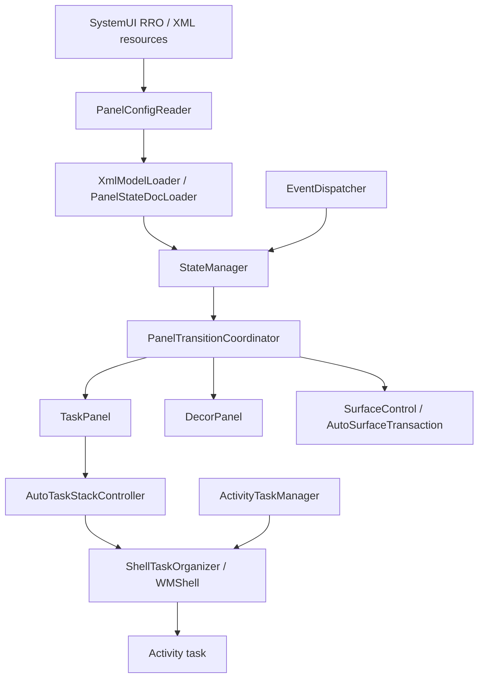
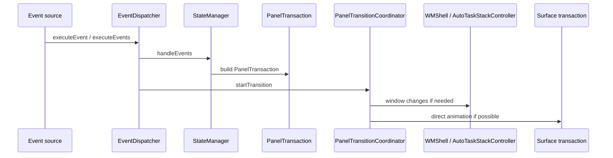
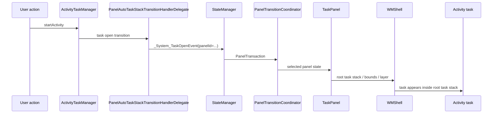

# AAOS17 ScalableUI As-Is Capability

## 目的

この文書は、Android 17 / AAOS17 の source code に存在する ScalableUI の実力を一枚で把握するための資料である。

対象は `android-17.0.0_r1` の AAOS source tree とする。説明の正は repository 内の説明文ではなく、AAOS/AOSP source code である。

この文書では、以下をまとめる。

- Panel / TaskPanel / DecorPanel の意味
- XML / RRO で定義できること
- Task event と Transition の使い方
- Controller でできること
- Task routing / Activity 表示の実体
- Runtime 変更の実力と限界
- TaskView / RemoteCarTaskView との違い
- 変更を入れる場合の拡張境界

## Executive Summary

AAOS17 の ScalableUI は、通常アプリの UI toolkit ではなく、CarSystemUI 内で WindowManager / WMShell / ActivityTaskManager と接続し、Panel 単位で task 表示、状態遷移、surface animation を扱う framework である。

重要な結論は以下である。

| 領域 | As-Is でできること | As-Is だけでは完結しないこと |
| --- | --- | --- |
| Panel 定義 | XML / DCF から PanelState を読み込む | 任意 UI から自由に panel を追加・保存・編集する完成機能 |
| TaskPanel | RootTaskStack を作り、Activity task を panel として表示する | TaskView / RemoteCarTaskView と同じ方式として扱うこと |
| Transition | event に応じて variant を切り替え、WM transition と surface animation を扱う | HMI 固有 event 設計、入力制御、永続化 policy の全自動化 |
| Controller | Panel ごとの初期 Activity、persistent Activity、package 変更追従などを扱う | XML だけで任意 Java/Kotlin controller を追加すること |
| Runtime 変更 | `StateManager.addState()` / `reloadPanelState()` の下回りはある | ユーザー操作での panel editor / app picker / layout persistence |
| App 表示 | `Panel -> TaskPanel -> RootTaskStack / Task -> Activity` として表示する | `Panel -> Activity` の直接モデル |
| Launcher | Home / AppGrid などの入口になれる | ScalableUI の panel 管理主体になること |

## Source Scope

主な確認対象は以下である。

| 領域 | Source path |
| --- | --- |
| ScalableUI runtime | `packages/apps/Car/SystemUI/src/com/android/systemui/car/wm/scalableui` |
| ScalableUI model / XML loader | `packages/apps/Car/systemlibs/car-scalable-ui-lib/src/com/android/car/scalableui` |
| Automotive WMShell support | `packages/services/Car/libs/car-wm-shell-lib/src/com/android/wm/shell/automotive` |
| Shell task organizer | `frameworks/base/libs/WindowManager/Shell/src/com/android/wm/shell/ShellTaskOrganizer.java` |
| ScalableUI codelab RRO examples | `packages/apps/Car/References/scalable-ui/codelab` |

## Architecture Overview



ScalableUI の中心は、XML/DCF で定義された `PanelState` を `StateManager` に読み込ませ、event によって各 panel の `Variant` を切り替えることである。

アプリ表示の最短モデルは以下になる。

```text
TaskPanel
  -> RootTaskStack
  -> Task
  -> Activity
```

これは `TaskView` / `RemoteCarTaskView` のように View 内へ task を埋め込むモデルではない。

## Component Map

| 概念 | 主な class / method | Source path | 役割 |
| --- | --- | --- | --- |
| Config reader | `PanelConfigReader.init()` / `loadConfig()` / `loadFromXml()` / `reloadConfig(Configuration)` | `packages/apps/Car/SystemUI/src/com/android/systemui/car/wm/scalableui/PanelConfigReader.java` | RRO/XML または DCF から PanelState を読み込む |
| XML loader | `XmlModelLoader.createPanelState(int)` | `packages/apps/Car/systemlibs/car-scalable-ui-lib/src/com/android/car/scalableui/loader/xml/XmlModelLoader.java` | XML resource を PanelState model に変換する |
| State manager | `StateManager.addState()` / `handleEvents()` / `reloadPanelState()` | `packages/apps/Car/systemlibs/car-scalable-ui-lib/src/com/android/car/scalableui/manager/StateManager.java` | panel state と event-to-variant 変換を管理する |
| Event dispatcher | `EventDispatcher.executeEvent()` / `executeEvents()` / `getTransaction()` | `packages/apps/Car/SystemUI/src/com/android/systemui/car/wm/scalableui/EventDispatcher.java` | event を PanelTransaction に変換し transition を開始する |
| Transition | `PanelTransitionCoordinator.startTransition()` / `startDirectAnimation()` / `createAutoTaskStackTransaction()` | `packages/apps/Car/SystemUI/src/com/android/systemui/car/wm/scalableui/PanelTransitionCoordinator.java` | WM transition と surface animation を制御する |
| Task panel | `TaskPanel.init()` | `packages/apps/Car/SystemUI/src/com/android/systemui/car/wm/scalableui/panel/TaskPanel.java` | panel 用 RootTaskStack を作る |
| Root task stack | `AutoTaskStackController.createRootTaskStack()` | `packages/services/Car/libs/car-wm-shell-lib/src/com/android/wm/shell/automotive/AutoTaskStackController.kt` | automotive 向け root task stack を作る API |
| Task creation | `AutoTaskStackControllerImpl.createRootTaskStack()` | `packages/services/Car/libs/car-wm-shell-lib/src/com/android/wm/shell/automotive/AutoTaskStackControllerImpl.kt` | `TaskCreationParams` を作り ShellTaskOrganizer へ渡す |
| Shell task | `ShellTaskOrganizer.createTask(TaskCreationParams, TaskListener)` | `frameworks/base/libs/WindowManager/Shell/src/com/android/wm/shell/ShellTaskOrganizer.java` | root task / task appeared info を作る |
| Controller init | `PanelControllerInitializer.createTaskPanelController()` / `createDecorPanelController()` | `packages/apps/Car/SystemUI/src/com/android/systemui/car/wm/scalableui/panel/controller/PanelControllerInitializer.java` | XML metadata の controller class 名から controller を作る |
| Controller binding | `PanelControllerModule` | `packages/apps/Car/SystemUI/src/com/android/systemui/car/wm/scalableui/panel/controller/PanelControllerModule.java` | controller factory を Dagger map に登録する |
| System events | `SystemEventConstants` / `SystemEventHandler` | `packages/apps/Car/SystemUI/src/com/android/systemui/car/wm/scalableui/systemevents` | Home、task open、user switch、UXR などの system event を発火する |

## Panel の種類

### SysUIPanel

`SysUIPanel` は Android17 の CarSystemUI 側 panel 実装の土台である。

確認対象:

- `packages/apps/Car/SystemUI/src/com/android/systemui/car/wm/scalableui/panel/SysUIPanel.kt`
- `packages/apps/Car/SystemUI/src/com/android/systemui/car/wm/scalableui/panel/TaskPanel.java`
- `packages/apps/Car/SystemUI/src/com/android/systemui/car/wm/scalableui/panel/DecorPanel.java`

`TaskPanel` は `SysUIPanel` を継承する。Android17 source を説明するときは、古い `BasePanel` 前提で断定しない。

### TaskPanel

`TaskPanel` は Activity task を表示する panel である。

根拠:

- `TaskPanel` の class comment は `RootTaskStack based implementation of a Panel` である。
- `TaskPanel.init()` は `AutoTaskStackController.createRootTaskStack(getDisplayId(), getPanelId(), ...)` を呼ぶ。
- `AutoTaskStackControllerImpl.createRootTaskStack()` は `ShellTaskOrganizer.createTask(...)` を呼ぶ。

つまり、TaskPanel は Activity を直接持つのではなく、panel ごとの root task stack を持つ。

### DecorPanel

`DecorPanel` はアプリ task ではなく、grip bar、scrim、overlay、app style view などの SystemUI 装飾要素を扱う panel である。

関連 controller / view:

- `GripBarViewController`
- `PanelOverlayController`
- `AppStyledViewController`
- `DecorPanelControllerBase`

DecorPanel は TaskPanel の補助 UI として、タップ、ドラッグ、scrim、overlay 表現などを担える。

## XML / RRO で定義できること

AAOS17 では `PanelConfigReader.loadFromXml()` が `R.array.window_states` を読み、各 XML を `XmlModelLoader.createPanelState(xmlResId)` に渡す。

最小構成は以下である。

```xml
<resources>
    <array name="window_states">
        <item>@xml/app_panel</item>
        <item>@xml/map_panel</item>
    </array>
</resources>
```

source example:

- `packages/apps/Car/References/scalable-ui/codelab/TwoPanelRROCast/res/values/config.xml`

### TaskPanel XML

TaskPanel XML では、panel id、初期 variant、role、display id、variant、layer、visibility、alpha、bounds、transition を定義できる。

```xml
<TaskPanel
    id="app_panel"
    defaultVariant="@id/closed"
    role="@string/default_config"
    displayId="0">

    <Variant id="@+id/opened">
        <Layer layer="@integer/app_panel_layer"/>
        <Visibility isVisible="true"/>
        <Alpha alpha="1.0"/>
        <Bounds left="0" top="@dimen/map_height" width="100%" height="@dimen/app_height"/>
    </Variant>

    <Variant id="@+id/closed">
        <Layer layer="@integer/app_panel_layer"/>
        <Alpha alpha="0.0"/>
        <Visibility isVisible="false"/>
        <Bounds left="0" top="@dimen/screen_height" width="100%" height="@dimen/app_height"/>
    </Variant>

    <Transitions>
        <Transition
            onEvent="_System_TaskOpenEvent"
            onEventTokens="panelId=app_panel"
            toVariant="@id/opened"/>
        <Transition
            onEvent="_System_OnHomeEvent"
            toVariant="@id/closed"/>
    </Transitions>
</TaskPanel>
```

source example:

- `packages/apps/Car/References/scalable-ui/codelab/TwoPanelRROCast/res/xml/app_panel.xml`

### Variant

`Variant` は panel の状態である。典型的には以下を持つ。

| XML 要素 | 意味 |
| --- | --- |
| `Layer` | z-order / layer |
| `Visibility` | 表示 / 非表示 |
| `Alpha` | surface alpha |
| `Bounds` | panel の位置とサイズ |
| `parent` | 共通定義を継承する variant |

`map_panel.xml` のように、共通 layer を `map_base` に置き、`opened` / `closed` で visibility と bounds だけを変える構成も取れる。

### Bounds

`Bounds` では `left`、`top`、`right`、`bottom`、`width`、`height` などを使い、数値や dimension、`100%` のような相対値を使える。

source examples:

- `packages/apps/Car/References/scalable-ui/codelab/BoundsExampleRRO/res/xml/background_panel.xml`
- `packages/apps/Car/References/scalable-ui/codelab/TwoPanelRROSafeBounds/res/xml/app_panel.xml`

### Layer

`Layer` は panel の前後関係を決める。たとえば codelab では `map_panel_layer` と `app_panel_layer` を分け、app panel を map panel より前に置く構成がある。

source example:

- `packages/apps/Car/References/scalable-ui/codelab/TwoPanelRROCast/res/values/integers.xml`

### config_default_activities

`config_default_activities` は panel id と default Activity component の紐付けに使われる。

```xml
<string-array name="config_default_activities" translatable="false">
    <item>map_panel;com.android.car.portraitlauncher/.homeactivities.BackgroundPanelBaseActivity</item>
</string-array>
```

source example:

- `packages/apps/Car/References/scalable-ui/codelab/TwoPanelRROCast/res/values/config.xml`

## XML / RRO でできること・できないこと

| 項目 | XML / RRO で可能か | 補足 |
| --- | --- | --- |
| panel を宣言する | 可能 | `window_states` に XML を列挙する |
| panel type を選ぶ | 可能 | `TaskPanel` / `DecorPanel` 系 XML |
| 初期 variant を決める | 可能 | `defaultVariant` |
| panel の layer を決める | 可能 | `Layer` |
| panel の表示 / 非表示を決める | 可能 | `Visibility` |
| panel の bounds を決める | 可能 | `Bounds` |
| event による variant 遷移を定義する | 可能 | `Transitions` / `Transition` |
| default Activity を紐付ける | 可能 | `config_default_activities` や controller metadata |
| custom controller を指定する | 条件付きで可能 | controller class が SystemUI 側に存在し、Dagger map に binding されている必要がある |
| 任意 UI から panel を追加・削除する | XML/RRO だけでは不可 | `StateManager.addState()` はあるが、UI / policy / persistence は別途必要 |
| 任意アプリを任意 panel に保存付きで割り当てる | XML/RRO だけでは不可 | app picker、保存、権限、routing policy が必要 |
| task を Panel A から Panel B へ移動する UX を完成させる | XML/RRO だけでは不可 | task reuse / reparent / focus / lifecycle の設計が必要 |

## Task Event

ScalableUI の transition は event によって発火する。

`Event` は id と token を持つ model であり、`Event.isMatch(...)` は id と token を比較して transition に一致するか判断する。

確認対象:

- `packages/apps/Car/systemlibs/car-scalable-ui-lib/src/com/android/car/scalableui/model/Event.java`
- `packages/apps/Car/systemlibs/car-scalable-ui-lib/src/com/android/car/scalableui/loader/xml/parser/TransitionParser.java`
- `packages/apps/Car/SystemUI/src/com/android/systemui/car/wm/scalableui/EventDispatcher.java`

### Event の基本形

XML 側:

```xml
<Transition
    onEvent="_System_TaskOpenEvent"
    onEventTokens="panelId=app_panel"
    toVariant="@id/opened"/>
```

runtime 側:

```text
Event id: _System_TaskOpenEvent
tokens:
  panelId=app_panel
```

event id が一致し、XML に指定された token が runtime event に含まれる場合、その transition が適用対象になる。

### System Event

AAOS17 source で確認できる主な system event は以下である。

| Event | 用途 |
| --- | --- |
| `_System_OnHomeEvent` | Home 操作 |
| `_System_TaskOpenEvent` | task open |
| `_System_TaskCloseEvent` | task close |
| `_System_TaskPanelEmptyEvent` | task panel が空になった状態 |
| `_System_EnterSuwEvent` | setup wizard へ入る |
| `_System_ExitSuwEvent` | setup wizard から出る |
| `_System_BeforeUserSwitch` | user switch 前 |
| `_System_UserSwitchComplete` | user switch 完了 |
| `_System_KeyguardShown` | keyguard 表示 |
| `_System_KeyguardHidden` | keyguard 非表示 |
| `_System_UserAuthenticated` | display on / user storage unlocked / keyguard hidden を満たす |
| `_System_EnterImmersiveMode` | immersive mode へ入る |
| `_System_ExitImmersiveMode` | immersive mode から出る |
| `_System_UxrStateChanged` | UX restrictions 変更 |
| `_System_Show_Panel` | panel 表示 |
| `_System_Hide_Panel` | panel 非表示 |

source:

- `packages/apps/Car/SystemUI/src/com/android/systemui/car/wm/scalableui/systemevents/SystemEventConstants.java`

### Event token

`Event.java` で確認できる代表的 token は以下である。

| Token | 意味 |
| --- | --- |
| `panelId` | 対象 panel id |
| `component` | Activity component |
| `package` | package name |
| `panelToVariantId` | 遷移先 variant id |

`SystemEventConstants` では、UX restrictions 用の `restricted`、user authenticated 用の `userSwitch`、drag direction 用の `direction` も確認できる。

## Transition

`StateManager.handleEvents(...)` は event list を受け取り、各 `PanelState` に定義された transition を評価して `PanelTransaction` を作る。

`EventDispatcher.executeEvents(...)` は `PanelTransitionCoordinator.startTransition(...)` を呼ぶ。



重要なのは、ScalableUI が Window State と Surface の両方を扱う点である。

| 種類 | 例 | 主な処理 |
| --- | --- | --- |
| Window State | visibility、bounds、task open、task close、z-order | `AutoTaskStackController` / WMShell transition |
| Surface | alpha、scale、translation、crop | `AutoSurfaceTransaction` / direct animation |

## Controller

Controller は XML だけでは表現しにくい panel 固有の判断や初期化を担う。

AAOS17 では、panel XML に controller metadata を書き、`PanelControllerInitializer` が `PanelControllerMetadata.getControllerName()` の class 名を読み、Dagger map に登録された factory から controller を作る。

source:

- `packages/apps/Car/SystemUI/src/com/android/systemui/car/wm/scalableui/panel/controller/PanelControllerInitializer.java`
- `packages/apps/Car/SystemUI/src/com/android/systemui/car/wm/scalableui/panel/controller/PanelControllerModule.java`
- `packages/apps/Car/systemlibs/car-scalable-ui-lib/src/com/android/car/scalableui/loader/xml/parser/PanelControllerParser.java`

### Controller XML

source example:

```xml
<TaskPanel
    id="background_panel"
    defaultVariant="@id/fullscreen"
    role="@string/background_panel_array"
    displayId="0"
    controller="@xml/background_stub_controller">
    ...
</TaskPanel>
```

```xml
<Controller id="background_stub_controller">
    <ControllerName>com.android.systemui.car.wm.scalableui.panel.controller.BaseTaskPanelController</ControllerName>
    <PersistentActivity>com.android.systemui/.TestActivity</PersistentActivity>
</Controller>
```

source:

- `packages/apps/Car/References/scalable-ui/codelab/BoundsExampleRRO/res/xml/background_panel.xml`
- `packages/apps/Car/References/scalable-ui/codelab/BoundsExampleRRO/res/xml/background_stub_controller.xml`

### Built-in TaskPanel controller

AAOS17 source では以下の TaskPanel controller factory が binding されている。

| Controller | Source path | 主な用途 |
| --- | --- | --- |
| `BaseTaskPanelController` | `packages/apps/Car/SystemUI/src/com/android/systemui/car/wm/scalableui/panel/controller/BaseTaskPanelController.java` | default component / default intent / persistent activities / install-uninstall 追従 |
| `MapsPanelController` | `packages/apps/Car/SystemUI/src/com/android/systemui/car/wm/scalableui/panel/controller/MapsPanelController.java` | maps panel 向け制御 |
| `SetupPanelController` | `packages/apps/Car/SystemUI/src/com/android/systemui/car/wm/scalableui/panel/controller/SetupPanelController.java` | setup panel 向け制御 |

`PanelControllerModule` に binding がない class 名を XML に書いても、`PanelControllerInitializer` は factory を取得できず controller を作れない。

### Built-in DecorPanel controller

AAOS17 source では以下の DecorPanel controller factory が binding されている。

| Controller | Source path | 主な用途 |
| --- | --- | --- |
| `GripBarViewController` | `packages/apps/Car/SystemUI/src/com/android/systemui/car/wm/scalableui/view/GripBarViewController.java` | grip bar 操作 |
| `AppStyledViewController` | `packages/apps/Car/SystemUI/src/com/android/systemui/car/wm/scalableui/view/AppStyledViewController.java` | app style view |
| `PanelOverlayController` | `packages/apps/Car/SystemUI/src/com/android/systemui/car/wm/scalableui/view/PanelOverlayController.java` | overlay 表示 |

### Controller でできること

| できること | 根拠 |
| --- | --- |
| default component / default intent を解釈する | `BaseTaskPanelController.parseDefaultComponent()` / `parseDefaultIntent()` |
| package install / uninstall / changed / replaced に追従する | `BaseTaskPanelController.registerApplicationInstallUninstallReceiver()` |
| persistent activities を扱う | `BaseTaskPanelController.updatePersistentActivities()` |
| panel 固有の reset / init を追加する | `BaseTaskPanelController` subclass |
| DecorPanel から event を送る | `GripBarViewController` / `AppStyledViewController` が `EventDispatcher.executeEvent(...)` を呼ぶ |
| toolbar controller を差し替える | `PanelControllerInitializer.createTaskToolBarController()` |

### Controller で注意すること

Controller は XML resource だけで完結する拡張点ではない。新しい controller class を使うには、少なくとも以下が必要になる。

1. SystemUI 側に controller class を実装する。
2. `TaskPanelController.Factory` または `DecorPanelController.Factory` を用意する。
3. `PanelControllerModule` の Dagger map に class key で binding する。
4. XML の `<ControllerName>` に class 名を書く。
5. build / boot / event dispatch / dumpsys で初期化を確認する。

## Task Routing

ScalableUI の app 表示は、Activity 起動と panel 配置が分かれている。



`PanelAutoTaskStackTransitionHandlerDelegate.handleRequest(...)` は WM transition request から ScalableUI event を作り、`EventDispatcher.getTransaction(...)` と `PanelTransitionCoordinator.createAutoTaskStackTransaction(...)` に接続する。

このため、説明上は以下のように切り分ける。

| 領域 | 主体 |
| --- | --- |
| Activity の起動・task lifecycle | ActivityTaskManager |
| task appeared / root task stack creation | WMShell / ShellTaskOrganizer |
| panel id と variant の選択 | ScalableUI / StateManager / transition XML |
| bounds / layer / visibility / surface animation | PanelTransitionCoordinator / AutoTaskStackController / AutoSurfaceTransaction |

## TaskView / RemoteCarTaskView との違い

AAOS17 には `TaskView` / `RemoteCarTaskView` 系も存在するが、ScalableUI `TaskPanel` の実体ではない。

| 方式 | 主な class | Source path | 位置づけ |
| --- | --- | --- | --- |
| ScalableUI TaskPanel | `TaskPanel`, `AutoTaskStackController`, `RootTaskStack` | `packages/apps/Car/SystemUI/src/com/android/systemui/car/wm/scalableui/panel/TaskPanel.java` | CarSystemUI / WMShell が panel root task stack を制御する |
| TaskView | `TaskView`, `TaskViewTaskController` | `frameworks/base/libs/WindowManager/Shell/src/com/android/wm/shell/taskview` | View / SurfaceView に task を表示する別経路 |
| RemoteCarTaskView | `RemoteCarTaskView`, `ControlledRemoteCarTaskView`, `RemoteCarTaskViewServerImpl` | `packages/services/Car/car-lib/src/android/car/app/RemoteCarTaskView.java`, `packages/apps/Car/SystemUI/src/com/android/systemui/car/wm/taskview/RemoteCarTaskViewServerImpl.java` | CarLauncher などから remote task view を使うための別経路 |

したがって、ScalableUI の panel 表示を説明するときに `TaskPanel == TaskView` と置くのは不正確である。

## Runtime Panel Generation

`StateManager.addState(PanelState)` は存在する。`StateManager.reloadPanelState(Map<String, PanelState>)` も存在し、`PanelConfigReader.loadConfig()` は XML/DCF から読み込んだ panel state map を `reloadPanelState(...)` に渡す。

source:

- `packages/apps/Car/systemlibs/car-scalable-ui-lib/src/com/android/car/scalableui/manager/StateManager.java`
- `packages/apps/Car/SystemUI/src/com/android/systemui/car/wm/scalableui/PanelConfigReader.java`

ただし、As-Is の標準初期化は「任意 UI から panel を増やす」より「定義済み config を読み込む」流れである。

| 項目 | As-Is 状態 |
| --- | --- |
| `StateManager.addState()` | あり |
| `StateManager.reloadPanelState()` | あり |
| XML / DCF reload | あり |
| panel config readiness monitor | あり。`PanelConfigReadStateMonitor` |
| 任意 app picker | 完成機能としては確認しない |
| user layout persistence | 完成機能としては確認しない |
| drag resize の完成 UX | GripBar / event の部品はあるが、仕様化は別途必要 |

Runtime 変更を行う場合は、`StateManager` の API だけでなく、入力 UI、権限、保存形式、reboot 復元、user switching、task lifecycle、focus をセットで設計する必要がある。

## DCF / Design Compose

`PanelConfigReader.loadConfig()` は `Flag.ScalableUiDesignCompose` が有効な場合 DCF を読み、それ以外では XML を読む。

source:

- `packages/apps/Car/SystemUI/src/com/android/systemui/car/wm/scalableui/PanelConfigReader.java`
- `packages/apps/Car/SystemUI/src/com/android/systemui/car/wm/scalableui/panel/panelupdates/PanelConfigReadStateMonitor.kt`

このため AAOS17 では、XML/RRO 経路だけでなく、Design Compose / DCF 経路も source 上に存在する。ただし、どちらを採用するかは target の flag、resource、build 構成に依存する。

## Window State と Surface

ScalableUI は `PanelTransaction` をもとに、WindowManager 管理の window state と SurfaceControl 管理の surface state を分けて扱う。

| 変更 | Window State | Surface |
| --- | --- | --- |
| panel を表示する | あり | alpha animation を伴うことがある |
| panel bounds を変える | あり | crop / translation を伴うことがある |
| panel を前面に出す | layer / z-order | surface layer |
| scrim を fade する | 不要な場合あり | alpha |
| grip drag 中の見た目 | 場合による | translation / crop |

source:

- `packages/apps/Car/SystemUI/src/com/android/systemui/car/wm/scalableui/PanelTransitionCoordinator.java`
- `packages/services/Car/libs/car-wm-shell-lib/src/com/android/wm/shell/automotive/AutoSurfaceTransaction.java`

## Dismiss / Floating / Overlay の考え方

AAOS17 source には `PanelOverlayController`、`AppStyledViewController`、`GripBarViewController` のような DecorPanel controller が存在する。これらは TaskPanel とは別に、overlay / scrim / grip などの装飾と操作点を作るための部品である。

中央 floating panel、外側タップ dismiss、scrim fade のような UX は、以下の組み合わせで設計する。

| 役割 | 主な部品 |
| --- | --- |
| 浮かせる対象 | TaskPanel または DecorPanel |
| 前後関係 | `Layer` |
| 表示状態 | `Variant` / `Visibility` / `Alpha` |
| dismiss trigger | DecorPanel controller から `EventDispatcher.executeEvent(...)` |
| 閉じる animation | `Transition` + `PanelTransitionCoordinator` |

XML だけで「どこをタップしたら閉じるか」まで表現するのではなく、入力を受ける view/controller と event を組み合わせる。

## Data Collection / Observability

ScalableUI は analytics 基盤ではない。ただし、event と transition の境界が明確なため、実装次第で以下のような状態は観測しやすい。

| 取れる情報 | 取りやすさ | 候補箇所 |
| --- | --- | --- |
| どの event が発火したか | 高い | `EventDispatcher.executeEvent()` / `executeEvents()` |
| どの PanelTransaction が作られたか | 高い | `StateManager.handleEvents()` |
| どの panel がどの variant へ移ったか | 高い | `PanelState` / `PanelTransaction` |
| どの task が開いたか | 中 | `PanelAutoTaskStackTransitionHandlerDelegate` / `TaskPanelInfoRepository` |
| どの app component が起動対象になったか | 中 | `Event` token の `component` / Activity launch request |
| 他アプリ内部でどの UI を操作したか | 低い | ScalableUI の責務外 |

ログや telemetry を追加する場合は、他アプリ内部の操作を横取りするのではなく、ScalableUI event、task open、panel transition、アプリ自身が出す明示 event を分けて扱う。

## Security / Permission / Signing Boundary

ScalableUI は CarSystemUI / WMShell / WindowManager と接続するため、通常 APK だけで同等の制御を行うことはできない。

| 変更内容 | どこに入るか | 注意点 |
| --- | --- | --- |
| XML/RRO で panel state を定義する | overlay / product resource | overlay 適用、署名、partition、resource 解決が必要 |
| 新しい controller を追加する | CarSystemUI source | SystemUI build、Dagger binding、権限、SELinux を確認する |
| task routing を変える | CarSystemUI / WMShell 周辺 | ActivityTaskManager / WMShell との整合が必要 |
| task lifecycle を制御する | platform privileged 領域 | focus、user、display、process death を確認する |
| 通常アプリの UI を作る | app APK | Panel 内表示に適した responsive UI は作れるが、TaskPanel 自体は制御しない |

## HowTo: XML を作るときの最小手順

1. `res/values/config.xml` に `window_states` を定義する。
2. 各 panel XML を `res/xml/*.xml` として作る。
3. `TaskPanel` または `DecorPanel` を選ぶ。
4. `id`、`defaultVariant`、`displayId`、必要なら `role` と `controller` を定義する。
5. `Variant` に `Layer`、`Visibility`、`Alpha`、`Bounds` を定義する。
6. `Transitions` に system event または custom event を定義する。
7. default Activity が必要な panel は `config_default_activities` または controller metadata で指定する。
8. overlay 適用後、`PanelConfigReader.loadConfig()` が読み込む resource として解決されることを確認する。
9. boot 後に dumpsys / logcat / screenshot で panel state、task、layer、bounds を確認する。

## HowTo: Task Event を設計するときの最小手順

1. event id を決める。
2. event token を決める。代表例は `panelId`、`component`、`package`、`panelToVariantId`。
3. XML の `Transition` に `onEvent` と `onEventTokens` を書く。
4. event 発火元を決める。System event か、SystemUI 側 controller か、system window かを分ける。
5. `EventDispatcher.executeEvent(...)` へ event が届く経路を用意する。
6. `StateManager.handleEvents(...)` が期待する `PanelTransaction` を返すか確認する。
7. `PanelTransitionCoordinator` が WM transition または direct animation として適用できるか確認する。

## HowTo: Controller を追加するときの最小手順

1. `TaskPanelController` または `DecorPanelController` のどちらにするか決める。
2. 既存 controller で足りるか確認する。
3. 足りない場合、CarSystemUI 側に controller class を実装する。
4. assisted factory を用意する。
5. `PanelControllerModule` に `@ClassKey` 付きで binding する。
6. controller XML に `<ControllerName>` を書く。
7. panel XML の `controller="@xml/..."` から参照する。
8. boot 時に `PanelControllerInitializer` が factory を取得できることを logcat で確認する。
9. controller の event 発火、persistent activity、package 変更追従、destroy 処理を検証する。

## Capability Matrix

| 項目 | As-Is capability | 主な source 根拠 | 判定 |
| --- | --- | --- | --- |
| ScalableUI framework | CarSystemUI 内で panel / system window / transition を扱う | `README.md`, `ScalableUIWMInitializer.java` | あり |
| XML panel 定義 | `window_states` から XML panel を読み込む | `PanelConfigReader.loadFromXml()` | あり |
| DCF 読み込み | flag 有効時に DCF を読む | `PanelConfigReader.loadConfig()` | あり |
| TaskPanel | RootTaskStack based panel | `TaskPanel.java` | あり |
| DecorPanel | overlay / grip / scrim などの装飾 panel | `DecorPanel.java`, `PanelControllerModule.java` | あり |
| Event transition | event id / token で variant 切替 | `Event.java`, `TransitionParser.java`, `StateManager.java` | あり |
| System event | Home/task/user/UXR などの event | `SystemEventConstants.java`, `SystemEventHandler.java` | あり |
| Controller metadata | XML から controller class 名を読む | `PanelControllerParser.java`, `PanelControllerMetadata.java` | あり |
| Controller instance | Dagger map に登録された factory から作る | `PanelControllerInitializer.java`, `PanelControllerModule.java` | あり |
| Runtime addState | state 追加 API | `StateManager.addState()` | 部品あり |
| Runtime reload | state map reload API | `StateManager.reloadPanelState()` | あり |
| User layout editor | app picker / persistence / restore まで一式 | source 上の完成機能としては確認しない | なし |
| Task migration UX | Panel 間で既存 task を移す完成 policy | source 上の完成機能としては確認しない | 要設計 |
| TaskView equivalence | TaskPanel が TaskView そのもの | `TaskPanel.java`, `TaskView.java` | なし |
| RemoteCarTaskView equivalence | TaskPanel が RemoteCarTaskView そのもの | `RemoteCarTaskView.java`, `RemoteCarTaskViewServerImpl.java` | なし |

## 誤解しやすい点

| 誤解 | 正しい説明 |
| --- | --- |
| Panel は Activity を直接持つ | 実装上は `TaskPanel -> RootTaskStack / Task -> Activity` |
| TaskPanel は TaskView である | TaskPanel と TaskView は別経路 |
| RemoteCarTaskView を使えば ScalableUI と同じになる | RemoteCarTaskView は別の埋め込み経路 |
| XML だけで任意 controller を追加できる | controller class と Dagger binding が SystemUI 側に必要 |
| `addState()` があるので runtime panel editor は完成済み | state API はあるが、UI / policy / persistence は別途必要 |
| Launcher が panel 管理主体である | ScalableUI panel 管理は CarSystemUI / WMShell 側 |
| WindowContainerTransaction があるので panel 間移動は自動でできる | API の存在と UX policy の完成は別 |

## 最後に

AAOS17 ScalableUI の As-Is 実力は、XML/RRO で panel state を定義し、event に応じて variant を切り替え、TaskPanel 経由で Activity task を配置するところまでが明確に source 上で確認できる。

一方で、任意 panel editor、ユーザーごとの layout persistence、任意 app assignment、既存 task の高度な移動 policy、UX restrictions と組み合わせた実運用ルールは、ScalableUI の部品を使いながら別途設計する領域である。
