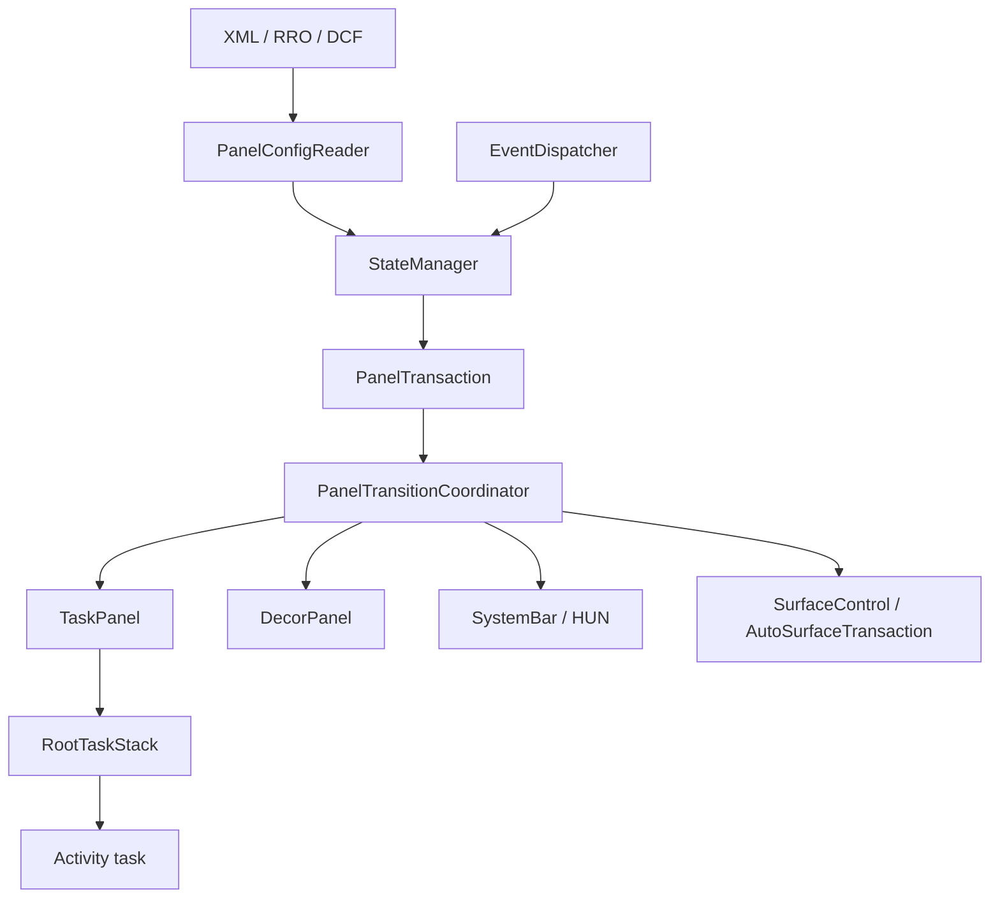
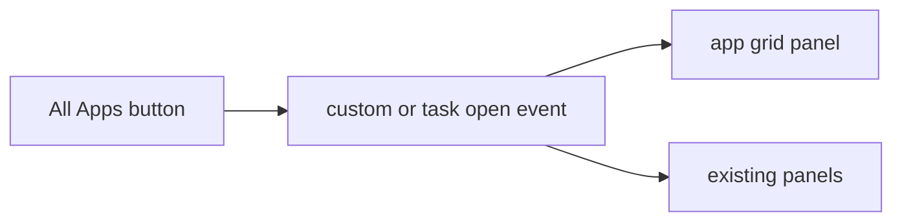
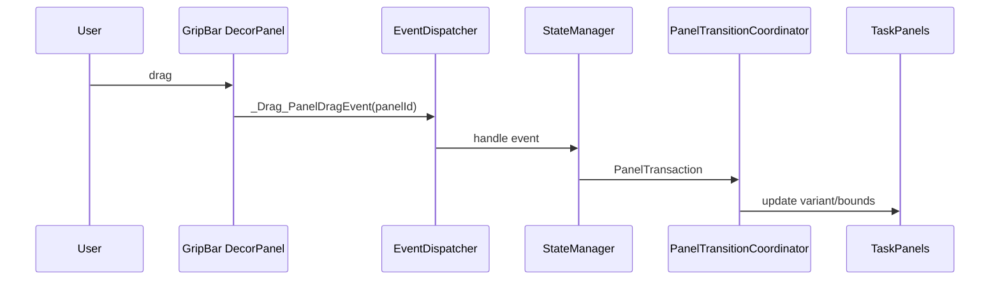

# AAOS17 Official ScalableUI Fact Check

## 目的

この文書は、Android Developers の ScalableUI 公式ページと AAOS17 source code を照合し、ScalableUI で確認できる事実、事実の詳細、そこからの設計上の想定を分けて整理する。

確認日: 2026-06-24

対象 source:

```text
android-17.0.0_r1
```

この文書では次の言葉を厳密に分ける。

| 区分 | 意味 |
| --- | --- |
| 事実 | 公式ページ、または AAOS17 source code で確認できた内容 |
| 詳細 | 事実を実装観点で分解した説明。source path や class / method を併記する |
| 想定 | 事実から設計上あり得ると考えられるが、そのまま標準機能として確認できていない内容 |

## Executive Summary

AAOS17 の ScalableUI は、CarSystemUI 内で panel、system bar、HUN、SUW、system event、transition、runtime panel update を扱う高度な windowing framework として確認できる。

一方で、公式ページと AAOS17 source code だけでは、ユーザー操作で任意の panel を自由に追加・削除・並べ替えし、その状態を永続化する完成済み editor 機能までは確認できない。動的な panel サイズ変更や panel update の仕組みは存在するが、任意 layout editor を実現する場合は、ScalableUI の event / transition / controller / panel update API を使った追加設計として扱うべきである。

重要な結論は以下である。

| 論点 | 判定 | 理由 |
| --- | --- | --- |
| Panel は Activity を直接持つか | 誤り | `TaskPanel` は `RootTaskStack` ベースの `Panel` 実装であり、Activity は task として入る |
| Runtime resize は存在するか | 事実 | 公式 ecosystem page が runtime panel size change に言及し、source に `PanelUpdateConsumer` / `ScalableUIPanelUpdateImpl` がある |
| 任意 panel 生成 editor が標準であるか | 未確認 | panel state の XML/DCF load と runtime update は確認できるが、任意 editor / persistence は確認できない |
| Drag 操作は可能か | 事実。ただし範囲限定 | `GripBarViewController` と sample XML が drag event を dispatch する。任意 layout editor 全体は別設計 |
| HUN panel は標準的に制御対象か | 事実 | Android 17+ 公式 page と `HunWindow` 実装で確認できる |
| System bar は XML だけで完結するか | 一部事実 | XML で配置や metadata を定義するが、View / Window は Dagger module 側の実装も関係する |
| SUW panel は標準的な組み込み対象か | 事実 | 公式 page と `SetupPanelController` / sample `suw_panel.xml` で確認できる |
| Event matching は曖昧一致か | 一部事実 | event id は一致が必要。token は transition 側で指定された全 token が一致する必要があり、余分な dispatch token は無視される |

## Source Map

| 領域 | 公式ページ | AAOS17 source evidence |
| --- | --- | --- |
| 概要 / sample experience | `https://source.android.com/docs/automotive/scalableui?hl=ja` | `packages/apps/Car/SystemUI/samples/README.md` |
| WM invariants | `https://source.android.com/docs/automotive/scalableui/wm-invariants?hl=ja` | `packages/apps/Car/SystemUI/src/com/android/systemui/car/wm/scalableui/PanelTransitionCoordinator.java` |
| System bars | `https://source.android.com/docs/automotive/scalableui/system-bars?hl=ja` | `packages/apps/Car/SystemUI/src/com/android/systemui/car/wm/scalableui/configuration/SystemBarConfiguration.kt`, `systemwindow/SystemBarWindowImpl.java` |
| HUN panels | `https://source.android.com/docs/automotive/scalableui/hun-panels?hl=ja` | `packages/apps/Car/SystemUI/src/com/android/systemui/car/wm/scalableui/systemwindow/HunWindow.kt`, `samples/DEWDCommon/res-common/xml/hun_panel.xml` |
| SUW integration | `https://source.android.com/docs/automotive/scalableui/suw-integrate?hl=ja` | `panel/controller/SetupPanelController.java`, `samples/DEWDCommon/res-common/xml/suw_panel.xml` |
| Event reference | `https://source.android.com/docs/automotive/scalableui/event-ref?hl=ja` | `systemevents/SystemEventConstants.java`, `EventDispatcher.java` |
| App ecosystem | `https://source.android.com/docs/automotive/scalableui/ecosystem?hl=ja` | `panel/panelupdates/PanelUpdateConsumer.java`, `panel/panelupdates/ScalableUIPanelUpdateImpl.java` |
| Panel XML loading | 公式ページ全体の前提 | `PanelConfigReader.java` |
| Task panel | 公式 Panel / TaskPanel 設定の前提 | `panel/TaskPanel.java` |
| Decor panel / drag | 公式 sample / dynamic UI の前提 | `panel/DecorPanel.java`, `view/GripBarViewController.java`, `samples/DEWDSplit/res/xml/grip_bar.xml` |

## Overall Architecture



事実:

- `PanelConfigReader.loadConfig()` は XML または DCF から `PanelState` を読み込み、`StateManager.reloadPanelState(panelStates)` に渡す。
- `TaskPanel` は `RootTaskStack` ベースの `Panel` 実装である。
- `DecorPanel` は `AutoDecor` ベースの `Panel` 実装であり、View または controller から decor view を得る。
- `EventDispatcher.executeEvents()` は `StateManager.handleEvents()` の結果を `PanelTransitionCoordinator.startTransition()` に渡す。

詳細:

| Class | Method | Source path | 確認できること |
| --- | --- | --- | --- |
| `PanelConfigReader` | `init()`, `loadConfig()` | `packages/apps/Car/SystemUI/src/com/android/systemui/car/wm/scalableui/PanelConfigReader.java` | panel pool を初期化し、XML/DCF を読み込んで state を reload する |
| `TaskPanel` | class definition | `packages/apps/Car/SystemUI/src/com/android/systemui/car/wm/scalableui/panel/TaskPanel.java` | `RootTaskStack` based implementation と明記される |
| `DecorPanel` | `inflateDecorView()`, `reset()` | `packages/apps/Car/SystemUI/src/com/android/systemui/car/wm/scalableui/panel/DecorPanel.java` | controller または role から View を作り、AutoDecor として載せる |
| `EventDispatcher` | `executeEvents()` | `packages/apps/Car/SystemUI/src/com/android/systemui/car/wm/scalableui/EventDispatcher.java` | event を panel transaction に変換し、transition coordinator に実行させる |

想定:

- XML/DCF と `StateManager` が中心なので、画面構成は「Activity を直接置く」ではなく「panel state と task stack を制御する」と捉えるのが安全である。
- 任意 editor を作る場合も、最終的には panel state / event / transition に落とし込む設計が必要になる。

## WM Invariants

公式ページで確認できる事実:

| 事実 | 詳細 | 実装上の影響 |
| --- | --- | --- |
| Activity launch 時点の configuration は安定しているべき | launch 後すぐに別 transition で再配置すると、互換性や CTS 観点で不利になる | app 起動直後に panel を二段階 resize する設計は避ける |
| Home に戻った通常 Activity は stopped になるべき | Home scene に戻ったのに背後の Activity が resumed のままになる設計は避ける | Home event で app panel を閉じる/隠すだけで lifecycle が期待通りか検証が必要 |
| 通常 Activity の上に独自装飾を重ねない | overlay が必要な場合は SystemOverlay inset または Android 15+ の DecorPanel を使う | toolbar、grip、scrim は DecorPanel 側に分離する |
| immersive request で app window を勝手に resize しない | immersive は system bar visibility などの扱いであり、app window 自体の resize trigger ではない | fullscreen 化はユーザー操作や明示 event に分ける |
| corner rounding は display level で扱うべき | 個別 app surface に任意 corner を付ける設計は注意が必要 | Decor / overlay と app surface の責務を分ける |

AAOS17 source details:

- `PanelTransitionCoordinator` が panel state change と animation の中心になる。
- `TaskPanel` は root task stack に対して launch behavior や bounds を扱うため、app lifecycle と WM transition の両方に影響する。

想定:

- 「panel を押しのける fullscreen animation」は、launch 直後の強制 resize ではなく、既に存在する panel variant を event で切り替える形にする方が WM invariants と整合しやすい。
- resize 中に app を frame-by-frame relayout すると負荷が高い可能性があるため、必要に応じて overlay / surface animation を併用する。

## System Bars

公式ページで確認できる事実:

| 事実 | 詳細 | 実装上の影響 |
| --- | --- | --- |
| System bar は XML config と Dagger module でカスタマイズする | `<SystemBar>` を RRO XML に定義し、View / Window 側は module 実装も関係する | XML だけで独自 View の全処理が完結するとは見なさない |
| `barZOrder` がある | HUN より上に出す場合は HUN より高い z-order が必要 | HUN と system bar の重なり設計が必要 |
| `hideForKeyboard` がある | keyboard 表示時に隠す system bar には `_System_Show_Panel` / `_System_Hide_Panel` transition が必要 | keyboard と panel state の同期が必要 |
| Bounds は display edge に接する必要がある | system bar としての制約がある | 中央 floating panel を system bar として扱うのは不適切 |

AAOS17 source details:

| Class | Method / property | Source path | 確認できること |
| --- | --- | --- | --- |
| `SystemBarConfiguration` | `zOrder`, `isAboveHun`, `isHiddenForKeyboard` | `packages/apps/Car/SystemUI/src/com/android/systemui/car/wm/scalableui/configuration/SystemBarConfiguration.kt` | XML metadata から system bar の type、z-order、keyboard 時の挙動を取得する |
| `SystemBarWindowImpl` | class definition | `packages/apps/Car/SystemUI/src/com/android/systemui/car/wm/scalableui/systemwindow/SystemBarWindowImpl.java` | system bar を SystemUiWindow として扱う |

想定:

- All apps のような中央 floating UI は system bar ではなく `TaskPanel` または `DecorPanel` として設計する方が自然である。
- HUN より上に system bar を出す設計は可能だが、通知 visibility、touch target、focus の検証が必要になる。

## HUN Panels

公式ページで確認できる事実:

| 事実 | 詳細 | 実装上の影響 |
| --- | --- | --- |
| Android 17+ で ScalableUI HUN panel が導入される | HUN の位置、背景 scrim、animation、container を RRO と framework で制御できる | 通知 content の描画そのものとは分けて、container の WM を設計できる |
| `<HunPanel>` を RRO で定義できる | bounds、gravity、visibility、background、transition を持てる | top / bottom 表示、scrim、show/hide animation を XML 化できる |
| 有効化は `window_states` に `@xml/hun_panel` を含める形 | RRO enable/disable で HUN panel の扱いを切り替える | overlay 適用後に SystemUI restart と runtime 検証が必要 |

AAOS17 source details:

| Class / file | Method / XML | Source path | 確認できること |
| --- | --- | --- | --- |
| `HunWindow` | `getLayoutParams()` | `packages/apps/Car/SystemUI/src/com/android/systemui/car/wm/scalableui/systemwindow/HunWindow.kt` | HUN window は panel update の bounds / gravity を使い、`TYPE_STATUS_BAR_SUB_PANEL` として layout params を作る |
| sample XML | `hun_panel.xml` | `packages/apps/Car/SystemUI/samples/DEWDCommon/res-common/xml/hun_panel.xml` | HUN panel の XML sample が存在する |

想定:

- 「通知が来たら必ず最前面に出す」こと自体は HUN の性質に近いが、他 panel に被らないことを常に保証するには、HUN bounds、z-order、system bar、scrim、dismiss gesture の組み合わせを設計・検証する必要がある。
- HUN content rendering は通知側の仕組みであり、ScalableUI HUN panel は主に container window の制御として扱う。

## SUW Panel

公式ページで確認できる事実:

| 事実 | 詳細 | 実装上の影響 |
| --- | --- | --- |
| advanced windowing の Home scene は特定 Activity ではなく複数 panel の組み合わせになり得る | blank Home Activity を visibility barrier として置くことが推奨される | Home role の Activity と ScalableUI panel scene を分ける |
| SUW は dedicated panel として構成できる | bounds / layer を持ち、比較的高い layer に置ける | 初期設定中だけ fullscreen 付近に出す設計が可能 |
| `_System_EnterSuwEvent` / `_System_ExitSuwEvent` を使う | SUW 進入/終了で panel state を切り替える | SUW 中の他 panel visibility を event で制御する |
| `TaskBehavior newTaskLaunchPolicy="REPARENT_TO_SOURCE"` の例がある | SUW task を source root task へ戻す意図を持つ | SUW 完了後の task routing を明示する |

AAOS17 source details:

| Class / file | Method / XML | Source path | 確認できること |
| --- | --- | --- | --- |
| `SetupPanelController` | `onPanelStateChanged()` observer | `packages/apps/Car/SystemUI/src/com/android/systemui/car/wm/scalableui/panel/controller/SetupPanelController.java` | SUW panel の visibility 変化を監視し、SUW in progress 中の挙動を扱う |
| `TaskPanel` | `trySetRootTaskLaunchBehavior()` | `packages/apps/Car/SystemUI/src/com/android/systemui/car/wm/scalableui/panel/TaskPanel.java` | `REPARENT_TO_SOURCE` を `CarActivityManager` の root task launch behavior に変換する |
| sample XML | `suw_panel.xml` | `packages/apps/Car/SystemUI/samples/DEWDCommon/res-common/xml/suw_panel.xml` | SUW panel の sample が存在する |

想定:

- SUW panel は「標準に存在する概念」と言える。ただし有効化、Home barrier、controller、package 名、user 状態は対象環境に合わせて確認する必要がある。

## Event Reference

公式ページで確認できる事実:

| 事実 | 詳細 | 実装上の影響 |
| --- | --- | --- |
| Event は state change / action の trigger | SystemUI 内外から intent で dispatch できる | button、vehicle state、app state を transition に接続できる |
| Event は ID と token を持つ | token 例: `panelId`, `component`, `package`, `panelToVariantId` | panel 単位、app component 単位で transition を分けられる |
| matching は event id 一致が前提 | transition filter の token は全て一致が必要 | token 設計が粗いと意図しない transition になる |
| dispatch 側の余分な token は無視される | transition 側で指定した token が一致すれば match | 汎用 event に追加情報を載せても既存 transition を壊しにくい |
| 1 event につき 1 transition が選ばれる | 最も具体的な match が選ばれる | 同じ event に複数 transition を重ねると優先順位設計が重要 |

AAOS17 source details:

| Class | Constant / method | Source path | 確認できること |
| --- | --- | --- | --- |
| `SystemEventConstants` | `_System_OnHomeEvent`, `_System_TaskOpenEvent`, `_System_TaskPanelEmptyEvent`, `_System_EnterSuwEvent`, `_System_ExitSuwEvent`, `_System_Show_Panel`, `_System_Hide_Panel` | `packages/apps/Car/SystemUI/src/com/android/systemui/car/wm/scalableui/systemevents/SystemEventConstants.java` | system event ID が定数化されている |
| `EventDispatcher` | `executeEvent()`, `executeEvents()`, `getTransaction()` | `packages/apps/Car/SystemUI/src/com/android/systemui/car/wm/scalableui/EventDispatcher.java` | event を `StateManager` に渡し、transition coordinator を起動する |
| sample XML | `_System_TaskOpenEvent`, `_System_TaskPanelEmptyEvent`, `_Drag_PanelDragEvent` | `packages/apps/Car/SystemUI/samples/DEWDSplit/res/xml/grip_bar.xml` | system event と custom drag event を XML transition に使う sample がある |

想定:

- app carousel、floating all apps、fullscreen toggle、drag resize は、標準 event と custom event を組み合わせることで実装方針を作れる。
- ただし、どの UI 操作でどの event を出すか、どの token を付けるか、状態をどこに保存するかは追加設計になる。

## Runtime Panel Update

公式ページで確認できる事実:

| 事実 | 詳細 | 実装上の影響 |
| --- | --- | --- |
| runtime panel size change はサポートされる | ただし app content adjustment には性能影響がある | resize 設計では frame-by-frame relayout を避ける工夫が必要 |
| overlay screen で視覚的な影響を下げられる | app relayout を直接見せない設計が可能 | drag 中は overlay / surface animation を使う設計が有効 |
| app 側は responsive UI、insets、immersive の扱いが必要 | panel サイズは固定 fullscreen 前提ではない | アプリの表示品質検証が必要 |

AAOS17 source details:

| Class | Method | Source path | 確認できること |
| --- | --- | --- | --- |
| `PanelUpdateConsumer` | `registerCallback()`, `getBounds()`, `getAlpha()`, `getInsets()`, `getGravity()` | `packages/apps/Car/SystemUI/src/com/android/systemui/car/wm/scalableui/panel/panelupdates/PanelUpdateConsumer.java` | panel update を購読し、最後に知られている bounds / alpha / insets / gravity を取得できる |
| `ScalableUIPanelUpdateImpl` | `registerCallback()` | `packages/apps/Car/SystemUI/src/com/android/systemui/car/wm/scalableui/panel/panelupdates/ScalableUIPanelUpdateImpl.java` | panel ごとの listener と last known state を保持し、新規 listener に state を replay する |
| sample XML | `KeyFrameVariant id="@+id/drag"` | `packages/apps/Car/SystemUI/samples/DEWDSplit/res/xml/grip_bar.xml` | drag 中の keyframe variant を定義する sample がある |
| `GripBarViewController` | `onClick()`, `getView()`, `dispatchEvent()` | `packages/apps/Car/SystemUI/src/com/android/systemui/car/wm/scalableui/view/GripBarViewController.java` | grip bar view から event を dispatch する controller がある |

想定:

- runtime panel update は「サイズ変更・visibility・alpha・insets などを通知/反映する下回り」として存在する。
- 任意 panel を新規作成して永続化する editor を作る場合は、XML/DCF の initial state、runtime update、custom controller、保存先の再読み込み方針を別途設計する必要がある。

## Dynamic Samples And Carousel

公式 overview で確認できる事実:

- sample experience として floating apps、conditional floating panels、split screen、interactive split screen with dynamic resizing、home app carousel が挙げられている。
- AAOS17 source には `packages/apps/Car/SystemUI/samples/` があり、DEWD 系 sample と minimized controls sample が存在する。

AAOS17 source details:

| Sample | Source path | 画面構成として確認できること |
| --- | --- | --- |
| `DEWDDynamic` | `packages/apps/Car/SystemUI/samples/DEWDDynamic` | `window_states` に app / map / widget / assistant / SUW / unreactive / system bar / HUN / projected panel を含む構成がある |
| `DEWDLand` | `packages/apps/Car/SystemUI/samples/DEWDLand` | landscape 用の app / map / widget panel 構成がある |
| `DEWDPort` | `packages/apps/Car/SystemUI/samples/DEWDPort` | app drawer、app grid、grip bar、background map、styled view などの panel 構成がある |
| `DEWDSplit` | `packages/apps/Car/SystemUI/samples/DEWDSplit` | map panel、app panel、grip bar、map overlay による split / drag sample がある |
| `MinimizedControlsDynamic` | `packages/apps/Car/SystemUI/samples/MinimizedControlsDynamic` | background map、floating app、top/bottom bar、minimized media/dialer controls の構成がある |
| SystemBar samples | `packages/apps/Car/SystemUI/samples/SystemBar*` | system bar 位置、丸め、透過、persistency の RRO sample がある |

想定:

- 「ホーム画面アプリのカルーセル」は、公式 overview が sample experience として存在を示す。ただし、現時点の確認範囲では carousel をそのまま利用できる単一完成 module としては特定していない。
- 実装する場合は、carousel UI を `DecorPanel` または task を持つ panel として定義し、選択操作から `_System_TaskOpenEvent` または custom event を dispatch して対象 `TaskPanel` の variant / task routing を制御する設計が候補になる。

## Design Patterns Confirmed By Facts

### Floating All Apps

事実:

- floating panel は ScalableUI の sample experience として挙げられている。
- `TaskPanel` は app task を root task stack に入れる。
- event / transition によって panel visibility、bounds、layer を切り替えられる。

想定設計:



- All apps は中央 floating `TaskPanel` として定義する。
- show event で All apps panel を高 layer / visible にする。
- background panel は閉じず、必要なら scrim DecorPanel を出す。
- icon 再タップまたは外側 tap は hide event に変換する。

注意:

- system bar として扱うのは不適切。system bar は display edge に接する制約があるため。

### Drag Resize / Reorder

事実:

- `GripBarViewController` と `DEWDSplit` sample は drag event と keyframe variant を持つ。
- runtime panel size change と panel update callback は存在する。

想定設計:



- drag resize は DecorPanel の grip が custom event を出し、複数 panel の variant を同期させる形が現実的である。
- 並べ替えを行う場合は、panel state の切り替えに加えて、どの app/task をどの panel に割り当てるかを保存する追加設計が必要になる。

未確認:

- 任意の panel add/delete/reorder をそのまま提供する標準 UI は確認できていない。

### Existing App To Fullscreen

事実:

- app task は `TaskPanel` 内の root task stack で扱われる。
- event により panel variant を切り替えられる。
- WM invariants は launch 直後の二段階 transition や immersive による勝手な resize を避けることを求める。

想定設計:

- panel に既に存在する app を再選択したときは、同じ task を維持しつつ target panel の variant を fullscreen 相当に切り替える。
- 他 panel は閉じるのではなく、押しのけ後の variant に移す。
- Home event で fullscreen variant から直前の home layout variant に戻す。

未確認:

- 「直前 layout の履歴保存」は ScalableUI の標準 event/transition だけで完結するとは確認できていない。必要なら controller 側で直前 state を保持する。

## Corrected Understanding

以前の整理で「runtime panel 生成や drag resize は標準だけでは完結しない」とした点は、次のように更新する。

| 項目 | 更新後の理解 |
| --- | --- |
| Runtime resize | 標準機能として存在する。公式 page と `PanelUpdateConsumer` / sample drag XML で確認できる |
| Drag interaction | sample と controller は存在する。ただし layout editor 全体とは別 |
| Runtime panel add/delete | 標準の完成済み editor としては未確認。XML/DCF initial state と runtime update の組み合わせで設計する領域 |
| App assignment persistence | 標準だけで完結するとは未確認。controller または別 storage 設計が必要 |
| HUN / SUW / SystemBar | AAOS17 ScalableUI の明確な制御対象として扱える |

## Verification Checklist

実装・検証時は以下を確認する。

| 観点 | 確認方法 |
| --- | --- |
| panel 定義が読み込まれているか | `dumpsys activity service SystemUIService` または ScalableUI dumpsys を確認 |
| RRO が有効か | `cmd overlay list --user 0` |
| event が transition に match するか | event id と token の組み合わせを XML と照合 |
| HUN が想定 layer / bounds で出るか | 通知発生、swipe dismiss、scrim、system bar との重なりを見る |
| SUW panel が Home と競合しないか | setup 状態、Home intent、user unlock 前後を見る |
| drag resize が app relayout を過度に起こしていないか | frame drop、jank、app content resize の見え方を見る |
| Home 復帰で lifecycle が合うか | fullscreen / floating app から Home に戻り、Activity stopped state と panel state を確認 |

## Conclusion

AAOS17 の公式 ScalableUI 文書と source code を合わせると、ScalableUI は単なる静的XMLレイアウトではなく、event、transition、panel update、system window を含む高度な windowing framework であることが確認できる。

ただし、公式 page にある dynamic / carousel / drag の表現は、そのまま任意編集機能が完成済みで提供されることを意味しない。実装判断では、確認済みの事実を次のように分ける必要がある。

- 標準事実: XML/DCF panel、TaskPanel、DecorPanel、HUN、SUW、SystemBar、Event、Transition、runtime panel update。
- 標準 sample: DEWD 系、minimized controls、system bar RRO、grip bar drag。
- 追加設計: 任意 panel editor、app assignment persistence、直前 layout history、carousel の具体 UI、複数 app の配置保存。

この切り分けを守れば、公式機能を過大評価せずに、AAOS17 ScalableUI の実力を説明できる。
