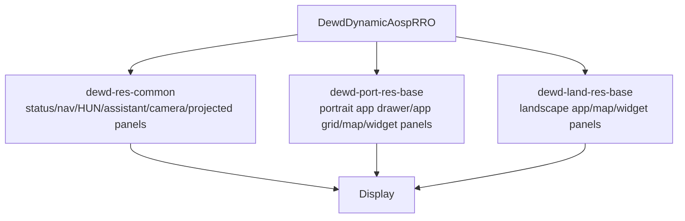
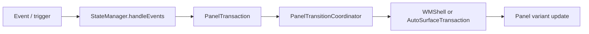
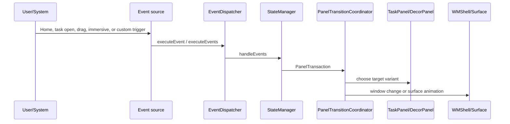

# DEWDDynamic ScalableUI Demo Analysis

## 位置づけ

orientation や resource qualifier により window_states を切り替える DEWD dynamic 構成。

- Source: `packages/apps/Car/SystemUI/samples/DEWDDynamic`
- 種別: `systemui-sample`
- Build module: `DewdDynamicAospRRO`
- Certificate: `platform`
- Partition: `system_ext`

## 全体構成

`DEWDDynamic` 自身の directory には panel XML は存在せず、`res/values/config.xml` と `res/values-port/config.xml` で読み込む `window_states` / resource の組み合わせを切り替える。画面を構成する panel 実体は `static_libs` の `dewd-res-common`、`dewd-port-res-base`、`dewd-land-res-base` から供給される。



`DEWDDynamic` directory 単体では TaskPanel は 0 個、DecorPanel は 0 個、SystemWindow は 0 個確認できる。これは panel が存在しないという意味ではなく、panel 定義が依存 resource library 側に分離されているという意味である。

## Panel 一覧

この RRO 単体で追加する panel はない。実際の画面構成は、依存する `DEWDCommon` / `DEWDPort` / `DEWDLand` の panel を合わせて読む。

| Panel | 種類 | defaultVariant | role | controller | variants | keyframes | source |
| --- | --- | --- | --- | --- | --- | --- | --- |

## 画面イメージ

```text
+--------------------------------------------------+
| status / top panels / HUN                         |
|                                                  |
| map or background panel                           |
|   + widget / controls / app grid / floating app   |
|                                                  |
| bottom bar or minimized controls panels           |
+--------------------------------------------------+
```

## 主な画面遷移とトリガー



この demo では XML 上で 0 個の Transition が確認できる。主なものは以下。

| Panel | from | trigger | to |
| --- | --- | --- | --- |

## Runtime の動き



実際の処理経路は demo 固有 XML の Transition に従う。`TaskPanel` の bounds や visibility が変わる場合は Window State 変更になり、`DecorPanel` の alpha / overlay / grip 表示は direct surface animation 寄りに処理される。

## Source 上の実装ポイント

| 処理 | class / method | path |
| --- | --- | --- |
| XML 読み込み | `PanelConfigReader.loadConfig() / loadFromXml()` | `packages/apps/Car/SystemUI/src/com/android/systemui/car/wm/scalableui/PanelConfigReader.java` |
| PanelState 生成 | `XmlModelLoader.createPanelState(int)` | `packages/apps/Car/systemlibs/car-scalable-ui-lib/src/com/android/car/scalableui/loader/xml/XmlModelLoader.java` |
| event 評価 | `StateManager.handleEvents(...)` | `packages/apps/Car/systemlibs/car-scalable-ui-lib/src/com/android/car/scalableui/manager/StateManager.java` |
| transition 実行 | `PanelTransitionCoordinator.startTransition(...)` | `packages/apps/Car/SystemUI/src/com/android/systemui/car/wm/scalableui/PanelTransitionCoordinator.java` |
| TaskPanel root task | `TaskPanel.init()` | `packages/apps/Car/SystemUI/src/com/android/systemui/car/wm/scalableui/panel/TaskPanel.java` |
| root task 作成 | `AutoTaskStackControllerImpl.createRootTaskStack(...)` | `packages/services/Car/libs/car-wm-shell-lib/src/com/android/wm/shell/automotive/AutoTaskStackControllerImpl.kt` |

## 素の AAOS17 emulator への取り込み可否

可能。ただし RRO を build/install/enable するだけでは、参照 Activity、feature flag、required system property、system bar config の整合確認が必要。

想定手順:

1. `source build/envsetup.sh` と `lunch sdk_car_x86_64-trunk_staging-userdebug` を実行する。
2. `m DewdDynamicAospRRO` で RRO module を build する。複数 module がある場合は `DewdDynamicAospRRO` を確認する。
3. image に含める場合は `PRODUCT_PACKAGES += <module>` に追加する。手動確認なら APK を install して `cmd overlay enable --user 0 <package>` を実行する。
4. `cmd overlay list`、logcat、`dumpsys window`、screenshot で overlay と panel state を確認する。
5. system bar / immersive / user 10 などを扱う sample は、必要な user に overlay を有効化して SystemUI を restart する。

取り込み時に不足しやすい情報・software:

- static libs: dewd-res-common, dewd-port-res-base, dewd-land-res-base, com_android_car_scalableui_flags_lib
- flags packages: com_android_car_scalableui_flags
- required system property: car.dewd.config=dynamic
- uses system_ext platform-signed RRO modules and DEWD resource libraries

## Source files
