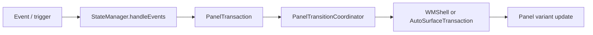
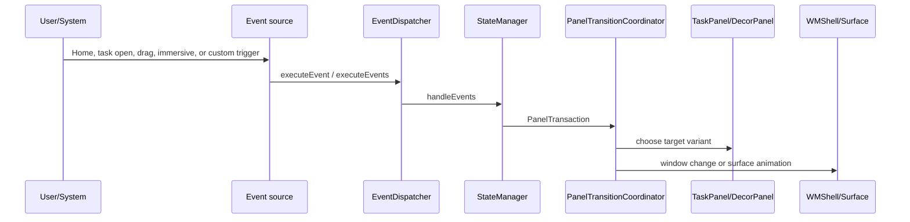

# DEWDPort ScalableUI Demo Analysis

## 位置づけ

portrait 向けに app drawer、app grid、map、widget、calm mode、styled view を panel 化する構成。

- Source: `packages/apps/Car/SystemUI/samples/DEWDPort`
- 種別: `systemui-sample`
- Build module: `dewd-port-res-base, DewdPortAospRRO`
- Certificate: `platform`
- Partition: `system_ext`

## 全体構成

```mermaid
flowchart TB
    Display[Display]
    Display --> app_panel["TaskPanel: app_panel<br/>default @id/closed"]
    Display --> panel_app_grid["TaskPanel: panel_app_grid<br/>default @id/closed"]
    Display --> panel_app_styled_view["TaskPanel: panel_app_styled_view<br/>default @id/closed"]
    Display --> map_panel["TaskPanel: map_panel<br/>default @id/opened"]
    Display --> panel_calm_mode["TaskPanel: panel_calm_mode<br/>default @id/closed"]
    Display --> widget_panel["TaskPanel: widget_panel<br/>default @id/opened"]
    Display --> decor_grip_app["DecorPanel: decor_grip_app<br/>default @id/closed"]
    Display --> decor_grip["DecorPanel: decor_grip<br/>default @id/closed"]
    Display --> decor_app_styled_view_background["DecorPanel: decor_app_styled_view_background<br/>default @id/closed"]
    Display --> decor_app_styled_view_scrim["DecorPanel: decor_app_styled_view_scrim<br/>default @id/closed"]
```



TaskPanel は 6 個、DecorPanel は 4 個、SystemWindow は 0 個確認できる。

## Panel 一覧

| Panel | 種類 | defaultVariant | role | controller | variants | keyframes | source |
| --- | --- | --- | --- | --- | --- | --- | --- |
| `app_panel` | `TaskPanel` | `@id/closed` | `@string/default_config` | `-` | `@+id/base`, `@+id/opened`, `@+id/closed`, `@+id/suw_open`, `@+id/suw_close`, `@+id/immersive` | `@+id/drag` | `packages/apps/Car/SystemUI/samples/DEWDPort/res/xml/app_drawer_panel.xml` |
| `decor_grip_app` | `DecorPanel` | `@id/closed` | `-` | `@xml/app_grid_grip_bar_controller` | `@+id/base`, `@+id/opened`, `@+id/closed`, `@+id/suw` | `@+id/drag` | `packages/apps/Car/SystemUI/samples/DEWDPort/res/xml/app_grid_grip_bar_panel.xml` |
| `panel_app_grid` | `TaskPanel` | `@id/closed` | `-` | `@xml/app_grid_panel_controller` | `@+id/base`, `@+id/opened`, `@+id/closed` | `@+id/drag` | `packages/apps/Car/SystemUI/samples/DEWDPort/res/xml/app_grid_panel.xml` |
| `decor_grip` | `DecorPanel` | `@id/closed` | `-` | `@xml/app_grip_bar_controller` | `@+id/base`, `@+id/opened`, `@+id/closed`, `@+id/suw` | `@+id/drag` | `packages/apps/Car/SystemUI/samples/DEWDPort/res/xml/app_grip_bar_panel.xml` |
| `decor_app_styled_view_background` | `DecorPanel` | `@id/closed` | `-` | `@xml/app_styled_view_background_controller` | `@+id/base`, `@+id/opened`, `@+id/closed` | - | `packages/apps/Car/SystemUI/samples/DEWDPort/res/xml/app_styled_view_background.xml` |
| `panel_app_styled_view` | `TaskPanel` | `@id/closed` | `-` | `@xml/app_styled_view_panel_controller` | `@+id/base`, `@+id/opened`, `@+id/closed` | - | `packages/apps/Car/SystemUI/samples/DEWDPort/res/xml/app_styled_view_panel.xml` |
| `decor_app_styled_view_scrim` | `DecorPanel` | `@id/closed` | `-` | `@xml/app_styled_view_scrim_controller` | `@+id/base`, `@+id/opened`, `@+id/closed` | - | `packages/apps/Car/SystemUI/samples/DEWDPort/res/xml/app_styled_view_scrim.xml` |
| `map_panel` | `TaskPanel` | `@id/opened` | `-` | `@xml/map_panel_controller` | `@+id/base`, `@+id/opened`, `@+id/opened_overlap_app_grid`, `@+id/closed`, `@+id/suw`, `@+id/userswitch`, `@+id/camera_opened`, `@+id/keyguard_opened`, `@+id/camera_appgrid` | - | `packages/apps/Car/SystemUI/samples/DEWDPort/res/xml/background_map_panel.xml` |
| `panel_calm_mode` | `TaskPanel` | `@id/closed` | `-` | `@xml/calm_mode_panel_controller` | `@+id/base`, `@+id/opened`, `@+id/closed`, `@+id/suw` | - | `packages/apps/Car/SystemUI/samples/DEWDPort/res/xml/calm_mode_panel.xml` |
| `widget_panel` | `TaskPanel` | `@id/opened` | `-` | `@xml/widget_panel_controller` | `@+id/base`, `@+id/opened`, `@+id/closed`, `@+id/userswitch`, `@+id/keyguard_opened`, `@+id/suw` | - | `packages/apps/Car/SystemUI/samples/DEWDPort/res/xml/widget_bar_panel.xml` |

## 画面イメージ

```text
+--------------------------------------------------+
| status / top panels / HUN                         |
|                                                  |
| map or background panel                           |
|   + widget / controls / app grid / floating app   |
|                                                  |
| bottom bar or minimized controls panels           |
+--------------------------------------------------+
```

## 主な画面遷移とトリガー



この demo では XML 上で 75 個の Transition が確認できる。主なものは以下。

| Panel | from | trigger | to |
| --- | --- | --- | --- |
| `app_panel` | `@id/opened` | `_System_TaskOpenEvent(panel=panel_app_grid), _System_TaskOpenEvent(panel=panel_calm_mode), _System_TaskPanelEmptyEvent(panel=app_panel), _System_BeforeUserSwitch, _System_OnHomeEvent` | `@id/closed` |
| `app_panel` | `-` | `_System_TaskOpenEvent(panel=suw_panel)` | `@id/closed` |
| `app_panel` | `@id/closed` | `_System_TaskOpenEvent(panel=app_panel)` | `@id/opened` |
| `app_panel` | `@id/suw_close` | `_System_TaskOpenEvent(panel=app_panel)` | `@id/suw_open` |
| `app_panel` | `@id/suw_open` | `_System_TaskCloseEvent(panel=app_panel), _System_TaskPanelEmptyEvent(panel=app_panel)` | `@id/suw_close` |
| `app_panel` | `-` | `_System_EnterSuwEvent, _Drag_PanelDragEvent(panelId=decor_grip)` | `@id/suw_close` |
| `app_panel` | `-` | `_Drag_PanelCloseEvent(panelId=decor_grip)` | `@id/closed` |
| `app_panel` | `-` | `_Drag_PanelOpenEvent(panelId=decor_grip)` | `@id/opened` |
| `app_panel` | `-` | `_System_ExitImmersiveMode(panel=app_panel)` | `@id/opened` |
| `app_panel` | `-` | `_System_EnterImmersiveMode(panel=app_panel)` | `@id/immersive` |
| `app_panel` | `@id/immersive` | `_System_TaskOpenEvent(panel=panel_app_grid), _System_TaskOpenEvent(panel=panel_calm_mode), _System_TaskPanelEmptyEvent(panel=app_panel), _System_BeforeUserSwitch, _System_OnHomeEvent` | `@id/closed` |
| `app_panel` | `@id/immersive` | `_System_TaskOpenEvent(panel=app_panel)` | `@id/opened` |
| `decor_grip_app` | `@id/opened` | `_System_TaskOpenEvent(panelId=app_panel), _Drag_PanelDragEvent(panelId=decor_grip_app)` | `@id/closed` |
| `decor_grip_app` | `-` | `_Drag_PanelCloseEvent(panelId=decor_grip_app)` | `@id/closed` |
| `decor_grip_app` | `-` | `_Drag_PanelOpenEvent(panelId=decor_grip_app)` | `@id/opened` |
| `panel_app_grid` | `@id/closed` | `_System_TaskOpenEvent(panelId=panel_app_grid), _Drag_PanelDragEvent(panelId=decor_grip_app)` | `@id/opened` |
| `panel_app_grid` | `-` | `_Drag_PanelCloseEvent(panelId=decor_grip_app)` | `@id/closed` |
| `panel_app_grid` | `-` | `_Drag_PanelOpenEvent(panelId=decor_grip_app)` | `@id/opened` |
| `decor_grip` | `@id/opened` | `_System_TaskOpenEvent(panelId=panel_app_grid), _Drag_PanelDragEvent(panelId=decor_grip)` | `@id/closed` |
| `decor_grip` | `-` | `_Drag_PanelCloseEvent(panelId=decor_grip)` | `@id/closed` |
| `decor_grip` | `-` | `_Drag_PanelOpenEvent(panelId=decor_grip)` | `@id/opened` |
| `decor_app_styled_view_background` | `-` | `_System_TaskOpenEvent(panelId=panel_app_styled_view)` | `@id/opened` |
| `decor_app_styled_view_background` | `-` | `_System_TaskOpenEvent(panelId=panel_app_grid)` | `@id/closed` |
| `decor_app_styled_view_background` | `-` | `_System_TaskOpenEvent(panelId=app_panel)` | `@id/closed` |
| `decor_app_styled_view_background` | `-` | `_System_TaskCloseEvent(panelId=panel_app_styled_view)` | `@id/closed` |
| `decor_app_styled_view_background` | `-` | `_System_OnHomeEvent` | `@id/closed` |
| `decor_app_styled_view_background` | `-` | `_AppStyleView_CloseEvent` | `@id/closed` |
| `panel_app_styled_view` | `@id/closed` | `_System_TaskOpenEvent(panelId=panel_app_styled_view)` | `@id/opened` |
| `panel_app_styled_view` | `@id/opened` | `_System_TaskOpenEvent(panelId=panel_app_grid)` | `@id/closed` |
| `panel_app_styled_view` | `@id/opened` | `_System_TaskOpenEvent(panelId=app_panel)` | `@id/closed` |

他に 45 個の transition がある。詳細は各 XML を参照。

## Runtime の動き



実際の処理経路は demo 固有 XML の Transition に従う。`TaskPanel` の bounds や visibility が変わる場合は Window State 変更になり、`DecorPanel` の alpha / overlay / grip 表示は direct surface animation 寄りに処理される。

## Source 上の実装ポイント

| 処理 | class / method | path |
| --- | --- | --- |
| XML 読み込み | `PanelConfigReader.loadConfig() / loadFromXml()` | `packages/apps/Car/SystemUI/src/com/android/systemui/car/wm/scalableui/PanelConfigReader.java` |
| PanelState 生成 | `XmlModelLoader.createPanelState(int)` | `packages/apps/Car/systemlibs/car-scalable-ui-lib/src/com/android/car/scalableui/loader/xml/XmlModelLoader.java` |
| event 評価 | `StateManager.handleEvents(...)` | `packages/apps/Car/systemlibs/car-scalable-ui-lib/src/com/android/car/scalableui/manager/StateManager.java` |
| transition 実行 | `PanelTransitionCoordinator.startTransition(...)` | `packages/apps/Car/SystemUI/src/com/android/systemui/car/wm/scalableui/PanelTransitionCoordinator.java` |
| TaskPanel root task | `TaskPanel.init()` | `packages/apps/Car/SystemUI/src/com/android/systemui/car/wm/scalableui/panel/TaskPanel.java` |
| root task 作成 | `AutoTaskStackControllerImpl.createRootTaskStack(...)` | `packages/services/Car/libs/car-wm-shell-lib/src/com/android/wm/shell/automotive/AutoTaskStackControllerImpl.kt` |

## 素の AAOS17 emulator への取り込み可否

可能。ただし RRO を build/install/enable するだけでは、参照 Activity、feature flag、required system property、system bar config の整合確認が必要。

想定手順:

1. `source build/envsetup.sh` と `lunch sdk_car_x86_64-trunk_staging-userdebug` を実行する。
2. `m DewdPortAospRRO` で RRO module を build する。複数 module がある場合は `dewd-port-res-base, DewdPortAospRRO` を確認する。
3. image に含める場合は `PRODUCT_PACKAGES += <module>` に追加する。手動確認なら APK を install して `cmd overlay enable --user 0 <package>` を実行する。
4. `cmd overlay list`、logcat、`dumpsys window`、screenshot で overlay と panel state を確認する。
5. system bar / immersive / user 10 などを扱う sample は、必要な user に overlay を有効化して SystemUI を restart する。

取り込み時に不足しやすい情報・software:

- static libs: dewd-res-common, com_android_car_scalableui_flags_lib
- flags packages: com_android_car_scalableui_flags
- required system property: car.dewd.config=port
- uses system_ext platform-signed RRO modules and DEWD resource libraries

## Source files

- `packages/apps/Car/SystemUI/samples/DEWDPort/res/xml/app_drawer_panel.xml`
- `packages/apps/Car/SystemUI/samples/DEWDPort/res/xml/app_grid_grip_bar_panel.xml`
- `packages/apps/Car/SystemUI/samples/DEWDPort/res/xml/app_grid_panel.xml`
- `packages/apps/Car/SystemUI/samples/DEWDPort/res/xml/app_grip_bar_panel.xml`
- `packages/apps/Car/SystemUI/samples/DEWDPort/res/xml/app_styled_view_background.xml`
- `packages/apps/Car/SystemUI/samples/DEWDPort/res/xml/app_styled_view_panel.xml`
- `packages/apps/Car/SystemUI/samples/DEWDPort/res/xml/app_styled_view_scrim.xml`
- `packages/apps/Car/SystemUI/samples/DEWDPort/res/xml/background_map_panel.xml`
- `packages/apps/Car/SystemUI/samples/DEWDPort/res/xml/calm_mode_panel.xml`
- `packages/apps/Car/SystemUI/samples/DEWDPort/res/xml/widget_bar_panel.xml`
