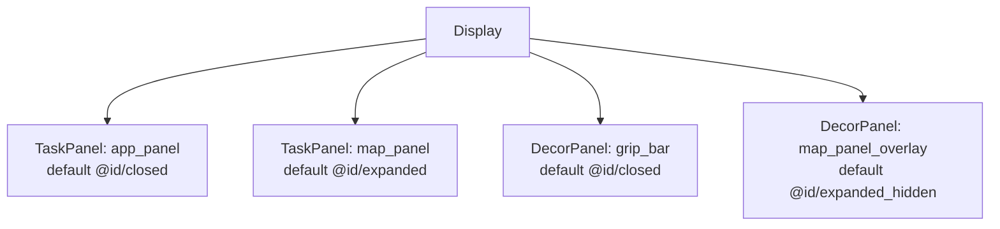
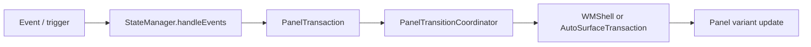
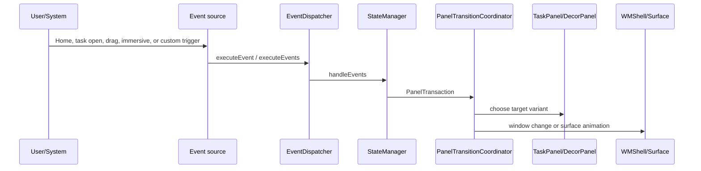

# DEWDSplit ScalableUI Demo Analysis

## 位置づけ

app_panel と map_panel を split 表示し、grip_bar で drag / immersive 遷移する構成。

- Source: `packages/apps/Car/SystemUI/samples/DEWDSplit`
- 種別: `systemui-sample`
- Build module: `dewd-split-res-base, DewdSplitAospRRO`
- Certificate: `platform`
- Partition: `system_ext`

## 全体構成



TaskPanel は 2 個、DecorPanel は 2 個、SystemWindow は 0 個確認できる。

## Panel 一覧

| Panel | 種類 | defaultVariant | role | controller | variants | keyframes | source |
| --- | --- | --- | --- | --- | --- | --- | --- |
| `app_panel` | `TaskPanel` | `@id/closed` | `@string/default_config` | `-` | `@+id/base`, `@+id/opened`, `@+id/immersive`, `@+id/closed` | `@+id/drag` | `packages/apps/Car/SystemUI/samples/DEWDSplit/res/xml/app_panel.xml` |
| `grip_bar` | `DecorPanel` | `@id/closed` | `-` | `@xml/grip_bar_controller` | `@+id/opened`, `@+id/closed` | `@+id/drag` | `packages/apps/Car/SystemUI/samples/DEWDSplit/res/xml/grip_bar.xml` |
| `map_panel` | `TaskPanel` | `@id/expanded` | `-` | `@xml/map_panel_controller` | `@+id/collapsed`, `@+id/expanded` | `@+id/drag` | `packages/apps/Car/SystemUI/samples/DEWDSplit/res/xml/map_panel.xml` |
| `map_panel_overlay` | `DecorPanel` | `@id/expanded_hidden` | `-` | `@xml/map_panel_overlay_controller` | `@+id/base`, `@+id/collapsed`, `@+id/expanded`, `@+id/collapsed_hidden`, `@+id/expanded_hidden` | `@+id/drag` | `packages/apps/Car/SystemUI/samples/DEWDSplit/res/xml/map_panel_overlay.xml` |

## 画面イメージ

```text
+--------------------------------------------------+
| map side / background             | app_panel     |
|                                   |               |
|                grip_bar / overlay between panels |
| drag events move split or close/open app panel    |
+--------------------------------------------------+
```

## 主な画面遷移とトリガー



この demo では XML 上で 22 個の Transition が確認できる。主なものは以下。

| Panel | from | trigger | to |
| --- | --- | --- | --- |
| `app_panel` | `@id/closed` | `_System_TaskOpenEvent(panel=app_panel)` | `@id/opened` |
| `app_panel` | `-` | `_System_TaskPanelEmptyEvent(panel=app_panel), _System_OnHomeEvent` | `@id/closed` |
| `app_panel` | `-` | `_Drag_PanelDragEvent(panelId=grip_bar)` | `@id/drag` |
| `app_panel` | `-` | `_Drag_PanelOpenEvent(panelId=grip_bar)` | `@id/opened` |
| `app_panel` | `-` | `_Drag_PanelCloseEvent(panelId=grip_bar)` | `@id/closed` |
| `app_panel` | `-` | `_System_ExitImmersiveMode(panel=app_panel)` | `@id/opened` |
| `app_panel` | `-` | `_System_EnterImmersiveMode(panel=app_panel)` | `@id/immersive` |
| `grip_bar` | `@id/closed` | `_System_TaskOpenEvent(panel=app_panel)` | `@id/opened` |
| `grip_bar` | `-` | `_System_TaskPanelEmptyEvent(panel=app_panel), _System_OnHomeEvent` | `@id/closed` |
| `grip_bar` | `-` | `_Drag_PanelDragEvent(panelId=grip_bar)` | `@id/drag` |
| `grip_bar` | `-` | `_Drag_PanelOpenEvent(panelId=grip_bar)` | `@id/opened` |
| `grip_bar` | `-` | `_Drag_PanelCloseEvent(panelId=grip_bar)` | `@id/closed` |
| `map_panel` | `@id/expanded` | `_System_TaskOpenEvent(panel=app_panel)` | `@id/collapsed` |
| `map_panel` | `-` | `_System_TaskPanelEmptyEvent(panel=app_panel), _System_OnHomeEvent` | `@id/expanded` |
| `map_panel` | `-` | `_Drag_PanelDragEvent(panelId=grip_bar)` | `@id/drag` |
| `map_panel` | `-` | `_Drag_PanelOpenEvent(panelId=grip_bar)` | `@id/collapsed` |
| `map_panel` | `-` | `_Drag_PanelCloseEvent(panelId=grip_bar)` | `@id/expanded` |
| `map_panel_overlay` | `@id/expanded_hidden` | `_System_TaskOpenEvent(panel=app_panel)` | `@id/collapsed` |
| `map_panel_overlay` | `@id/collapsed_hidden` | `_System_TaskPanelEmptyEvent(panel=app_panel), _System_OnHomeEvent` | `@id/expanded` |
| `map_panel_overlay` | `-` | `_System_OnAnimationEndEvent(panelId=map_panel_overlay;panelToVariantId=collapsed), _Drag_PanelDragEvent(panelId=grip_bar)` | `@id/collapsed_hidden` |
| `map_panel_overlay` | `-` | `_Drag_PanelOpenEvent(panelId=grip_bar)` | `@id/collapsed_hidden` |
| `map_panel_overlay` | `-` | `_Drag_PanelCloseEvent(panelId=grip_bar)` | `@id/expanded_hidden` |

## Runtime の動き



実際の処理経路は demo 固有 XML の Transition に従う。`TaskPanel` の bounds や visibility が変わる場合は Window State 変更になり、`DecorPanel` の alpha / overlay / grip 表示は direct surface animation 寄りに処理される。

## Source 上の実装ポイント

| 処理 | class / method | path |
| --- | --- | --- |
| XML 読み込み | `PanelConfigReader.loadConfig() / loadFromXml()` | `packages/apps/Car/SystemUI/src/com/android/systemui/car/wm/scalableui/PanelConfigReader.java` |
| PanelState 生成 | `XmlModelLoader.createPanelState(int)` | `packages/apps/Car/systemlibs/car-scalable-ui-lib/src/com/android/car/scalableui/loader/xml/XmlModelLoader.java` |
| event 評価 | `StateManager.handleEvents(...)` | `packages/apps/Car/systemlibs/car-scalable-ui-lib/src/com/android/car/scalableui/manager/StateManager.java` |
| transition 実行 | `PanelTransitionCoordinator.startTransition(...)` | `packages/apps/Car/SystemUI/src/com/android/systemui/car/wm/scalableui/PanelTransitionCoordinator.java` |
| TaskPanel root task | `TaskPanel.init()` | `packages/apps/Car/SystemUI/src/com/android/systemui/car/wm/scalableui/panel/TaskPanel.java` |
| root task 作成 | `AutoTaskStackControllerImpl.createRootTaskStack(...)` | `packages/services/Car/libs/car-wm-shell-lib/src/com/android/wm/shell/automotive/AutoTaskStackControllerImpl.kt` |

## 素の AAOS17 emulator への取り込み可否

可能。ただし RRO を build/install/enable するだけでは、参照 Activity、feature flag、required system property、system bar config の整合確認が必要。

想定手順:

1. `source build/envsetup.sh` と `lunch sdk_car_x86_64-trunk_staging-userdebug` を実行する。
2. `m DewdSplitAospRRO` で RRO module を build する。複数 module がある場合は `dewd-split-res-base, DewdSplitAospRRO` を確認する。
3. image に含める場合は `PRODUCT_PACKAGES += <module>` に追加する。手動確認なら APK を install して `cmd overlay enable --user 0 <package>` を実行する。
4. `cmd overlay list`、logcat、`dumpsys window`、screenshot で overlay と panel state を確認する。
5. system bar / immersive / user 10 などを扱う sample は、必要な user に overlay を有効化して SystemUI を restart する。

取り込み時に不足しやすい情報・software:

- static libs: dewd-res-common, com_android_car_scalableui_flags_lib
- flags packages: com_android_car_scalableui_flags
- required system property: car.dewd.config=split
- uses system_ext platform-signed RRO modules and DEWD resource libraries

## Source files

- `packages/apps/Car/SystemUI/samples/DEWDSplit/res/xml/app_panel.xml`
- `packages/apps/Car/SystemUI/samples/DEWDSplit/res/xml/grip_bar.xml`
- `packages/apps/Car/SystemUI/samples/DEWDSplit/res/xml/map_panel.xml`
- `packages/apps/Car/SystemUI/samples/DEWDSplit/res/xml/map_panel_overlay.xml`
