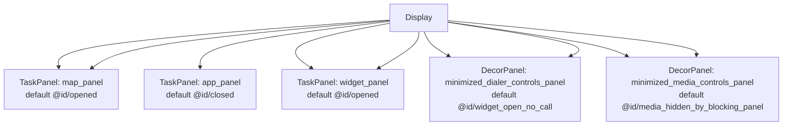
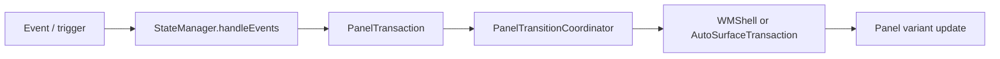
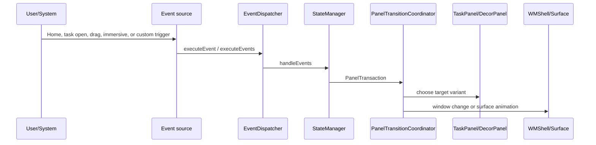

# MinimizedControlsDynamic ScalableUI Demo Analysis

## 位置づけ

floating app、map、widget、minimized media / dialer controls、bar panels を ScalableUI panel 化する構成。

- Source: `packages/apps/Car/SystemUI/samples/MinimizedControlsDynamic`
- 種別: `systemui-sample`
- Build module: `MinimizedControlsDynamicRRO`
- Certificate: `platform`
- Partition: `system_ext`

## 全体構成



TaskPanel は 5 個、DecorPanel は 4 個、SystemWindow は 0 個確認できる。

## Panel 一覧

| Panel | 種類 | defaultVariant | role | controller | variants | keyframes | source |
| --- | --- | --- | --- | --- | --- | --- | --- |
| `map_panel` | `TaskPanel` | `@id/opened` | `-` | `@xml/map_panel_controller` | `@+id/base`, `@+id/opened`, `@+id/closed`, `@+id/suw`, `@+id/userswitch` | - | `packages/apps/Car/SystemUI/samples/MinimizedControlsDynamic/res/xml/background_map_panel.xml` |
| `app_panel` | `TaskPanel` | `@id/closed` | `@string/default_config` | `-` | `@+id/base`, `@+id/opened`, `@+id/closed`, `@+id/suw_open`, `@+id/suw_close` | - | `packages/apps/Car/SystemUI/samples/MinimizedControlsDynamic/res/xml/floating_app_panel.xml` |
| `minimized_dialer_controls_panel` | `DecorPanel` | `@id/widget_open_no_call` | `-` | `@xml/minimized_dialer_controls_controller` | `@id/base`, `@id/open`, `@id/closed`, `@+id/widget_open_no_call`, `@+id/widget_open_call_active` | `@+id/drag` | `packages/apps/Car/SystemUI/samples/MinimizedControlsDynamic/res/xml/minimized_dialer_controls_bar_panel.xml` |
| `minimized_dialer_controls_panel` | `DecorPanel` | `@id/widget_open_no_call` | `-` | `@xml/minimized_dialer_controls_controller` | `@id/base`, `@id/open`, `@id/closed`, `@+id/widget_open_no_call`, `@+id/widget_open_call_active` | - | `packages/apps/Car/SystemUI/samples/MinimizedControlsDynamic/res/xml/minimized_dialer_controls_panel.xml` |
| `minimized_media_controls_panel` | `DecorPanel` | `@id/media_hidden_by_blocking_panel` | `-` | `@xml/minimized_media_controls_controller` | `@id/base`, `@id/open`, `@id/closed`, `@+id/media_opened`, `@+id/media_hidden_by_blocking_panel`, `@+id/media_hidden_by_call`, `@+id/media_hidden_by_both` | `@+id/drag` | `packages/apps/Car/SystemUI/samples/MinimizedControlsDynamic/res/xml/minimized_media_controls_bar_panel.xml` |
| `minimized_media_controls_panel` | `DecorPanel` | `@id/media_hidden_by_blocking_panel` | `-` | `@xml/minimized_media_controls_controller` | `@id/base`, `@id/open`, `@id/closed`, `@+id/media_opened`, `@+id/media_hidden_by_blocking_panel`, `@+id/media_hidden_by_call`, `@+id/media_hidden_by_both` | - | `packages/apps/Car/SystemUI/samples/MinimizedControlsDynamic/res/xml/minimized_media_controls_panel.xml` |
| `widget_panel` | `TaskPanel` | `@id/opened` | `-` | `@xml/widget_panel_controller` | `@+id/base`, `@+id/opened`, `@+id/closed`, `@+id/userswitch`, `@+id/suw` | `@+id/drag` | `packages/apps/Car/SystemUI/samples/MinimizedControlsDynamic/res/xml/widget_bar_panel.xml` |
| `widget_panel` | `TaskPanel` | `@id/opened` | `-` | `@xml/widget_panel_controller` | `@+id/base`, `@+id/opened`, `@+id/closed`, `@+id/suw`, `@+id/userswitch` | - | `packages/apps/Car/SystemUI/samples/MinimizedControlsDynamic/res/xml/widget_panel.xml` |
| `map_panel` | `TaskPanel` | `@id/opened` | `-` | `@xml/map_panel_controller` | `@+id/base`, `@+id/opened`, `@+id/opened_overlap_app_grid`, `@+id/closed`, `@+id/suw`, `@+id/userswitch`, `@+id/camera_opened`, `@+id/camera_appgrid` | - | `packages/apps/Car/SystemUI/samples/MinimizedControlsDynamic/res/xml-port/background_map_panel.xml` |

## 画面イメージ

```text
+--------------------------------------------------+
| status / top panels / HUN                         |
|                                                  |
| map or background panel                           |
|   + widget / controls / app grid / floating app   |
|                                                  |
| bottom bar or minimized controls panels           |
+--------------------------------------------------+
```

## 主な画面遷移とトリガー



この demo では XML 上で 105 個の Transition が確認できる。主なものは以下。

| Panel | from | trigger | to |
| --- | --- | --- | --- |
| `map_panel` | `-` | `_System_EnterSuwEvent` | `@id/suw` |
| `map_panel` | `@id/suw` | `_System_ExitSuwEvent` | `@id/opened` |
| `map_panel` | `@id/closed` | `_System_OnHomeEvent` | `@id/opened` |
| `map_panel` | `@id/closed` | `_System_TaskPanelEmptyEvent(panelId=app_panel)` | `@id/opened` |
| `map_panel` | `@id/closed` | `_System_TaskOpenEvent(panelId=map_panel)` | `@id/opened` |
| `map_panel` | `-` | `_System_BeforeUserSwitch` | `@id/userswitch` |
| `map_panel` | `@id/userswitch` | `_System_UserSwitchComplete` | `@id/opened` |
| `app_panel` | `-` | `_System_EnterSuwEvent` | `@id/suw_close` |
| `app_panel` | `@id/suw_open` | `_System_ExitSuwEvent` | `@id/closed` |
| `app_panel` | `@id/suw_close` | `_System_ExitSuwEvent` | `@id/closed` |
| `app_panel` | `@id/suw_close` | `_System_TaskOpenEvent(panelId=app_panel)` | `@id/suw_open` |
| `app_panel` | `@id/closed` | `_System_TaskOpenEvent(panelId=app_panel)` | `@id/opened` |
| `app_panel` | `@id/opened` | `_System_TaskOpenEvent(panelId=map_panel)` | `@id/closed` |
| `app_panel` | `@id/suw_open` | `_System_TaskOpenEvent(panelId=map_panel)` | `@id/suw_close` |
| `app_panel` | `@id/suw_open` | `_System_TaskCloseEvent(panelId=app_panel)` | `@id/suw_close` |
| `app_panel` | `@id/opened` | `_System_TaskCloseEvent(panelId=app_panel)` | `@id/closed` |
| `app_panel` | `@id/opened` | `_System_OnHomeEvent` | `@id/closed` |
| `app_panel` | `@id/suw_open` | `_System_OnHomeEvent` | `@id/suw_close` |
| `app_panel` | `@id/opened` | `_System_TaskPanelEmptyEvent(panelId=app_panel)` | `@id/closed` |
| `app_panel` | `@id/suw_open` | `_System_TaskPanelEmptyEvent(panelId=app_panel)` | `@id/suw_close` |
| `app_panel` | `-` | `_System_BeforeUserSwitch` | `@id/closed` |
| `minimized_dialer_controls_panel` | `@id/closed` | `_System_Call_Connected, _Drag_PanelDragEvent(panelId=decor_grip), _Drag_PanelDragEvent(panelId=decor_grip_app)` | `@id/open` |
| `minimized_dialer_controls_panel` | `@id/drag` | `_Drag_PanelCloseEvent(panelId=decor_grip), _Drag_PanelCloseEvent(panelId=decor_grip_app)` | `@id/closed` |
| `minimized_dialer_controls_panel` | `@id/drag` | `_Drag_PanelOpenEvent(panelId=decor_grip), _Drag_PanelOpenEvent(panelId=decor_grip_app)` | `@id/open` |
| `minimized_dialer_controls_panel` | `@id/drag` | `_System_Call_Disconnected` | `@id/closed` |
| `minimized_dialer_controls_panel` | `@id/drag` | `_System_TaskOpenEvent(panelId=widget_panel)` | `@id/widget_open_call_active` |
| `minimized_dialer_controls_panel` | `@id/drag` | `_System_OnHomeEvent` | `@id/widget_open_call_active` |
| `minimized_dialer_controls_panel` | `@id/drag` | `_System_TaskCloseEvent(panelId=app_panel)` | `@id/widget_open_call_active` |
| `minimized_dialer_controls_panel` | `@id/drag` | `_System_TaskCloseEvent(panelId=panel_app_grid)` | `@id/widget_open_call_active` |
| `minimized_dialer_controls_panel` | `@id/drag` | `_System_TaskOpenEvent(panelId=map_panel)` | `@id/widget_open_call_active` |

他に 75 個の transition がある。詳細は各 XML を参照。

## Runtime の動き



実際の処理経路は demo 固有 XML の Transition に従う。`TaskPanel` の bounds や visibility が変わる場合は Window State 変更になり、`DecorPanel` の alpha / overlay / grip 表示は direct surface animation 寄りに処理される。

## 下部 Navigation Backplate 検証

目的は、`MinimizedControlsDynamic` で下部ナビゲーションバー周辺に見える白っぽい帯を消しつつ、左右の HVAC / system bar 領域の見た目とタッチ領域を壊さないこと。

AAOS17 の as-is 構造を崩さないため、専用 Java controller や新規 SystemUI layout を追加せず、RRO 側の既存 `SystemBar` panel 定義を調整する方針で検証した。

```text
Before:
+--------------------------------------------------+
| app / map / widget area                           |
+------------+--------------------------+----------+
| left bar   | center nav bar only      | right bar |
|            | white-ish strip remains  |           |
+------------+--------------------------+----------+

After:
+--------------------------------------------------+
| app / map / widget area                           |
+--------------------------------------------------+
| full-width center backplate / nav carrier         |
| left bar and right bar are layered above it       |
+------------+--------------------------+----------+
```

変更点:

- `bottom_bar_center_panel.xml`
  - `left="0"`、`width="100%"` に変更し、center panel を下部全幅の backplate / carrier として扱う。
  - `barZOrder="10"` は維持する。
- `bottom_bar_left_panel.xml`
  - `barZOrder="11"` に変更し、全幅 center panel より前面に配置する。
- `bottom_bar_right_panel.xml`
  - `barZOrder="11"` に変更し、全幅 center panel より前面に配置する。
- `dimens.xml`
  - `split_system_bar_padding=0px` を追加する。
- `overlays.xml`
  - `dimen/split_system_bar_padding` を overlay 対象に追加する。

この構成により、center panel が下部全幅の背景を受け持ち、左右 panel はその上に重なる。既存の button / HVAC view はそのまま使うため、操作領域の定義は既存構造に沿う。

実機確認結果:

```text
overlay:
  [x] com.android.systemui.car.minimizedcontrols.dynamic

dumpsys window:
  bottom_bar_center_panel frame=[0,936][1920,1080]
  bottom_bar_center_panel touchable region=(0,936,1920,1080)

  bottom_bar_left_panel frame=[0,936][250,1080]
  bottom_bar_left_panel touchable region=(0,936,250,1080)

  bottom_bar_right_panel frame=[1670,936][1920,1080]
  bottom_bar_right_panel touchable region=(1670,936,1920,1080)
```

AppGrid button も再確認した。下部 bar 上の AppGrid 位置を tap すると、`com.android.car.carlauncher/.AppGridActivity` が top resumed / current focus になった。つまり、center panel を全幅化しても、少なくとも確認した AppGrid 操作は失われていない。

検証 evidence:

- screenshot: `/tmp/aaos17-minimized-backplate-final-appgrid-20260624-202514/screen.png`
- window / overlay dump: `/tmp/aaos17-minimized-backplate-final-appgrid-20260624-202514`

制約:

- RRO のみで既存 center panel を全幅化する方針では、主な白っぽい帯は消せる。
- 一方で、既存 `split_system_bar_background` の角丸形状に由来する端部のわずかな見え方は残り得る。
- 完全に独立した非角丸 backplate layer を作る場合は、SystemUI 側の layout/controller 追加、または private SystemUI resource を解決できる形での layout overlay が必要になる。今回の検証では、RRO-only layout override は private style / attr / drawable 参照の解決で aapt2 compile/link が成立しなかったため採用しなかった。

## Source 上の実装ポイント

| 処理 | class / method | path |
| --- | --- | --- |
| XML 読み込み | `PanelConfigReader.loadConfig() / loadFromXml()` | `packages/apps/Car/SystemUI/src/com/android/systemui/car/wm/scalableui/PanelConfigReader.java` |
| PanelState 生成 | `XmlModelLoader.createPanelState(int)` | `packages/apps/Car/systemlibs/car-scalable-ui-lib/src/com/android/car/scalableui/loader/xml/XmlModelLoader.java` |
| event 評価 | `StateManager.handleEvents(...)` | `packages/apps/Car/systemlibs/car-scalable-ui-lib/src/com/android/car/scalableui/manager/StateManager.java` |
| transition 実行 | `PanelTransitionCoordinator.startTransition(...)` | `packages/apps/Car/SystemUI/src/com/android/systemui/car/wm/scalableui/PanelTransitionCoordinator.java` |
| TaskPanel root task | `TaskPanel.init()` | `packages/apps/Car/SystemUI/src/com/android/systemui/car/wm/scalableui/panel/TaskPanel.java` |
| root task 作成 | `AutoTaskStackControllerImpl.createRootTaskStack(...)` | `packages/services/Car/libs/car-wm-shell-lib/src/com/android/wm/shell/automotive/AutoTaskStackControllerImpl.kt` |

## 素の AAOS17 emulator への取り込み可否

可能。ただし RRO を build/install/enable するだけでは、参照 Activity、feature flag、required system property、system bar config の整合確認が必要。

想定手順:

1. `source build/envsetup.sh` と `lunch sdk_car_x86_64-trunk_staging-userdebug` を実行する。
2. `m MinimizedControlsDynamicRRO` で RRO module を build する。複数 module がある場合は `MinimizedControlsDynamicRRO` を確認する。
3. image に含める場合は `PRODUCT_PACKAGES += <module>` に追加する。手動確認なら APK を install して `cmd overlay enable --user 0 <package>` を実行する。
4. `cmd overlay list`、logcat、`dumpsys window`、screenshot で overlay と panel state を確認する。
5. system bar / immersive / user 10 などを扱う sample は、必要な user に overlay を有効化して SystemUI を restart する。

取り込み時に不足しやすい情報・software:

- static libs: dewd-res-common, dewd-port-res-base, dewd-land-res-base, com_android_car_scalableui_flags_lib
- flags packages: com_android_car_scalableui_flags
- uses system_ext platform-signed RRO modules and DEWD resource libraries

## Source files

- `packages/apps/Car/SystemUI/samples/MinimizedControlsDynamic/res/xml-port/background_map_panel.xml`
- `packages/apps/Car/SystemUI/samples/MinimizedControlsDynamic/res/xml/background_map_panel.xml`
- `packages/apps/Car/SystemUI/samples/MinimizedControlsDynamic/res/xml/floating_app_panel.xml`
- `packages/apps/Car/SystemUI/samples/MinimizedControlsDynamic/res/xml/minimized_dialer_controls_bar_panel.xml`
- `packages/apps/Car/SystemUI/samples/MinimizedControlsDynamic/res/xml/minimized_dialer_controls_panel.xml`
- `packages/apps/Car/SystemUI/samples/MinimizedControlsDynamic/res/xml/minimized_media_controls_bar_panel.xml`
- `packages/apps/Car/SystemUI/samples/MinimizedControlsDynamic/res/xml/minimized_media_controls_panel.xml`
- `packages/apps/Car/SystemUI/samples/MinimizedControlsDynamic/res/xml/widget_bar_panel.xml`
- `packages/apps/Car/SystemUI/samples/MinimizedControlsDynamic/res/xml/widget_panel.xml`
