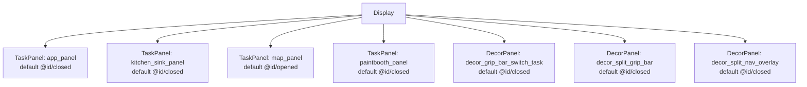
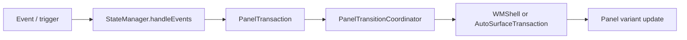
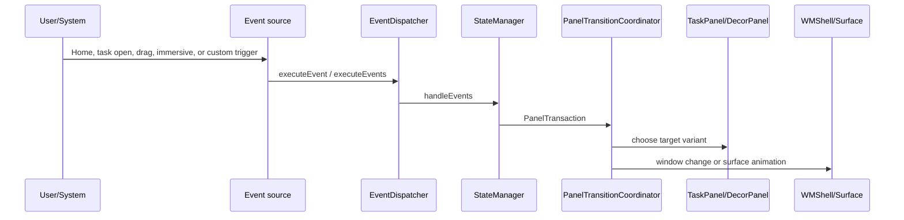

# ThreePanelRRO ScalableUI Demo Analysis

## 位置づけ

複数 TaskPanel と grip / overlay DecorPanel を組み合わせ、split、drag、task switch を表現する構成。

- Source: `packages/apps/Car/References/scalable-ui/codelab/ThreePanelRRO`
- 種別: `codelab`
- Build module: `ThreePanelRRO`

## 全体構成



TaskPanel は 4 個、DecorPanel は 3 個、SystemWindow は 0 個確認できる。

## Panel 一覧

| Panel | 種類 | defaultVariant | role | controller | variants | keyframes | source |
| --- | --- | --- | --- | --- | --- | --- | --- |
| `app_panel` | `TaskPanel` | `@id/closed` | `@string/default_config` | `-` | `@+id/base`, `@+id/opened`, `@+id/closed` | - | `packages/apps/Car/References/scalable-ui/codelab/ThreePanelRRO/res/xml/app_panel.xml` |
| `decor_grip_bar_switch_task` | `DecorPanel` | `@id/closed` | `@string/task_switch_grid_bar_provider` | `@xml/drag_switch_task_grip_controller` | `@+id/base`, `@+id/opened_bottom`, `@+id/opened_top`, `@+id/closed`, `@+id/drag_switch` | `@+id/drag` | `packages/apps/Car/References/scalable-ui/codelab/ThreePanelRRO/res/xml/decor_grip_bar_switch_task.xml` |
| `decor_split_grip_bar` | `DecorPanel` | `@id/closed` | `@string/decor_split_grip_bar_provider` | `@xml/drag_switch_task_grip_controller` | `@+id/base`, `@+id/opened_bottom`, `@+id/opened_top`, `@+id/closed`, `@+id/drag_switch` | `@+id/drag` | `packages/apps/Car/References/scalable-ui/codelab/ThreePanelRRO/res/xml/decor_split_grip_bar.xml` |
| `decor_split_nav_overlay` | `DecorPanel` | `@id/closed` | `@string/decor_split_nav_overlay_panel_provider` | `@xml/decor_split_nav_overlay_controller` | `@+id/map_base`, `@+id/opened_blur`, `@+id/closed` | - | `packages/apps/Car/References/scalable-ui/codelab/ThreePanelRRO/res/xml/decor_split_nav_overlay.xml` |
| `kitchen_sink_panel` | `TaskPanel` | `@id/closed` | `@string/kitchen_sink_componentName` | `-` | `@+id/base`, `@+id/opened`, `@+id/closed` | - | `packages/apps/Car/References/scalable-ui/codelab/ThreePanelRRO/res/xml/kitchen_sink_panel.xml` |
| `map_panel` | `TaskPanel` | `@id/opened` | `@array/nav_components` | `-` | `@+id/map_base`, `@+id/opened`, `@+id/opened_split`, `@+id/opened_split_blur`, `@+id/opened_lower`, `@+id/opened_blur`, `@+id/closed` | - | `packages/apps/Car/References/scalable-ui/codelab/ThreePanelRRO/res/xml/map_panel.xml` |
| `paintbooth_panel` | `TaskPanel` | `@id/closed` | `@string/paintbooth_componentName` | `-` | `@+id/base`, `@+id/bottom_opened`, `@+id/closed`, `@+id/drag_top_opened`, `@+id/top_opened` | `@+id/drag` | `packages/apps/Car/References/scalable-ui/codelab/ThreePanelRRO/res/xml/paintbooth_panel.xml` |

## 画面イメージ

```text
+--------------------------------------------------+
| map/background panel                              |
|   + multiple app task panels                      |
|   + decor panels for grip / overlay / switch      |
| transitions coordinate task open, drag, and home  |
+--------------------------------------------------+
```

## 主な画面遷移とトリガー



この demo では XML 上で 48 個の Transition が確認できる。主なものは以下。

| Panel | from | trigger | to |
| --- | --- | --- | --- |
| `app_panel` | `-` | `_System_TaskOpenEvent(panelId=app_panel)` | `@id/opened` |
| `app_panel` | `-` | `_System_TaskOpenEvent(panelId=paintbooth_panel)` | `@id/closed` |
| `app_panel` | `-` | `_System_TaskOpenEvent(panelId=kitchen_sink_panel)` | `@id/closed` |
| `app_panel` | `-` | `_System_OnHomeEvent` | `@id/closed` |
| `decor_grip_bar_switch_task` | `-` | `_System_TaskOpenEvent(panelId=app_panel)` | `@id/closed` |
| `decor_grip_bar_switch_task` | `-` | `_System_TaskOpenEvent(panelId=paintbooth_panel)` | `@id/opened_bottom` |
| `decor_grip_bar_switch_task` | `-` | `_System_TaskOpenEvent(panelId=kitchen_sink_panel)` | `@id/closed` |
| `decor_grip_bar_switch_task` | `-` | `_System_OnHomeEvent` | `@id/closed` |
| `decor_grip_bar_switch_task` | `-` | `_System_EnterSuwEvent` | `@id/closed` |
| `decor_grip_bar_switch_task` | `-` | `_System_ExitSuwEvent` | `@id/closed` |
| `decor_grip_bar_switch_task` | `-` | `close_app_grid` | `@id/closed` |
| `decor_grip_bar_switch_task` | `-` | `_User_DragEvent_split` | `@id/drag` |
| `decor_grip_bar_switch_task` | `-` | `_Drag_TaskSwitchEvent_top` | `@id/opened_top` |
| `decor_grip_bar_switch_task` | `-` | `_Drag_TaskSwitchEvent_bottom` | `@id/opened_bottom` |
| `decor_split_grip_bar` | `-` | `_System_TaskOpenEvent(panelId=app_panel)` | `@id/closed` |
| `decor_split_grip_bar` | `-` | `_System_TaskOpenEvent(panelId=paintbooth_panel)` | `@id/opened_bottom` |
| `decor_split_grip_bar` | `-` | `_System_TaskOpenEvent(panelId=kitchen_sink_panel)` | `@id/closed` |
| `decor_split_grip_bar` | `-` | `_System_OnHomeEvent` | `@id/closed` |
| `decor_split_grip_bar` | `-` | `_System_EnterSuwEvent` | `@id/closed` |
| `decor_split_grip_bar` | `-` | `_System_ExitSuwEvent` | `@id/closed` |
| `decor_split_grip_bar` | `-` | `close_app_grid` | `@id/closed` |
| `decor_split_grip_bar` | `-` | `_User_DragEvent_split` | `@id/drag` |
| `decor_split_grip_bar` | `-` | `_Drag_TaskSwitchEvent_top` | `@id/opened_top` |
| `decor_split_grip_bar` | `-` | `_Drag_TaskSwitchEvent_bottom` | `@id/opened_bottom` |
| `decor_split_nav_overlay` | `-` | `_System_OnHomeEvent` | `@id/closed` |
| `decor_split_nav_overlay` | `-` | `_System_TaskOpenEvent(panelId=paintbooth_panel)` | `@id/closed` |
| `decor_split_nav_overlay` | `-` | `_System_TaskOpenEvent(panelId=app_panel)` | `@id/closed` |
| `decor_split_nav_overlay` | `-` | `_System_TaskOpenEvent(panelId=kitchen_sink_panel)` | `@id/opened_blur` |
| `decor_split_nav_overlay` | `-` | `_Drag_TaskSwitchEvent_top` | `@id/closed` |
| `decor_split_nav_overlay` | `-` | `_Drag_TaskSwitchEvent_bottom` | `@id/closed` |

他に 18 個の transition がある。詳細は各 XML を参照。

## Runtime の動き



実際の処理経路は demo 固有 XML の Transition に従う。`TaskPanel` の bounds や visibility が変わる場合は Window State 変更になり、`DecorPanel` の alpha / overlay / grip 表示は direct surface animation 寄りに処理される。

## Source 上の実装ポイント

| 処理 | class / method | path |
| --- | --- | --- |
| XML 読み込み | `PanelConfigReader.loadConfig() / loadFromXml()` | `packages/apps/Car/SystemUI/src/com/android/systemui/car/wm/scalableui/PanelConfigReader.java` |
| PanelState 生成 | `XmlModelLoader.createPanelState(int)` | `packages/apps/Car/systemlibs/car-scalable-ui-lib/src/com/android/car/scalableui/loader/xml/XmlModelLoader.java` |
| event 評価 | `StateManager.handleEvents(...)` | `packages/apps/Car/systemlibs/car-scalable-ui-lib/src/com/android/car/scalableui/manager/StateManager.java` |
| transition 実行 | `PanelTransitionCoordinator.startTransition(...)` | `packages/apps/Car/SystemUI/src/com/android/systemui/car/wm/scalableui/PanelTransitionCoordinator.java` |
| TaskPanel root task | `TaskPanel.init()` | `packages/apps/Car/SystemUI/src/com/android/systemui/car/wm/scalableui/panel/TaskPanel.java` |
| root task 作成 | `AutoTaskStackControllerImpl.createRootTaskStack(...)` | `packages/services/Car/libs/car-wm-shell-lib/src/com/android/wm/shell/automotive/AutoTaskStackControllerImpl.kt` |

## 素の AAOS17 emulator への取り込み可否

可能。ただし RRO を build/install/enable するだけでは、参照 Activity、feature flag、required system property、system bar config の整合確認が必要。

想定手順:

1. `source build/envsetup.sh` と `lunch sdk_car_x86_64-trunk_staging-userdebug` を実行する。
2. `m ThreePanelRRO` で RRO module を build する。複数 module がある場合は `ThreePanelRRO` を確認する。
3. image に含める場合は `PRODUCT_PACKAGES += <module>` に追加する。手動確認なら APK を install して `cmd overlay enable --user 0 <package>` を実行する。
4. `cmd overlay list`、logcat、`dumpsys window`、screenshot で overlay と panel state を確認する。
5. system bar / immersive / user 10 などを扱う sample は、必要な user に overlay を有効化して SystemUI を restart する。

取り込み時に不足しやすい情報・software:

- default activities include paintbooth / kitchen sink / portraitlauncher components; verify packages are present in the target image

## Source files

- `packages/apps/Car/References/scalable-ui/codelab/ThreePanelRRO/res/xml/app_panel.xml`
- `packages/apps/Car/References/scalable-ui/codelab/ThreePanelRRO/res/xml/decor_grip_bar_switch_task.xml`
- `packages/apps/Car/References/scalable-ui/codelab/ThreePanelRRO/res/xml/decor_split_grip_bar.xml`
- `packages/apps/Car/References/scalable-ui/codelab/ThreePanelRRO/res/xml/decor_split_nav_overlay.xml`
- `packages/apps/Car/References/scalable-ui/codelab/ThreePanelRRO/res/xml/kitchen_sink_panel.xml`
- `packages/apps/Car/References/scalable-ui/codelab/ThreePanelRRO/res/xml/map_panel.xml`
- `packages/apps/Car/References/scalable-ui/codelab/ThreePanelRRO/res/xml/paintbooth_panel.xml`
