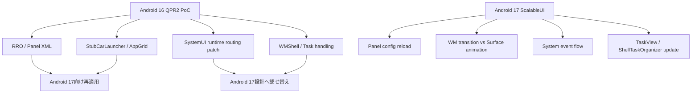

# Android 17 ScalableUI 差分調査メモ

## 目的

Android 17.0.0 Release 1 (`android-17.0.0_r1`) で更新された ScalableUI 関連実装と、現在の workspace にある Android 16 QPR2 ベースの ScalableUI PoC との差分を明確にする。

本資料は、Android 17 への移植作業を開始する前の一次整理を起点にしている。
その後、Android 17 `sdk_car_x86_64-trunk_staging-userdebug` のAs-Is build / emulator起動確認を実施した。
移植作業の最新方針は [aaos17_scalableui_development_flow_ja.md](aaos17_scalableui_development_flow_ja.md) を正とする。

## 比較対象

### Android 17

AOSP manifest:

https://android.googlesource.com/platform/manifest/+/refs/tags/android-17.0.0_r1

Gitiles 上で確認した manifest tag 情報:

| 項目 | 値 |
| --- | --- |
| tag | `android-17.0.0_r1` |
| tag sha | `7a9e46ba6ed424f922a3457f4964e67e0b966201` |
| manifest commit | `5bc9a7ce1cd78dd53613bbfd0ebf506e1e4adb0f` |
| message | `Android 17.0.0 Release 1` |
| tagger date | `2026-06-16 23:31:21 +0000` |

関連 project の Android 17 tag:

| project | Android 17 tag commit |
| --- | --- |
| `platform/packages/apps/Car/SystemUI` | `0052c28c` |
| `platform/packages/services/Car` | `0b5729dbd5` |
| `platform/frameworks/base` | `23149ba144e8` |

### 現在 workspace の Android 16 QPR2

ローカル checkout:

`/home/y-fuk/work/android16-qpr2-release`

| project | local HEAD | 備考 |
| --- | --- | --- |
| `packages/apps/Car/SystemUI` | `43736f34` | `25Q4-release` 系 merge commit |
| `packages/services/Car` | `b8fe0e1e8f` | `25Q4-release` 系 merge commit |
| `frameworks/base` | `45034f0663f9` | `25Q4-release` 系 merge commit |

現在の AAOS tree には PoC の working tree 差分が存在する。特に `packages/services/Car` には `car_product/scalableui_declarative_multipanel` が追加され、`packages/apps/Car/SystemUI` には ScalableUI runtime routing 向けの変更が入っている。

PoC 側の Android 16 QPR2 パッチ:

| patch | 内容 |
| --- | --- |
| `variants/declarative-multipanel/android16-qpr2/patches/device-generic-car/0001-add-sdk-car-scalableui-declarative-multipanel-x86-64-product.patch` | product 定義 |
| `variants/declarative-multipanel/android16-qpr2/patches/packages-apps-Car-SystemUI/0001-add-scalableui-declarative-multipanel-runtime-routing.patch` | ScalableUI runtime routing |
| `variants/declarative-multipanel/android16-qpr2/patches/packages-apps-Car-Launcher/0001-mark-appgrid-launch-source.patch` | AppGrid launch source |
| `variants/declarative-multipanel/android16-qpr2/patches/packages-services-Car/0001-add-scalableui-declarative-multipanel-rro.patch` | RRO / StubCarLauncher |

## 結論

Android 17 の ScalableUI は、Android 16 QPR2 workspace の実装から見て無視できない更新が入っている。

特に重要なのは以下である。

1. `packages/apps/Car/SystemUI` の ScalableUI core が大きく更新されている。
2. Android17 source では Panel 基底実装として `SysUIPanel` が使われており、`BasePanel` 前提の古い PoC patch は見直しが必要である。
3. `PanelConfigReader` が config reload / readiness monitor を持つようになっている。
4. `PanelTransitionCoordinator` が direct Surface animation と WM transition の分岐をより明確に扱うようになっている。
5. `SystemEventHandler` / event flow が更新され、task event / controller 設計の再確認が必要である。
6. WMShell 側では `ShellTaskOrganizer` と `TaskView` 周辺が更新され、root task 作成 API が `createRootTask` 系から `createTask(TaskCreationParams)` 方向へ寄っている。
7. PoC の `scalableui_declarative_multipanel` product/RRO は Android 17 AOSP には存在しないため、再適用が必要である。

したがって、Android 17 化は単純な patch rebase ではなく、ScalableUI core / WMShell task handling の差分を見ながら移植する作業として扱うべきである。

## 社内説明向けサマリ

Android 17 では、ScalableUI が「試験的な panel 制御の集まり」から「SystemUI 内で window / surface / event を整理して扱う HMI framework」に近づいている。

我々の PoC は Android 16 QPR2 上で、RRO と一部 SystemUI patch によって multipanel HMI を成立させている。一方、Android 17 では ScalableUI 本体側に大きな整理が入っているため、Android 16 向けに足した patch の一部は、そのまま再適用するのではなく、Android 17 の新しい設計に載せ替える必要がある。

説明するときの要点は以下である。

| 観点 | 社内向けの言い方 | 実務上の意味 |
| --- | --- | --- |
| ScalableUI core | Android 17 で ScalableUI の中核が整理・拡張された | SystemUI patch は conflict する前提で見直す |
| Panel 定義 | Panel の名前や読み込み方が変わった | RRO/XML は再確認が必要 |
| Transition | 表示変更とアニメーションの扱いが整理された | All Apps、最大化、Home 復帰を Android 17 流に分類する |
| Event | アプリやボタン操作を ScalableUI に伝える経路が変わった | task event / controller の設計を再確認する |
| Task / WMShell | アプリを載せる task の作り方が変わった | ScalableUI は TaskPanel / RootTaskStack、別経路として TaskView / RemoteCarTaskView を確認する |
| Product / RRO | 我々の PoC product は Android 17 AOSP には入っていない | RRO / StubCarLauncher / product 定義は再適用する |



## 差分ごとの分かりやすい解説

### 1. Android17 source に ScalableUI README が存在する

| 項目 | 内容 |
| --- | --- |
| 何を確認したか | Android 17 では ScalableUI 配下に README が存在し、ScalableUI の役割、構成要素、処理の流れが説明されている |
| なぜ重要か | これまでコードを読まないと分かりづらかった「どこが責務を持つのか」が明文化された |
| 我々への影響 | 今後の設計説明やサプライヤー依頼では、この README の責務分解をベースに説明できる |
| 社内説明用の一言 | Android 17 では、ScalableUI の考え方がドキュメント化され、移植判断の基準にしやすくなった |

README では、ScalableUI を AAOS SystemUI 内の abstraction layer として説明している。つまり ScalableUI は、通常アプリの UI toolkit ではなく、Panel、system window、task 表示、transition を SystemUI 側でまとめる仕組みである。

### 2. Window State と Surface の分離が明確になった

| 項目 | 内容 |
| --- | --- |
| 何が変わったか | Android 17 README で、Window State と Surface の違いが明確に説明された |
| Window State | WindowManager が管理する表示状態。visibility、size、position、z-order、app launch / close / resize など |
| Surface | SurfaceFlinger が扱う描画属性。alpha、scale、translation、crop など |
| 我々への影響 | All Apps overlay、最大化、Home 復帰を「WM変更が必要なもの」と「Surface animationで済むもの」に分ける必要がある |
| 社内説明用の一言 | Android 17では、画面構成を変える処理と、見た目だけを動かす処理を分けて考える必要がある |

例として、アプリを別 Panel に表示したり Panel の大きさを変えたりする処理は Window State に近い。一方、scrim をフェードインする、overlay を少し動かす、alpha を変えるといった処理は Surface animation に近い。

この整理により、我々の PoC の以下の要件は再分類が必要になる。

| PoC 要件 | 分類の考え方 |
| --- | --- |
| All Apps を中央に浮かせる | Panel 自体を出すなら Window State、見た目のfadeだけなら Surface |
| 外側タップで閉じる | event は SystemUI、見た目の閉じ方は Surface animation で足りる可能性 |
| 既存アプリを最大化 | Panel bounds / task focus が変わるため Window State の可能性が高い |
| Home 復帰 | 前回の Panel 状態保存と Window State 復元が必要 |

### 3. Android17 source は `SysUIPanel` を前提にしている

| 項目 | 内容 |
| --- | --- |
| 何を確認したか | Android 17 source では `TaskPanel extends SysUIPanel` であり、`PanelConfigReader` も `SysUIPanel.Factory` を使う |
| なぜ重要か | `BasePanel` 前提の SystemUI patch がそのまま当たらない可能性が高い |
| 我々への影響 | `BasePanel` を参照する PoC patch、controller、factory の修正が必要 |
| 社内説明用の一言 | Panel の土台クラスの名前と整理が変わったため、移植時に機械的な修正が必ず発生する |

これは機能追加というより、ScalableUI 内部の名前と構造の整理として扱う。ただし、現時点のローカル確認では Android16 checkout が存在しないため、この文書では「rename」と断定せず、「Android17 source は `SysUIPanel` 前提」と表現する。移植時にはビルドエラーとして出やすいので、Android17 対応の最初の作業で潰すべき差分である。

### 4. `PanelConfigReader` が reload 前提になった

| 項目 | 内容 |
| --- | --- |
| 何が変わったか | Android 17 では panel XML / DCF を読み込む処理が `loadConfig()` / `reloadConfig(Configuration)` として整理された |
| 旧構成 | `StateManager.clearStates()` と `StateManager.addState(...)` で状態を積む考え方 |
| 新構成 | panel state を map として読み込み、`StateManager.reloadPanelState(...)` で入れ替える考え方 |
| 我々への影響 | runtime panel generation や controller 初期化順序の前提を見直す必要がある |
| 社内説明用の一言 | Panel定義を「追加していく」より、「設定として読み直す」設計に寄っている |

この変更は、RRO/XML 内製にとって重要である。Android 17 では、画面回転や表示構成変更に合わせて panel config を読み直す可能性が高くなる。したがって、RRO/XML の内容だけでなく、いつ読み込まれ、いつ controller が使い始めるかも確認が必要になる。

### 5. Android17 source に `PanelConfigReadStateMonitor` が存在する

| 項目 | 内容 |
| --- | --- |
| 何を確認したか | Panel config の読み込みが完了したかを監視する monitor が Android17 source に存在する |
| なぜ重要か | config が読み終わる前に controller や event が動くと、対象 Panel が見つからない可能性がある |
| 我々への影響 | `SHOW_ALL_APPS` や `MAXIMIZE_PANEL` などの event を、config ready 後に処理する必要がある |
| 社内説明用の一言 | Android17では、Panel定義が準備できてから動作を開始する安全装置をsource上で確認できる |

我々の PoC では、起動直後に固定 Panel、All Apps、app picker などが関係する。Android 17 では、初期化順序がより重要になるため、boot直後の smoke test で config ready と Panel 表示を確認する必要がある。

### 6. `PanelTransitionCoordinator` が大きく変わった

| 項目 | 内容 |
| --- | --- |
| 何が変わったか | Panel の状態遷移、アニメーション、WM transition との同期を担う coordinator が大きく更新された |
| なぜ重要か | All Apps、最大化、Home 復帰など、我々の HMI 操作の中心にある |
| Android17 sourceで確認した考え方 | direct animation、historical event、focus calculation、current state の強制同期 |
| 我々への影響 | Android 16 向けに入れた direct animation patch は、Android 17 の標準機能で置き換えられる可能性がある |
| 社内説明用の一言 | Panelの動かし方の中核が強化されているので、既存patchを足すのではなくAndroid 17流に載せ替えるべき |

特に重要なのは、WM transition が必要な処理と、Surface animation だけで済む処理を coordinator が分けられるようになっている点である。

| PoC機能 | Android 17での見直し方 |
| --- | --- |
| All Apps overlay | direct animation で出せるか確認 |
| 外側タップ dismiss | Surface animation と event 処理で済むか確認 |
| app panel 最大化 | Window State 変更が必要か確認 |
| Home 復帰 | previous state 保存と復元を coordinator に合わせる |
| telemetry | transition start / end に計測点を置けるか確認 |

### 7. `PanelAutoTaskStackTransitionHandlerDelegate` の見直しが必要

| 項目 | 内容 |
| --- | --- |
| 何が変わったか | WM transition から ScalableUI event へ変換する bridge 部分が更新された |
| なぜ重要か | アプリ起動、Home、Task表示の変化を ScalableUI の Panel 操作へつなぐ場所だから |
| 我々への影響 | Android 16向けの target panel routing patch が conflict する可能性が高い |
| 社内説明用の一言 | アプリ起動をどのPanelに流すかを判断する関所が変わっている |

我々の PoC では、「All Appsから起動した通常アプリは `app_panel` に出す」「Settingsは固定settings panelではなくfullscreen寄りpanelへ出す」といったルールを入れている。この判断は delegate と task routing に関わるため、Android 17 の変更に合わせて再実装が必要になる。

### 8. `SystemEventHandler` / `EventDispatcher` の確認が必要

| 項目 | 内容 |
| --- | --- |
| 何が変わったか | System event を受け取り、Panel transaction に変換する経路が更新された |
| なぜ重要か | 自社アプリや AppGrid から送る HMI event の入口だから |
| 我々への影響 | `SHOW_ALL_APPS`、`DISMISS_ALL_APPS`、`MAXIMIZE_PANEL`、`RESTORE_HOME` の mapping を再確認する |
| 社内説明用の一言 | ボタン操作やアプリ操作をScalableUIに伝えるイベント経路が変わっている |

Android 17移植では、eventの名前だけでなく、以下を再確認する必要がある。

| 確認項目 | 理由 |
| --- | --- |
| event の送信元 | どの app / priv-app から送れるかを制限するため |
| extra schema | `panel_id`、`component`、`reason` などを維持するため |
| sender restriction | 第三者アプリから勝手にPanel操作されることを防ぐため |
| transition result | telemetry と smoke test に使うため |

### 9. `TaskPanel` と `TaskPanelInfoRepository` が更新された

| 項目 | 内容 |
| --- | --- |
| 何が変わったか | TaskPanel の状態管理、task 情報保持、既存 task 検索に関係する実装が更新された |
| なぜ重要か | ScalableUIで「Panelにアプリを表示する」実体に近い部分だから |
| 我々への影響 | 既存アプリ再選択で最大化、既存task再利用、target panel routing の実装を見直す |
| 社内説明用の一言 | Panelにどのアプリtaskが載っているかを管理する部分が変わっている |

ここは、ユーザー体験に直結する。たとえば、地図がすでに小さいPanelに出ている状態で地図を再度起動した場合、我々は「同じアプリを増やす」のではなく「既存Panelを最大化する」挙動を目指している。この挙動は `TaskPanel` / `TaskPanelInfoRepository` / routing policy に関係する。

### 10. Android17 source に `SetupPanelController` が存在する

| 項目 | 内容 |
| --- | --- |
| 何を確認したか | setup 用の Panel controller が Android17 source に存在する |
| なぜ重要か | ScalableUI controller が用途別に増えており、controller module の構成が変わっている |
| 我々への影響 | 自社 controller を追加する場合、Android 17 の module / Dagger 構成に合わせる必要がある |
| 社内説明用の一言 | Android 17では、Panel制御を用途別controllerとして整理する方向が進んでいる |

我々が将来 `AllAppsPanelController`、`MaximizePanelController`、`AppAssignmentController` のような自社controllerを作る場合、Android 17 の controller module 構成を参考にするのがよい。

### 11. GripBar が方向別に分かれた

| 項目 | 内容 |
| --- | --- |
| 何を確認したか | Android17 source では `GripBarBase.java`、`HorizontalGripBar.kt`、`VerticalGripBar.kt` が存在する |
| なぜ重要か | Panel resize / drag UI の表現が方向別に整理された |
| 我々への影響 | 将来 grip resize やPanel移動をやる場合、Android 17のクラス構成に合わせる |
| 社内説明用の一言 | Panelを掴んで動かすUI部品が、横向き・縦向きで整理された |

現在の `declarative-multipanel` baseline では continuous grip resize は主目的ではない。ただし、将来の editable panel / runtime layout では関係するため、Android 17の新構成を前提にするべきである。

### 12. `SystemUiWindow*` が更新された

| 項目 | 内容 |
| --- | --- |
| 何が変わったか | HUN、system bar、system window と ScalableUI の関係部分が更新された |
| なぜ重要か | All Apps overlay、上部/下部bar、通知、system UI layer と重なる可能性がある |
| 我々への影響 | All Appsを常に最前面に出す設計では、z-order / input / focus の確認が必要 |
| 社内説明用の一言 | アプリPanelだけでなく、SystemUIのバーや通知との重なり方も見直しが必要 |

All Apps を中央にfloating表示する場合、単にPanel XMLを追加するだけでは足りない。System window、scrim、outside tap、通知やsystem barとの重なりを確認する必要がある。

### 13. SystemUI `Android.bp` の構成が変わった

| 項目 | 内容 |
| --- | --- |
| 何が変わったか | CarSystemUI の build module が分割・整理され、`CarSystemUI-application-srcs` や `CarSystemUI-Shared` などの構成が追加されている |
| なぜ重要か | SystemUI patch が当たっても、build target や依存関係で失敗する可能性がある |
| 我々への影響 | `CarSystemUI` module build、RRO build、StubCarLauncher build のCIをAndroid 17向けに更新する |
| 社内説明用の一言 | コードだけでなく、ビルドの組み立て方も変わっている |

これは見た目のHMI機能ではないが、移植作業ではかなり重要である。Android 16で通っていた `m CarSystemUI` がAndroid 17でも同じ依存関係で通るとは限らない。

### 14. WMShell の `ShellTaskOrganizer` が大きく変わった

| 項目 | 内容 |
| --- | --- |
| 何が変わったか | root task の作成・削除・listener API が更新された |
| 旧方向 | `createRootTask(...)` 系 API |
| 新方向 | `createTask(TaskCreationParams, TaskListener)` / `deleteTask(WindowContainerToken)` |
| 我々への影響 | ScalableUI TaskPanel / RootTaskStack routing を触る patch は再設計が必要。TaskView / RemoteCarTaskView は別経路として境界確認する |
| 社内説明用の一言 | アプリを載せるためのtaskコンテナの作り方が変わっている |

ScalableUIはPanelを見た目として扱うだけでなく、そのPanel内にアプリのTaskを表示する。WMShell側のtask APIが変わると、「アプリをどのPanelに出すか」「既存Taskを再利用するか」「最大化するか」といった挙動に影響する。

### 15. Android17 source に `TaskViewRootTask.kt` が存在する

| 項目 | 内容 |
| --- | --- |
| 何を確認したか | TaskView が管理する root task 情報を表す interface が Android17 source に存在する |
| なぜ重要か | TaskView / RemoteTaskView / TaskPanel の境界を整理する材料になる |
| 我々への影響 | 既存ドキュメントの「Panel -> TaskPanel -> Task -> Activity」モデルをAndroid 17でも再確認する |
| 社内説明用の一言 | TaskViewがどのroot taskを管理しているかを扱うための抽象をsource上で確認できる |

これは、ScalableUIのTaskPanelそのものがTaskViewに置き換わるという意味ではない。だが、WMShell側ではTaskView周辺のroot task管理が整理されているため、TaskPanelの裏側でどのtaskがどう扱われるかを確認する必要がある。

### 16. Android 17 AOSPには我々のPoC product/RROは存在しない

| 項目 | 内容 |
| --- | --- |
| 何が変わったか | Android 17 AOSPには `car_product/scalableui_declarative_multipanel` は存在しない |
| なぜ重要か | 我々のHMIはAOSP標準機能として入ったわけではない |
| 我々への影響 | product mk、RRO、StubCarLauncher、AppGrid、app picker は新規差分として再適用する |
| 社内説明用の一言 | Android 17に上げてもPoC HMIが自動で入るわけではなく、我々の差分は再度持ち込む必要がある |

この点は社内説明で誤解されやすい。Android 17でScalableUI本体は更新されているが、我々が作った `declarative-multipanel` のproductやRROがAOSPに入ったわけではない。したがって、Android 17対応では「AOSP側のScalableUI更新に追従する作業」と「我々のPoC差分を再適用する作業」の両方が必要である。

## Android 17 での repository 構成上の注意

Android 17 manifest では Car app 群が細かい project として定義されている。

例:

| path | project |
| --- | --- |
| `packages/apps/Car/SystemUI` | `platform/packages/apps/Car/SystemUI` |
| `packages/apps/Car/Launcher` | `platform/packages/apps/Car/Launcher` |
| `packages/apps/Car/Settings` | `platform/packages/apps/Car/Settings` |
| `packages/services/Car` | `platform/packages/services/Car` |

ローカル Android 16 QPR2 でも `packages/apps/Car/SystemUI` は独立 git project として存在している。Android 17 へ移る場合、`packages/apps/Car` 全体を単一 repository として扱わず、`SystemUI`、`Launcher`、`services/Car`、`frameworks/base` を個別に追う必要がある。

## ScalableUI core 差分

比較:

```bash
git -C packages/apps/Car/SystemUI diff --stat HEAD android-17.0.0_r1 -- \
  src/com/android/systemui/car/wm/scalableui
```

結果概要:

| 種別 | 件数 |
| --- | --- |
| Added | 6 |
| Modified | 36 |
| Renamed | 2 |
| 差分規模 | 44 files, 3199 insertions, 1180 deletions |

主なファイル差分:

| ファイル | 状態 | 移植影響 |
| --- | --- | --- |
| `src/com/android/systemui/car/wm/scalableui/README.md` | 追加 | ScalableUI の役割、WM transition flow、System event flow が明文化された |
| `ScalableUIUtils.java` | 追加 | 共通 utility 追加。既存 helper / local patch と衝突可能性あり |
| `PanelConfigReader.java` | 変更 | config reload、readiness monitor、Design Compose / XML 読み込み経路の整理 |
| `PanelTransitionCoordinator.java` | 変更大 | direct animation、historical events、focus、WM transition reconciliation が更新 |
| `PanelAutoTaskStackTransitionHandlerDelegate.java` | 変更 | WM transition から ScalableUI event への変換経路を再確認する必要あり |
| `SysUIPanel.kt` | Android17 sourceで確認 | PoC patch で `BasePanel` を参照している場合は修正必須 |
| `TaskPanel.java` | 変更大 | TaskPanel の状態更新、surface/window state 整合、task routing 影響を確認 |
| `TaskPanelInfoRepository.java` | 変更 | 既存 task 検索・panel assignment に影響する可能性 |
| `SetupPanelController.java` | 追加 | setup 専用 panel controller 追加。controller module との依存確認が必要 |
| `PanelConfigReadStateMonitor.kt` | 追加 | config read 完了状態を監視する仕組み。初期化順序に影響 |
| `GripBarBase.java` / `HorizontalGripBar.kt` / `VerticalGripBar.kt` | Android17 sourceで確認 | grip UI / controller を触る場合はAndroid17の構成に合わせる |
| `HorizontalGripBar.kt` / `VerticalGripBar.kt` | 追加 | orientation 別 grip 実装に分割 |
| `SystemEventHandler.java` | 変更大 | task event / controller event の受け口を再確認 |
| `SystemUiWindow*` | 変更 | system bar / HUN / system window と ScalableUI の関係を確認 |

## Android 17 ScalableUI README から分かる設計整理

Android 17 では `src/com/android/systemui/car/wm/scalableui/README.md` が追加されている。そこでは ScalableUI が AAOS SystemUI 内の abstraction layer として、panel や system window の presentation / behavior を管理するものとして説明されている。

特に重要な整理:

| 概念 | Android 17 README 上の意味 | PoC への影響 |
| --- | --- | --- |
| Window State | WindowManager が扱う visibility、size、position、z-order | app launch / close / resize は heavyweight な WM 変更として扱う |
| Surface | alpha、scale、translation、crop など SurfaceFlinger 側の低レベル描画属性 | overlay / dismiss / visual animation は direct Surface animation で処理できる可能性 |
| `PanelAutoTaskStackTransitionHandlerDelegate` | WM transition と ScalableUI の bridge | PoC の runtime routing patch と直接衝突しやすい |
| `PanelTransitionCoordinator` | panel animation / state change の orchestrator | 最大化、Home 復帰、All Apps overlay の中心 |
| `EventDispatcher` | system event を panel transaction に変換 | task event contract の要 |
| `TaskPanel`, `DecorPanel`, `SysUIPanel` | UI container 種別 | `BasePanel` ではなく `SysUIPanel` を前提に再整理 |

この README は、我々が作成した「controller / task event / telemetry」整理と方向性は合っている。一方で、Android 17 では Window State と Surface の分離がより明確に書かれているため、移植時には以下の設計判断を明示する必要がある。

| PoC 要件 | Android 17 での優先確認 |
| --- | --- |
| All Apps を中央 overlay 表示 | WM change なしの direct Surface animation で足りるか |
| 外側タップ / 再タップ dismiss | `SystemEventHandler` -> `EventDispatcher` -> `PanelTransitionCoordinator` の経路で処理できるか |
| 既存 app 再選択で最大化 | TaskPanel の window state change が必要か、surface だけで足りるか |
| Home 復帰 | historical event / previous state 保存を Android 17 の Coordinator に合わせる |
| telemetry | event dispatch / transition completion callback に計測点を置けるか |

## PanelConfigReader / StateManager 周辺

Android 17 の `PanelConfigReader` では、単純な `StateManager.addState(...)` ではなく、panel state を map として読み込み、`StateManager.reloadPanelState(...)` に渡す構成になっている。

確認した差分:

| Android 16 QPR2 workspace | Android 17 |
| --- | --- |
| 初期化時に XML / DCF を読んで StateManager に追加 | `loadConfig()` で panel state map を作成 |
| 旧PoC側で `BasePanel.Factory` を前提にした実装 | Android17 sourceでは `SysUIPanel.Factory` |
| `StateManager.clearStates()` + `addState()` | `StateManager.reloadPanelState(panelStates)` |
| config read 完了状態なし | `PanelConfigReadStateMonitor` 追加 |
| orientation / configuration reload は薄い | `reloadConfig(Configuration)` 追加 |

移植時の影響:

| PoC 要素 | Android 17 での対応 |
| --- | --- |
| RRO `window_states` / panel XML | 形式互換性を確認。読み込み自体は引き続き XML 経路あり |
| runtime panel generation | `reloadPanelState` 前提に再評価。`addState` 前提の記述や実装は見直し |
| controller 初期化 | config read readiness を待つ必要があるか確認 |
| orientation / display config | `reloadConfig(Configuration)` を利用できる可能性 |

## PanelTransitionCoordinator 周辺

Android 17 の `PanelTransitionCoordinator` は差分が大きい。README と diff から、WM transition が必要な変更と direct Surface animation で済む変更の分岐が明確になっている。

主な更新点:

| 更新 | 内容 | PoC 影響 |
| --- | --- | --- |
| `startTransition(transaction, panelIdsToForceCurrentState)` | transition 実行時に特定 panel の current state を強制できる | Home 復帰・最大化時の他 panel 同期に使える可能性 |
| `startDirectAnimation(...)` | WM transition が発生しない animation を直接実行 | All Apps overlay / scrim / dismiss に有用 |
| historical events retention | 一定時間、適用済み event を保持 | Home 復帰、重複 event 抑制、telemetry に関係 |
| `CarWMUserHelper` 依存 | user context を考慮 | multi-user / user switching の検証が必要 |
| focus calculation | README 上で責務に明記 | 最大化時の focus / input policy を再評価 |

移植時の注意:

1. 我々の `MAXIMIZE_PANEL` / `RESTORE_HOME` / `SHOW_ALL_APPS` event は、Android 17 の `PanelTransitionCoordinator` に合わせて「WM change 必要」か「direct animation で足りる」かを分類する。
2. Panel の visibility / bounds / z-order を変える場合は Window State として扱う。
3. alpha / translation / crop / scrim のような見た目だけの変化は Surface として扱える可能性がある。
4. 旧Android 16向けの direct surface 更新 patch は、Android 17 の coordinator に既に吸収されている可能性があるため、二重実装を避ける。

## SystemEventHandler / task event 周辺

Android 17 では `SystemEventHandler.java` に大きな差分がある。PoC の task event / controller 設計はここに影響される。

移植時に確認すべきこと:

| 確認項目 | 理由 |
| --- | --- |
| event 受信元 | 自社 app / StubCarLauncher / AppGrid から送る event を受けられるか |
| event 名 | `SHOW_ALL_APPS`、`DISMISS_ALL_APPS`、`MAXIMIZE_PANEL`、`RESTORE_HOME` の mapping |
| extra schema | `panel_id`、`component`、`source_panel`、`reason` を維持できるか |
| sender restriction | third-party app からの spoofing を防ぐ必要 |
| transition result callback | telemetry と smoke test に利用できるか |

## WMShell / TaskView / ShellTaskOrganizer 差分

比較:

```bash
git -C frameworks/base diff --stat HEAD android-17.0.0_r1 -- \
  libs/WindowManager/Shell/src/com/android/wm/shell/taskview \
  libs/WindowManager/Shell/src/com/android/wm/shell/ShellTaskOrganizer.java
```

結果概要:

| ファイル | 状態 | 移植影響 |
| --- | --- | --- |
| `ShellTaskOrganizer.java` | 変更大 | root task 作成 / 削除 / listener API が変わっている |
| `TaskView.java` | 変更 | TaskView 埋め込み挙動を確認 |
| `TaskViewBase.java` | 変更 | base interface 変更確認 |
| `TaskViewRepository.java` | 変更 | TaskView tracking 影響確認 |
| `TaskViewRootTask.kt` | 追加 | TaskView root task info 抽象が追加 |
| `TaskViewTaskController.java` | 変更 | root task / launch / cleanup 影響確認 |
| `TaskViewTransitions.java` | 変更 | transition 経路確認 |

特に `ShellTaskOrganizer` では以下が重要である。

| Android 16 QPR2 workspace | Android 17 |
| --- | --- |
| `createRootTask(...)` 系 API が存在 | `createTask(TaskCreationParams, TaskListener)` / `createTask(TaskCreationParams)` 方向 |
| root task create callback は限定的 | `ContainerHierarchyRootTaskListener` 追加 |
| root task remove callback は限定的 | `deleteTask(WindowContainerToken)` で root task removed 通知 |
| 初期 task 同期は薄い | `getInitialTasks()` 追加 |
| `onBackPressedOnTaskRoot(...)` | `onBackOnTaskRoot(...)` に詳細引数追加 |

PoC 影響:

1. TaskPanel / Task routing で root task 作成に触る場合、Android 17 の `TaskCreationParams` 前提へ移行する。
2. 既存 task 再利用 / relocation / maximize の実装は、`ShellTaskOrganizer` と `TaskViewTransitions` の新APIに合わせる。
3. Android17 source では `TaskViewRootTask` が存在するため、TaskView が管理する root task 情報取得の経路を確認する。RemoteTaskView / TaskView / TaskPanel の境界を再確認する。
4. Back / Home 復帰の挙動は `onBackOnTaskRoot(...)` の詳細引数を考慮する。

## packages/services/Car / product / RRO 差分

Android 17 AOSP の `packages/services/Car` には、我々の PoC product `car_product/scalableui_declarative_multipanel` は存在しない。

つまり、Android 17 化では以下を再適用する必要がある。

| PoC 要素 | Android 17 での扱い |
| --- | --- |
| `car_product/scalableui_declarative_multipanel` | 新規追加として再適用 |
| `CarSystemUIScalableUiDeclarativeMultipanelRRO` | Android 17 の SystemUI resource 名 / overlay target に合わせて再確認 |
| `CarFrameworkScalableUiDeclarativeMultipanelRRO` | framework config の resource 名変更有無を確認 |
| `CarServiceScalableUiDeclarativeMultipanelRRO` | `com.android.car.updatable` の target resource を確認 |
| `StubCarLauncher` | Android 17 の HOME role / privapp permission / query package policy を確認 |
| product wiring | Android 17 ではPoC専用productを作らず、標準 `sdk_car_x86_64` にPoC package/RROを追加する |

Android 17 の `packages/services/Car` では `car_ui_portrait` 配下に大きな構成変更があり、Android 16 QPR2 workspace から見ると `CarUiPortraitLauncher` などが削除扱いになっている。これは project 分割 / 移動の影響を含むため、PoC の `StubCarLauncher` を使う方針は維持しつつ、既存 CarLauncher / portrait launcher への依存を増やさない方が安全である。

## 我々の Android 16 QPR2 workspace 側の PoC 差分

現在の Android 16 QPR2 workspace には以下の PoC working tree 差分がある。

### packages/apps/Car/SystemUI

| ファイル | 目的 |
| --- | --- |
| `PanelAutoTaskStackTransitionHandlerDelegate.java` | app launch / target panel routing / Home判定の安定化 |
| `PanelConfigReader.java` | PoC RRO panel config 読み込み調整 |
| `PanelTransitionCoordinator.java` | DecorPanel-only transition / direct animation 対応 |
| `ScalableUIWMInitializer.java` | ScalableUI runtime 初期化調整 |
| `DecorPanel.java` | decor panel transaction 安定化 |
| `CarWMShellModule.java` | ScalableUI / shell 統合調整 |

### packages/services/Car

`car_product/scalableui_declarative_multipanel` 以下に以下を追加している。

| 種別 | 内容 |
| --- | --- |
| product mk | `car_scalableui_declarative_multipanel.mk` |
| Stub HOME | `StubCarLauncher` |
| app grid / picker | `AppGridScrimActivity`、`AppPickerActivity`、`PanelTriggerActivity` |
| panel content | `ControlBarActivity`、`SettingsPanelActivity`、`EmptySlotActivity`、`CameraStubActivity` |
| persistence | `PanelAssignmentStore` |
| Framework RRO | insets / framework config |
| CarService RRO | car service config |
| CarSystemUI RRO | `nav_panel`、`media_panel`、`app_panel`、`panel_app_grid`、`app_picker_panel`、`camera_priority_panel` など |

## Android 17 移植時の優先確認リスト

| 優先 | 確認対象 | 理由 |
| --- | --- | --- |
| 1 | `SysUIPanel` 前提への更新 | `BasePanel` 参照があるpatchは参照修正が必要 |
| 2 | `PanelConfigReader` / `StateManager.reloadPanelState` | RRO panel XML 読み込みと runtime reload に直結 |
| 3 | `PanelTransitionCoordinator` | All Apps overlay、最大化、Home 復帰、direct animation に直結 |
| 4 | `SystemEventHandler` / `EventDispatcher` | task event contract に直結 |
| 5 | `TaskPanel.java` / `TaskPanelInfoRepository.java` | app assignment / task reuse / target panel routing に直結 |
| 6 | `ShellTaskOrganizer.createTask(TaskCreationParams)` | task root 作成 / reparent / TaskView 経路に影響 |
| 7 | `TaskViewRootTask.kt` | TaskView / TaskPanel / RemoteTaskView の境界見直し |
| 8 | SystemUI `Android.bp` module split | CarSystemUI build patch の衝突可能性 |
| 9 | product / RRO target resources | overlay compile / runtime enable に影響 |
| 10 | StubCarLauncher permissions | HOME role、privapp、Package visibility、multi-user に影響 |

## 推奨移植ステップ

1. 新規 checkout を `android-17.0.0_r1` で作成する。
2. `packages/apps/Car/SystemUI` の ScalableUI README を正として、PoC の event / controller 設計を Window State と Surface に再分類する。
3. `variants/declarative-multipanel/android16-qpr2/patches` を Android 17 用にコピーし、`android17-r1/patches` として作業する。
4. `packages/services/Car` の RRO / StubCarLauncher patch を先に適用する。
5. `device/generic/car` product patch を Android 17 の product 構成に合わせて更新する。
6. `packages/apps/Car/SystemUI` patch は、まず compile conflict を解消する。
7. `BasePanel` 参照が残る patch / controller を `SysUIPanel` 前提へ更新する。
8. `PanelConfigReader` 変更に合わせ、`StateManager.addState` 前提の修正を廃止または置換する。
9. `PanelTransitionCoordinator` の既存 Android 17 機能で PoC の direct animation patch を置き換えられるか確認する。
10. `SystemEventHandler` / `EventDispatcher` に PoC event を追加する。
11. `ShellTaskOrganizer` / `TaskView` 変更に合わせ、task routing / existing task reuse を更新する。
12. module build: `CarSystemUI`、RRO、`StubCarLauncher`。
13. image build: `emu_img_zip`。
14. emulator smoke: fixed panels、All Apps overlay、app picker、maximize、Home restore、Settings routing、camera priority。

## ドキュメントへの反映方針

既存の `aaos_app_layer_scalableui_scope_ja.md` の整理は、Android 17 でも大枠は維持できる。ただし以下を追記・補正する。

| 既存整理 | Android 17 での更新 |
| --- | --- |
| controller / task event | Android 17 README の Window State / Surface 分離を反映 |
| Runtime Panel / StateManager | `reloadPanelState` / `PanelConfigReadStateMonitor` を反映 |
| Task routing | `ShellTaskOrganizer.createTask(TaskCreationParams)` と `TaskViewRootTask` を反映 |
| CI/CD flow | Android 17 branch を別 track とし、SystemUI / WMShell API diff check を追加 |
| supplier handoff | Android 17 では ScalableUI core 差分が大きいため、単純 patch apply ではなく移植作業として依頼 |

## 現在の確認状態

| 項目 | 状態 |
| --- | --- |
| Android17 source checkout | 実施済み。`/home/y-fuk/work/android17-r1` |
| Android17 As-Is runtime validation | 実施済み。証跡は [android17_as_is_scalableui_migration_plan_ja.md](android17_as_is_scalableui_migration_plan_ja.md) を参照 |
| Android17 ScalableUI source verification | 実施済み。詳細は [aaos17_scalableui_source_verification_ja.md](aaos17_scalableui_source_verification_ja.md) を参照 |
| PoC package/RRO の Android17 workspace 反映 | 作業中。標準 `sdk_car_x86_64-trunk_staging-userdebug` に差分を重ねる方針 |
| Android17 PoC runtime validation | `emu_img_zip` と emulator smoke 完了後に更新 |
| RRO resource 名の完全照合 | 継続確認 |
| SystemUI event 実装の詳細追跡 | 継続確認 |

## 参照した主要ソース

| 領域 | パス |
| --- | --- |
| Manifest | `platform/manifest refs/tags/android-17.0.0_r1` |
| ScalableUI core | `packages/apps/Car/SystemUI/src/com/android/systemui/car/wm/scalableui` |
| WMShell TaskView | `frameworks/base/libs/WindowManager/Shell/src/com/android/wm/shell/taskview` |
| ShellTaskOrganizer | `frameworks/base/libs/WindowManager/Shell/src/com/android/wm/shell/ShellTaskOrganizer.java` |
| PoC Android 16 QPR2 patches | `variants/declarative-multipanel/android16-qpr2/patches` |
