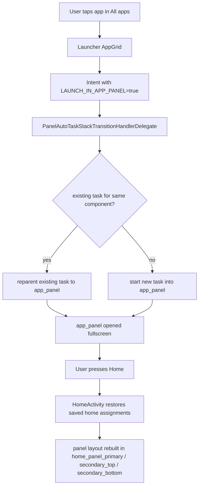
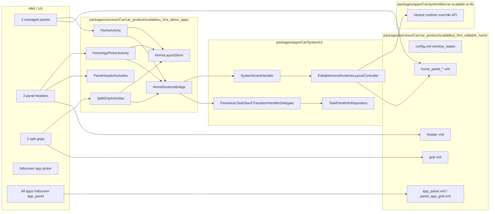

# Editable Home Fullscreen / Architecture 整理

## 目的

このメモは 2 つを整理するためのものです。

1. panel に表示中の app を fullscreen 表示したいとき、AAOS / ScalableUI でどう実装するのがよいか
2. `editable-home` PoC で、AAOS のどこに何を変更して何を実装したか

特に、「どこまでが ScalableUI の仕組みでできるか」と「どこからが個別実装か」を切り分けて理解することを目的にしています。

---

## 1. panel 表示中 app を fullscreen にするには

### 結論

`editable-home` の現在方針と相性がよいのは、次の `A` です。

- `A. move semantics`
  - panel 内にある既存 task を fullscreen 用 `app_panel` へ移動する
- `B. duplicate semantics`
  - panel 内 task は残したまま、fullscreen 用に別 task / 別 instance をもう 1 つ起動する

任意の一般 app に対して安定して実現しやすいのは `A` です。  
`B` は app 側の launchMode / documentMode / task affinity / process 挙動に強く依存するため、PoC を超えて汎用化するのはかなり難しいです。

---

## 2. 推奨する fullscreen 方針

### 方針 A: 既存 task を fullscreen `app_panel` に移す

たとえば `Map` が `home_panel_primary` に表示されているときに、All apps から `Map` を起動したら次のように動かします。

1. All apps 側は「この launch は panel 固定ではなく fullscreen 優先」として起動する
2. SystemUI は launch 先 panel を `app_panel` に決める
3. もし同じ `Map` task が panel 内で動いていたら、新規起動せず既存 task を `app_panel` に reparent する
4. その結果、`Map` は fullscreen 表示になる
5. ユーザーが Home に戻ったら、`HomeActivity` が保存済み assignment に従って再度 panel 群を復元する

### この方式の利点

- 任意 app に対して比較的一貫して動かしやすい
- heavy app を無駄に複製しない
- 「同じ app は 1 task」という現在の `editable-home` ポリシーと整合する
- ScalableUI の panel routing と task reparent をそのまま使える

### この方式の弱点

- fullscreen に行った時点で、その app は元 panel からはいったん消える
- 「panel の地図も残しつつ fullscreen の地図も開く」という体験にはならない

---

## 3. もし panel と fullscreen を同時に残したいなら

これは `ScalableUI だけではなく、app / task モデル側の条件` がかなり重要です。

必要になるもの:

- app が multi-instance を許容すること
- あるいは別 activity / alias / document task を fullscreen 用に用意すること
- 既存 panel task と fullscreen task を別扱いする routing policy

### 問題点

- 一般 app は multi-instance で安定動作するとは限らない
- `launchMode=singleTask` や既存 affinity に吸われることがある
- 片方を閉じた時の state 同期が複雑
- 任意 app 全般に対して「panel 版 + fullscreen 版」を保証するのは現実的ではない

### なので

PoC としては、

- 任意 app 全般: `move semantics`
- 個人検証側 app / 特定 app のみ: `duplicate semantics` を個別対応

という二段構えが現実的です。

---

## 4. 今回の PoC で fullscreen を実現する実装ポイント

### 4.1 All apps 側

All apps からの launch は `app_panel` 優先で扱います。

関係箇所:

- [AppLaunchProvider.kt](/home/y-fuk/work/android-automotiveos15-lts3/packages/apps/Car/Launcher/libs/appgrid/lib/src/com/android/car/carlauncher/repositories/appactions/AppLaunchProvider.kt)
- [0001-all-apps-launch-to-app-panel.patch](/home/y-fuk/work/android-automotiveos15-lts3/workdir/scalableui-poc/patches/packages-apps-Car-Launcher/0001-all-apps-launch-to-app-panel.patch)

ここで `com.android.car.carlauncher.extra.LAUNCH_IN_APP_PANEL=true` を付けています。

### 4.2 SystemUI routing

SystemUI では次の順で panel を決めます。

1. 明示的 `TARGET_PANEL_ID`
2. All apps などの `LAUNCH_IN_APP_PANEL`
3. component を handle する固定 panel
4. 最後に `app_panel`

関係箇所:

- [PanelAutoTaskStackTransitionHandlerDelegate.java](/home/y-fuk/work/android-automotiveos15-lts3/packages/apps/Car/SystemUI/src/com/android/systemui/car/wm/scalableui/PanelAutoTaskStackTransitionHandlerDelegate.java)

### 4.3 既存 task の再利用 / 移動

同一 component の既存 task がすでに panel 上にあれば、新規起動せずそれを target panel に移します。

関係箇所:

- [TaskPanelInfoRepository.java](/home/y-fuk/work/android-automotiveos15-lts3/packages/apps/Car/SystemUI/src/com/android/systemui/car/wm/scalableui/panel/TaskPanelInfoRepository.java)
- [PanelAutoTaskStackTransitionHandlerDelegate.java](/home/y-fuk/work/android-automotiveos15-lts3/packages/apps/Car/SystemUI/src/com/android/systemui/car/wm/scalableui/PanelAutoTaskStackTransitionHandlerDelegate.java)

これにより、

- Home header から選んだ app は target home panel へ
- All apps から選んだ app は `app_panel` へ

という違いを出せます。

---

## 5. fullscreen 化の flow 図

---

## 6. どこまでが ScalableUI でできるか

### ScalableUI の仕組みでできること

- panel 定義
- `app_panel` / `panel_app_grid` / fixed panel の共存
- panel の bounds / visibility / layer / corner の定義
- launch root panel の定義
- event / transition による panel の open/close
- task をどの panel に入れるかの routing 補助
- task の reparent による panel 間移動

### ScalableUI だけでは足りないこと

- インストール済み app 一覧を picker に出す
- どの app をどの panel に割り当てたかを永続化する
- 任意比率の continuous resize
- same-app を move するか duplicate するかという product policy
- All apps launch と Home assignment launch を分ける判断
- 「panel にいる app を fullscreen 表示したい」という UX ルール

つまり今回の PoC では、

- ScalableUI = panel / task の土台
- custom app + custom SystemUI patch = HMI と policy

という役割分担です。

---

## 7. `editable-home` PoC の AAOS 変更マップ

---

## 8. HMI とコード変更の紐づけ

| HMI 要素 | 実装の主担当 | 変更箇所 |
| --- | --- | --- |
| 3 panel の固定 home | ScalableUI panel 定義 + runtime geometry | [config.xml](/home/y-fuk/work/android-automotiveos15-lts3/packages/services/Car/car_product/scalableui_hmi_editable_home/rro/CarSystemUIScalableUiHmiEditableHomeRRO/res/values/config.xml), [home_panel_primary.xml](/home/y-fuk/work/android-automotiveos15-lts3/packages/services/Car/car_product/scalableui_hmi_editable_home/rro/CarSystemUIScalableUiHmiEditableHomeRRO/res/xml/home_panel_primary.xml), [EditableHomeRuntimeLayoutController.java](/home/y-fuk/work/android-automotiveos15-lts3/packages/apps/Car/SystemUI/src/com/android/systemui/car/wm/scalableui/EditableHomeRuntimeLayoutController.java) |
| header から app picker を開く | custom home app | [BasePanelHeaderActivity.java](/home/y-fuk/work/android-automotiveos15-lts3/packages/services/Car/car_product/scalableui_hmi_demo_apps/apps/home/src/com/android/car/scalableui/hmi/home/BasePanelHeaderActivity.java), [HomeAppPickerActivity.java](/home/y-fuk/work/android-automotiveos15-lts3/packages/services/Car/car_product/scalableui_hmi_demo_apps/apps/home/src/com/android/car/scalableui/hmi/home/HomeAppPickerActivity.java) |
| app assignment 永続化 | custom home app | [HomeLayoutStore.java](/home/y-fuk/work/android-automotiveos15-lts3/packages/services/Car/car_product/scalableui_hmi_demo_apps/apps/home/src/com/android/car/scalableui/hmi/home/HomeLayoutStore.java) |
| split drag | custom home app + SystemUI runtime layout | [BaseSplitGripActivity.java](/home/y-fuk/work/android-automotiveos15-lts3/packages/services/Car/car_product/scalableui_hmi_demo_apps/apps/home/src/com/android/car/scalableui/hmi/home/BaseSplitGripActivity.java), [SystemEventHandler.java](/home/y-fuk/work/android-automotiveos15-lts3/packages/apps/Car/SystemUI/src/com/android/systemui/car/wm/scalableui/systemevents/SystemEventHandler.java), [EditableHomeRuntimeLayoutController.java](/home/y-fuk/work/android-automotiveos15-lts3/packages/apps/Car/SystemUI/src/com/android/systemui/car/wm/scalableui/EditableHomeRuntimeLayoutController.java) |
| panel 内 app を selected panel に表示 | ScalableUI routing + custom launch hint | [HomeRuntimeBridge.java](/home/y-fuk/work/android-automotiveos15-lts3/packages/services/Car/car_product/scalableui_hmi_demo_apps/apps/home/src/com/android/car/scalableui/hmi/home/HomeRuntimeBridge.java), [PanelAutoTaskStackTransitionHandlerDelegate.java](/home/y-fuk/work/android-automotiveos15-lts3/packages/apps/Car/SystemUI/src/com/android/systemui/car/wm/scalableui/PanelAutoTaskStackTransitionHandlerDelegate.java) |
| All apps から fullscreen 表示 | Launcher patch + ScalableUI launch root panel | [AppLaunchProvider.kt](/home/y-fuk/work/android-automotiveos15-lts3/packages/apps/Car/Launcher/libs/appgrid/lib/src/com/android/car/carlauncher/repositories/appactions/AppLaunchProvider.kt), [app_panel.xml](/home/y-fuk/work/android-automotiveos15-lts3/packages/services/Car/car_product/scalableui_hmi_editable_home/rro/CarSystemUIScalableUiHmiEditableHomeRRO/res/xml/app_panel.xml) |
| same-app move semantics | custom routing policy | [TaskPanelInfoRepository.java](/home/y-fuk/work/android-automotiveos15-lts3/packages/apps/Car/SystemUI/src/com/android/systemui/car/wm/scalableui/panel/TaskPanelInfoRepository.java), [PanelAutoTaskStackTransitionHandlerDelegate.java](/home/y-fuk/work/android-automotiveos15-lts3/packages/apps/Car/SystemUI/src/com/android/systemui/car/wm/scalableui/PanelAutoTaskStackTransitionHandlerDelegate.java) |

---

## 9. 今回の PoC での理解ポイント

### ScalableUI でそのまま使っているもの

- panel XML
- `window_states`
- launch root `app_panel`
- `panel_app_grid`
- task reparent / routing の土台

### ScalableUI を拡張して使っているもの

- runtime geometry 更新
- `Variant` の runtime override
- Home 専用 split controller

### ScalableUI の外で実装しているもの

- Home app
- app picker
- assignment persistence
- fullscreen policy
- same-app move policy

---

## 10. いまの PoC に対するおすすめ方針

panel 内 app の fullscreen 化を product として成立させたいなら、まずは次のルールを明文化するのがよいです。

1. Home header からの起動は `panel assignment launch`
2. All apps からの起動は `fullscreen launch`
3. 同一 app は 1 task とし、fullscreen 起動時は既存 panel task を `app_panel` に移す
4. Home に戻ったら panel assignment を再適用する

この 4 つなら、ScalableUI の土台と現在の `editable-home` 実装をあまり壊さずに育てられます。

もし必要なら次に、

- この markdown をもとに draw.io 図へ変換
- fullscreen policy を `editable-home` の正式仕様として追記
- `All apps から panel app を起動したときの expected behavior` を acceptance に追加

までそのまま進められます。
