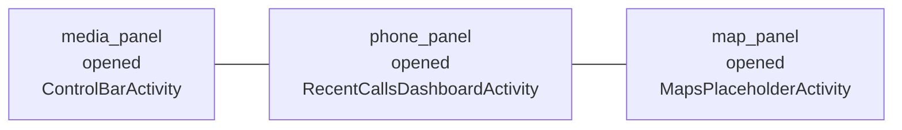
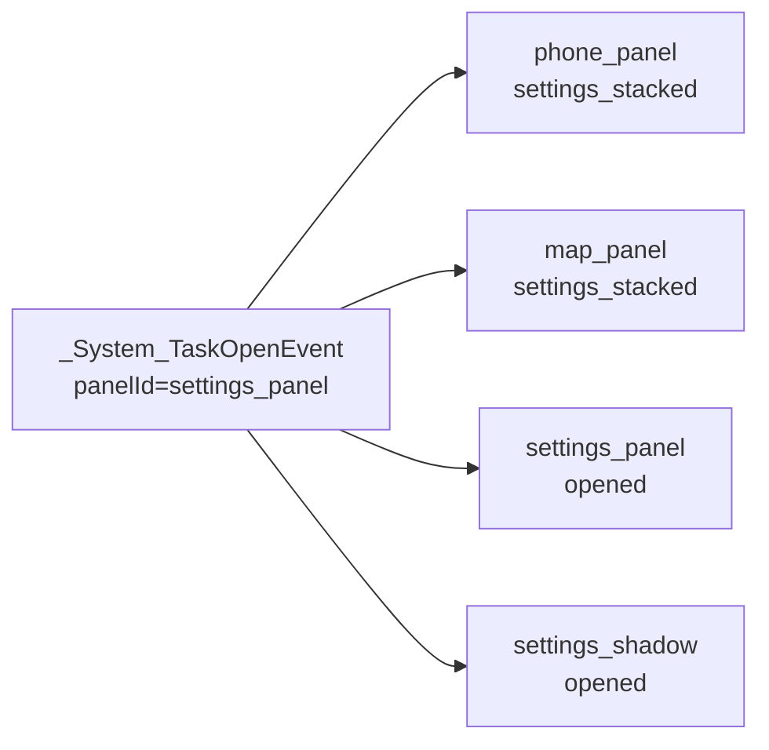
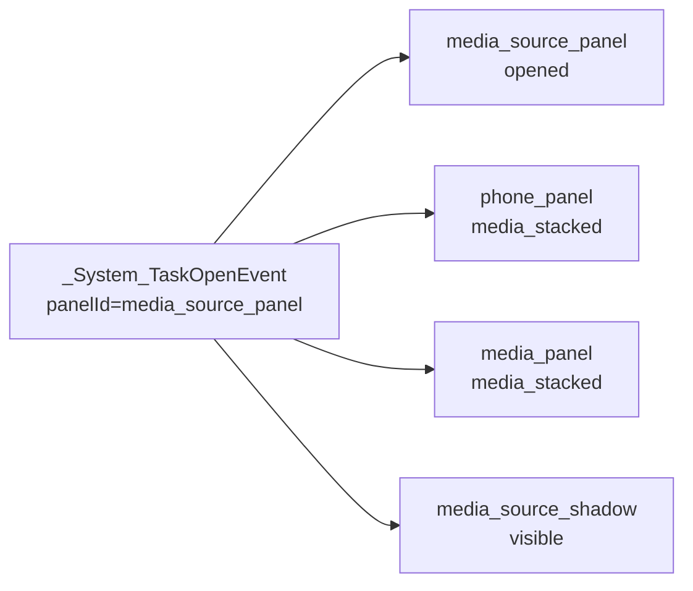
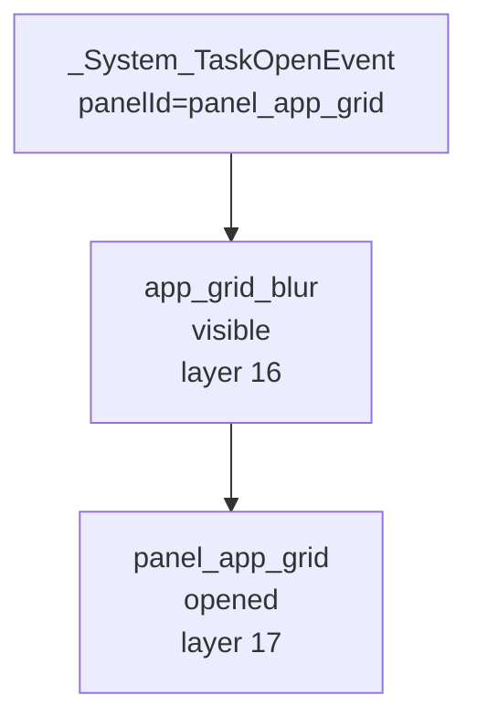
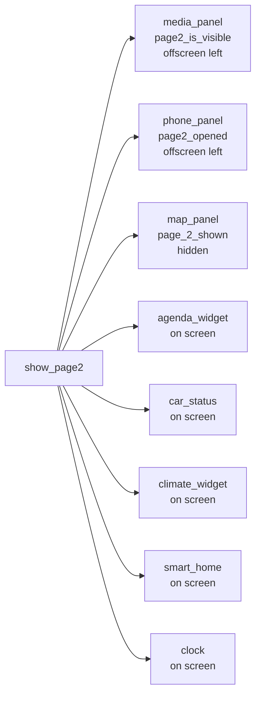
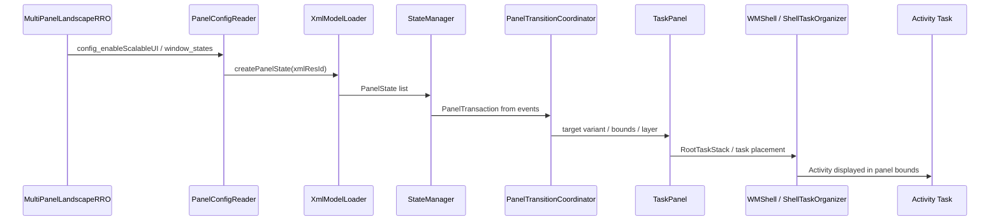

# MultiPanelLandscapeRRO Analysis

## Source

| Item | Value |
| --- | --- |
| Repository | https://github.com/passenger6/MultiPanelLandscapeRRO |
| Inspected commit | `5c034fa0c1acdda8f67fe986a6b8e95c35aec20a` |
| Main RRO source | `MultiPanelLandscapeRRO/` |
| Prebuilt artifacts | `prebuilt/` |
| Screenshot | `screenshot.png` |

この資料は、公開 repository の README と RRO XML を source として解析したもの。ScalableUI の runtime 本体については AAOS17 source の `packages/apps/Car/SystemUI/src/com/android/systemui/car/wm/scalableui` と `packages/apps/Car/systemlibs/car-scalable-ui-lib/src/com/android/car/scalableui` の責務に照らして読む。

## Executive Summary

`MultiPanelLandscapeRRO` は、Android Automotive の SystemUI RRO と prebuilt APK を組み合わせ、landscape 画面を複数 TaskPanel / DecorPanel に分ける demo である。実装の中心は Java/Kotlin code ではなく、`res/values/config.xml`、`res/xml/*.xml`、`res/values/dimens.xml` にある。

主な特徴は以下。

| 観点 | 内容 |
| --- | --- |
| 方式 | `com.android.systemui` 向け RRO で `config_enableScalableUI`、`window_states`、`config_default_activities` を override |
| 画面 | `1408x792dp` 前提の landscape layout。top/bottom system bar を有効化し、main area はおおむね `top=84dp` から `bottom=688dp` |
| 基本構成 | 左 `media_panel`、中央 `phone_panel`、右 `map_panel` の 3 panel home |
| 補助構成 | `settings_panel`、`media_source_panel`、`panel_app_grid`、fullscreen-ish `app_panel`、page2 widgets |
| 実装量 | XML 上は TaskPanel 12、DecorPanel 4、Variant 54、Transition 93、Controller 2 |
| 特徴的 event | custom event `show_page2` で widget page へ切り替える |
| 取り込み方法 | README は prebuilt APK を `/system/priv-app` と `/product/overlay` に push する手順を提示 |

README には `15 panels`、`TaskPanel 12`、`DecorPanel 3` とあるが、XML をそのまま数えると `window_states` は 16 item、TaskPanel は 12、DecorPanel は 4 である。`app_grid_blur` を DecorPanel として数えるかどうかで差が出ている可能性が高い。

## Repository Contents

```text
MultiPanelLandscapeRRO/
├── MultiPanelLandscapeRRO/
│   ├── AndroidManifest.xml
│   └── res/
│       ├── values/config.xml      # ScalableUI enable, window_states, default activities
│       ├── values/dimens.xml      # 1408x792dp 前提の bounds
│       ├── values/strings.xml     # panel role / component mapping
│       ├── xml/*.xml              # TaskPanel / DecorPanel / Controller / overlays
│       └── layout/*.xml           # DecorPanel shadow view
├── prebuilt/
│   ├── CarLauncher.apk
│   ├── StubCarLauncher.apk
│   ├── MockWidgets.apk
│   └── com.android.systemui.rro.scalableUI.multiPanelLandscape.apk
├── screenshot.png
└── README.md
```

この repository には `Android.bp` がない。そのため、AAOS source tree にそのまま module として追加して `m <module>` する構成ではなく、README は prebuilt APK を device/emulator へ直接 push する運用を示している。

## RRO Manifest And Overlay Target

`MultiPanelLandscapeRRO/AndroidManifest.xml` は `com.android.systemui` を target にする RRO である。

```xml
<overlay
    android:targetPackage="com.android.systemui"
    android:isStatic="false"
    android:resourcesMap="@xml/overlays"
    android:priority="100" />
```

`res/xml/overlays.xml` では、主に以下を target resource へ mapping している。

- `bool/config_enableScalableUI`
- `bool/config_enableClearBackStack`
- `bool/config_enableSafeAreaAndToolbarPerDisplay`
- `bool/config_enableTopSystemBar`
- `bool/config_enableBottomSystemBar`
- `array/window_states`
- `array/config_default_activities`
- `string/system_bar_app_drawer_intent`
- `string/config_appGridComponentName`
- `dimen/screen_height` / `dimen/top_bar_bottom` / `dimen/bottom_bar_top`
- `integer/overlay_panel_blur_radius`

## ScalableUI Config

`res/values/config.xml` で ScalableUI を有効化し、panel XML を `window_states` に登録している。

```xml
<bool name="config_enableScalableUI">true</bool>
<array name="window_states">
    <item>@xml/media_panel</item>
    <item>@xml/phone_panel</item>
    <item>@xml/map_panel</item>
    ...
    <item>@xml/panel_app_grid</item>
    <item>@xml/app_panel</item>
    <item>@xml/climate_widget</item>
</array>
```

また、初期起動する Activity を `config_default_activities` に定義している。

| Panel | Default activity / view |
| --- | --- |
| `media_panel` | `com.android.car.carlauncher/.ControlBarActivity` |
| `phone_panel` | `com.android.car.dialer/.ui.dashboard.RecentCallsDashboardActivity` |
| `map_panel` | `com.android.car.mapsplaceholder/.MapsPlaceholderActivity` |
| `agenda_widget` | `com.android.car.mockwidgets/.AgendaActivity` |
| `car_status` | `com.android.car.mockwidgets/.DrivingStatsActivity` |
| `smart_home` | `com.android.car.mockwidgets/.SmartDeviceActivity` |
| `clock` | `com.android.car.mockwidgets/.TimeWidgetActivity` |
| `climate_widget` | `com.android.car.mockwidgets/.ClimateActivity` |
| `settings_shadow` | `@layout/phone_shadow_view` |

## Screen Layout

基準寸法は `res/values/dimens.xml` にある。

```text
screen_width  = 1408dp
screen_height = 792dp
main top      = 84dp
main bottom   = 688dp
```

初期 home の主 panel は以下。

```text
+--------------------------------------------------------------------------------+
| top system bar                                                                  |
+--------------------------------------------------------------------------------+
| media_panel              | phone_panel              | map_panel                 |
| 17,84 - 401,688          | 411,84 - 795,688         | 816,84 - 1392,688         |
| layer 3                  | layer 6                  | layer 4                   |
+--------------------------------------------------------------------------------+
| bottom system bar / controls                                                    |
+--------------------------------------------------------------------------------+
```

README の screenshot もこの構成と一致しており、左に media、中央に recent calls、右に maps placeholder が表示される。

## Panel Inventory

| Panel | Type | defaultVariant | role / controller | Variants | Transitions | Source |
| --- | --- | --- | --- | ---: | ---: | --- |
| `media_panel` | TaskPanel | `@id/opened` | `@string/media_componentName` | 9 | 8 | `res/xml/media_panel.xml` |
| `phone_panel` | TaskPanel | `@id/opened` | `@array/phone_components` | 10 | 16 | `res/xml/phone_panel.xml` |
| `map_panel` | TaskPanel | `@id/opened` | `@string/mapsplaceholder_maps_placeholder_activity_componentName` | 5 | 14 | `res/xml/map_panel.xml` |
| `settings_panel` | TaskPanel | `@id/closed` | `@string/settings_panel_role` | 2 | 5 | `res/xml/settings_panel.xml` |
| `media_source_panel` | TaskPanel | `@id/closed` | `@array/media_app_components` | 2 | 3 | `res/xml/media_source_panel.xml` |
| `panel_app_grid` | TaskPanel | `@id/closed` | `@string/appgrid_componentName` | 2 | 6 | `res/xml/panel_app_grid.xml` |
| `app_panel` | TaskPanel | `@id/closed` | `@string/default_config` | 3 | 3 | `res/xml/app_panel.xml` |
| `agenda_widget` | TaskPanel | `@id/base` | mock widget activity | 2 | 2 | `res/xml/agenda_widget.xml` |
| `car_status` | TaskPanel | `@id/base` | mock widget activity | 2 | 2 | `res/xml/car_status.xml` |
| `climate_widget` | TaskPanel | `@id/base` | mock widget activity | 2 | 2 | `res/xml/climate_widget.xml` |
| `clock` | TaskPanel | `@id/base` | mock widget activity | 2 | 2 | `res/xml/clock.xml` |
| `smart_home` | TaskPanel | `@id/base` | mock widget activity | 2 | 2 | `res/xml/smart_home.xml` |
| `phone_shadow` | DecorPanel | `@id/hidden` | `@layout/phone_shadow_view` | 5 | 9 | `res/xml/phone_shadow.xml` |
| `settings_shadow` | DecorPanel | `@id/hidden` | `@layout/phone_shadow_view` | 2 | 9 | `res/xml/settings_shadow.xml` |
| `media_source_shadow` | DecorPanel | `@id/hidden` | `@xml/media_source_shadow_controller` | 2 | 5 | `res/xml/media_source_shadow.xml` |
| `app_grid_blur` | DecorPanel | `@id/hidden` | `@xml/app_grid_blur_controller` | 2 | 5 | `res/xml/app_grid_blur.xml` |

## Main Interaction Model

### Initial Home



起動時は `config_default_activities` により `media_panel`、`phone_panel`、`map_panel` などが task として立ち上がる。ScalableUI 実装上は `Panel -> TaskPanel -> RootTaskStack -> Task -> Activity` の経路で表示される。

### Settings Open

`settings_panel` が開くと、中央の `phone_panel` と `phone_shadow` が左寄りの stacked 状態へ移動し、右半分に settings が出る。



根拠:

- `phone_panel.xml`: `panelId=settings_panel` -> `@id/settings_stacked`
- `map_panel.xml`: `panelId=settings_panel` -> `@id/settings_stacked`
- `settings_panel.xml`: `panelId=settings_panel` -> `@id/opened`
- `settings_shadow.xml`: `panelId=settings_panel` -> `@id/opened`

### Media Source Open

`media_source_panel` が開くと、左半分に media source panel が出て、`phone_panel` は右寄りの `media_stacked` へ移動する。



根拠:

- `media_source_panel.xml`: `panelId=media_source_panel` -> `@id/opened`
- `phone_panel.xml`: `panelId=media_source_panel` -> `@id/media_stacked`
- `media_panel.xml`: `panelId=media_source_panel` -> `@id/media_stacked`
- `media_source_shadow.xml`: `panelId=media_source_panel` -> `@id/visible`

### AppGrid Open

AppGrid は `panel_app_grid` として下から開く。`app_grid_blur` は `PanelOverlayController` を使い、AppGrid 背後を暗くする。



根拠:

- `panel_app_grid.xml`: opened bounds `left=64dp, top=150dp, right=1344dp, bottom=672dp`
- `app_grid_blur.xml`: `panelId=panel_app_grid` -> `@id/visible`
- `app_grid_blur_controller.xml`: `PanelOverlayController`, `overlayPanelId=panel_app_grid`, `backgroundColor=#80000000`

### Generic App Open

`app_panel` は role `DEFAULT` の catch-all panel で、通常 app を画面中央ほぼ全体に出す。

```text
app_panel opened:
left=10dp, top=84dp, width=1385dp, bottom=688dp, layer=15
```

`_System_TaskOpenEvent panelId=app_panel` により、`media_panel` と `phone_panel` は `stacked` へ移動し、`map_panel` も `stacked` へ移動する。

### Page2 Custom Event

この repository の特徴は custom event `show_page2` である。README では `cmd statusbar carsysui-dispatch-event show_page2` を実行例として示している。

`show_page2` では初期 3 panel が左側へ退避し、widget 系 panel が画面内へ入る。



Widget page の座標は以下。

| Panel | On-screen bounds |
| --- | --- |
| `agenda_widget` | `27,84 - 386,688` |
| `car_status` | `416,86 - 800,354` |
| `climate_widget` | `416,386 - 800,688` |
| `smart_home` | `816,86 - 1392,350` |
| `clock` | `816,384 - 1392,688` |

## Event Summary

XML 上の Transition event は 4 種類。

| Event | Count | Meaning |
| --- | ---: | --- |
| `_System_TaskOpenEvent` | 43 | task open / target panel open による panel state 変更 |
| `_System_OnHomeEvent` | 23 | Home 相当操作で初期 layout へ戻す |
| `show_page2` | 22 | repository 独自の custom event。widget page へ切替 |
| `_System_TaskCloseEvent` | 5 | settings panel close などで周辺 panel を戻す |

## Runtime Path In AAOS17 Terms

この RRO は AAOS17 ScalableUI の標準経路に乗る。



Relevant AAOS17 classes / methods:

| Role | Class / method | Source path |
| --- | --- | --- |
| RRO/XML load | `PanelConfigReader.loadConfig()` / `loadFromXml()` | `packages/apps/Car/SystemUI/src/com/android/systemui/car/wm/scalableui/PanelConfigReader.java` |
| XML model conversion | `XmlModelLoader.createPanelState(int)` | `packages/apps/Car/systemlibs/car-scalable-ui-lib/src/com/android/car/scalableui/loader/xml/XmlModelLoader.java` |
| event handling | `StateManager.handleEvents(...)` | `packages/apps/Car/systemlibs/car-scalable-ui-lib/src/com/android/car/scalableui/manager/StateManager.java` |
| transition execution | `PanelTransitionCoordinator.startTransition(...)` | `packages/apps/Car/SystemUI/src/com/android/systemui/car/wm/scalableui/PanelTransitionCoordinator.java` |
| task panel root | `TaskPanel.init()` | `packages/apps/Car/SystemUI/src/com/android/systemui/car/wm/scalableui/panel/TaskPanel.java` |

## Integration Feasibility On Stock AAOS17 Emulator

取り込み自体は可能。ただし、この repo の README 手順は prebuilt を直接 system partition へ push する方式であり、AAOS source build に統合する方式ではない。

README の手順は以下を前提にしている。

- `userdebug` または `eng` build
- `adb root`
- `adb disable-verity`
- `adb remount`
- `/system/priv-app/CarLauncher/CarLauncher.apk` の差し替え
- `/system/priv-app/StubCarLauncher/StubCarLauncher.apk` の配置
- `MockWidgets.apk` の install
- `/product/overlay/com.android.systemui.rro.scalableUI.multiPanelLandscape.apk` の配置
- `cmd overlay enable com.android.systemui.rro.scalableUI.multiPanelLandscape`
- `killall com.android.systemui`

### Source-build integration にする場合

AAOS17 source tree にきれいに入れるなら、prebuilt push ではなく以下へ変換するのが現実的。

1. RRO source を `runtime_resource_overlay` module 化する。
2. `AndroidManifest.xml` の target `com.android.systemui` と `resourcesMap` を維持する。
3. `PRODUCT_PACKAGES` に RRO、StubCarLauncher、CarLauncher replacement、MockWidgets を追加する。
4. 必要な Activity component が AAOS17 image 内に存在するか確認する。
5. overlay enable の user / priority / partition を決める。
6. `cmd overlay list`、`cmd statusbar carsysui-dump-panelstates`、screenshot で検証する。

### 不足しやすい情報

| 項目 | 理由 |
| --- | --- |
| RRO の Soong module 定義 | repo には `Android.bp` がない |
| prebuilt APK の source / signing 情報 | `CarLauncher.apk`、`StubCarLauncher.apk`、`MockWidgets.apk` の source が repo 内にない |
| target AAOS image の component 差分 | `com.android.car.dialer`、`com.android.car.settings`、`com.android.car.mapsplaceholder` などが image に存在する必要がある |
| display density / resolution | XML は `1408x792dp` を強く前提にした固定座標 |
| Android version compatibility | README は Android 16 Baklava or newer と書くが、AAOS17 source へ入れる場合は target resource 名と ScalableUI XML schema の照合が必要 |

## Comparison With AAOS17 Source Samples

| Compared item | AAOS17 source sample | MultiPanelLandscapeRRO |
| --- | --- | --- |
| Minimal example | `OnePanelRRO` / `TwoPanelRRO` | より大きい 3-column production-like layout |
| Split behavior | `SplitPanelRRO`, `DEWDSplit` | fixed 3-column + overlay panels。drag grip はない |
| AppGrid | `DEWDPort` / `MinimizedControlsDynamic` に類似 | `panel_app_grid` + `app_grid_blur` overlay |
| Custom event | source samplesにも custom event 例はある | `show_page2` を中心機能として使う |
| Dynamic orientation | `DEWDDynamic` | landscape fixed bounds |
| Implementation style | source tree module | prebuilt push + RRO source |

## Key Takeaways

- この repo は ScalableUI の「XML/RRO だけでかなり複雑な multi-panel HMI を作れる」ことを示す良い実例。
- 実体は `Panel -> TaskPanel -> Task -> Activity` であり、README の “each panel hosts its own independent Activity” は概念説明としては近いが、実装上は TaskPanel / root task stack 経由で読むのが正確。
- `show_page2` は ScalableUI event bus に custom event を入れて layout 全体を切り替える例として参考になる。
- source-build に取り込むには `Android.bp`、prebuilt APK の扱い、component 存在確認、固定座標の再調整が必要。
- README の panel count は XML 集計と一部ずれる。解析・説明では XML 上の count を優先する。
