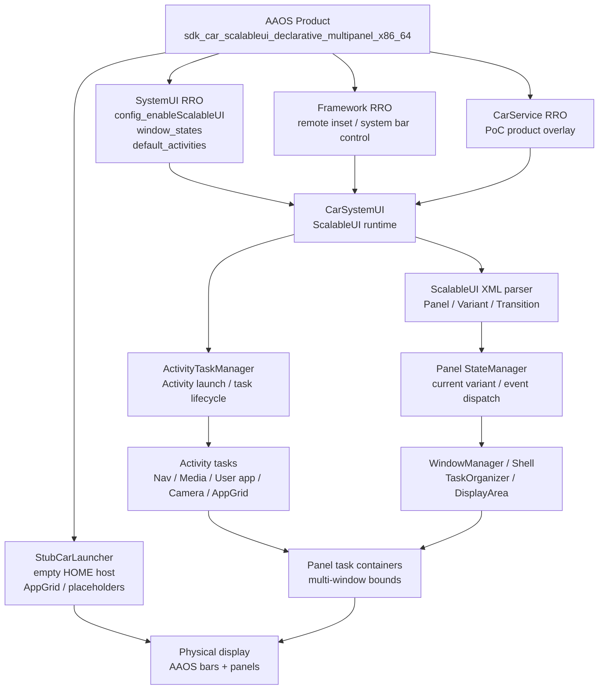
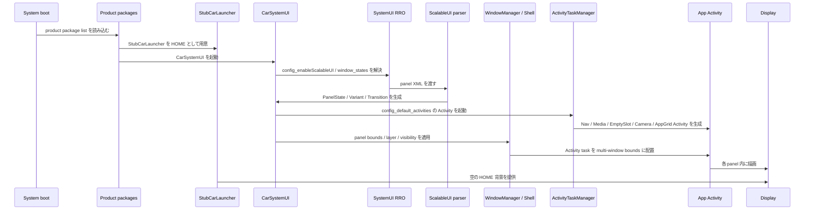
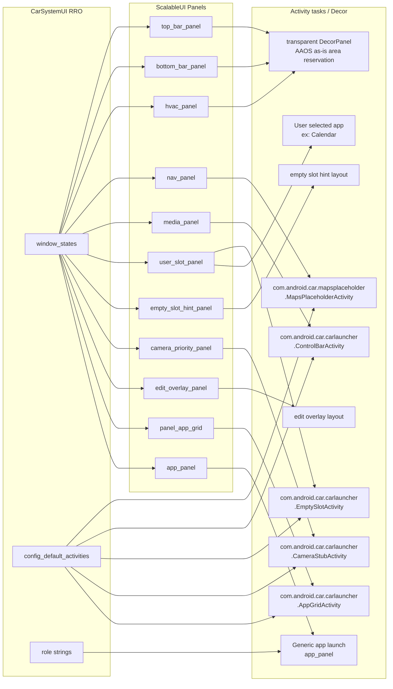
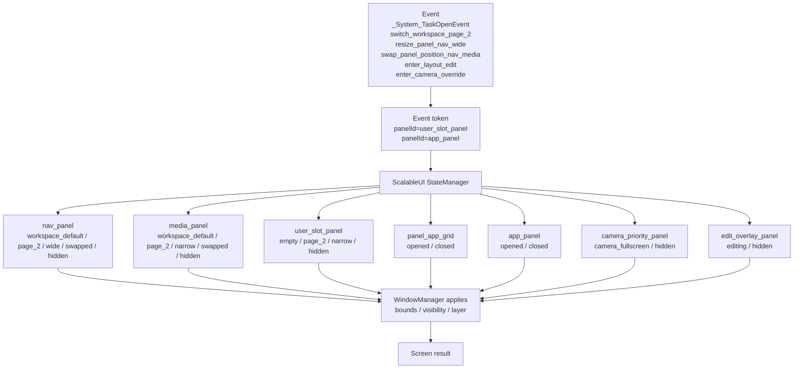
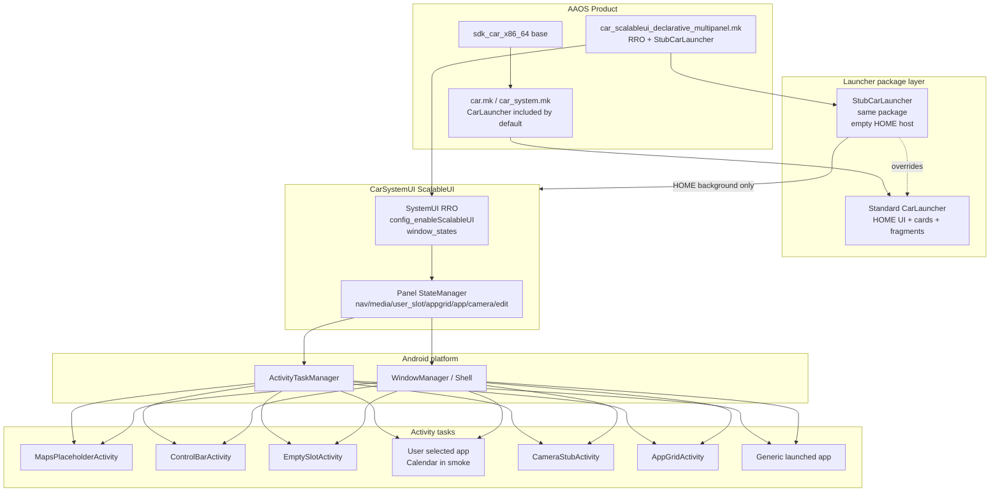

# AAOS ScalableUI / WindowManager 表示フロー

このドキュメントは、`aaos-scalable-ui-specs` と `declarative-multipanel` PoC を前提に、AAOS における ScalableUI、SystemUI、WindowManager、Launcher、各 panel、各アプリ Activity の関係を整理したものです。

目的は、ScalableUI を「Launcher 内の widget 実装」ではなく、「SystemUI が WindowManager / ActivityTaskManager と連携して複数アプリ Activity を panel として orchestrate する仕組み」として理解することです。

## 全体像



## 画面レイヤ

```text
┌─────────────────────────────────────────────────────────────┐
│ Physical Display 1920x1080                                  │
│  ┌───────────────────────────────────────────────────────┐  │
│  │ AAOS top bar area                                     │  │
│  ├───────────────────────────────────────────────────────┤  │
│  │ ScalableUI workspace                                  │  │
│  │  ┌──────────────────────────┐ ┌────────────────────┐  │  │
│  │  │ nav_panel                │ │ media_panel        │  │  │
│  │  │ Navigation / map task    │ ├────────────────────┤  │  │
│  │  │                          │ │ user_slot_panel    │  │  │
│  │  │                          │ │ empty or user app  │  │  │
│  │  └──────────────────────────┘ └────────────────────┘  │  │
│  │                                                       │  │
│  │  overlays: panel_app_grid / app_panel                 │  │
│  │  priority: camera_priority_panel / edit_overlay_panel │  │
│  ├───────────────────────────────────────────────────────┤  │
│  │ AAOS bottom bar / HVAC area                           │  │
│  └───────────────────────────────────────────────────────┘  │
└─────────────────────────────────────────────────────────────┘

裏側:

StubCarLauncher
  空の HOME Activity。標準 CarLauncher UI を出さず、ScalableUI が見える土台になる。

CarSystemUI
  RRO から panel XML を読み、WindowManager / ActivityTaskManager に task 配置を依頼する。

WindowManager / Shell
  panel bounds に対応する task container / display area を管理する。

各アプリ
  Launcher の widget ではなく、独立した Activity task として panel に載る。
```

## 表示までの時系列



## Panel と Activity の対応



## Event / Transition の流れ

ScalableUI は、イベントを受けて panel の variant を切り替えます。アプリ自体を再実装するのではなく、panel の bounds、visibility、layer、focus を切り替えるのが中心です。



例:

```text
_System_TaskOpenEvent panelId=user_slot_panel
  Calendar task        -> user_slot_panel bounds
  panel_app_grid       -> closed
  empty_slot_hint_panel -> hidden

_System_TaskOpenEvent panelId=app_panel
  app_panel       -> opened
  nav_panel       -> hidden
  media_panel     -> hidden
  user_slot_panel -> hidden
  panel_app_grid  -> closed

enter_camera_override
  camera_priority_panel -> camera_fullscreen
  panel_app_grid        -> closed
  app_panel             -> closed
  edit_overlay_panel    -> hidden

exit_camera_override
  camera_priority_panel -> hidden
```

`camera_override` では `nav_panel` / `media_panel` / `user_slot_panel` を hidden にしません。workspace panel を隠すと empty panel event が発火し、復帰後に黒い HOME が見えるためです。この PoC では camera を fullscreen high-layer として workspace の上に被せます。

## Launcher との関係

AAOS car product では標準 `CarLauncher` が product package に含まれ、`com.android.car.carlauncher/.CarLauncher` を HOME Activity として宣言しています。

標準 `CarLauncher` を残すと、Home card / fragment / AppGrid / control bar など Launcher 側の UI が ScalableUI HMI と干渉します。記事の Step 3 にある通り、この PoC では `StubCarLauncher` を入れて標準 Launcher を退避します。

```text
標準 CarLauncher を使う場合:

  CarLauncher Home UI
    ├─ Launcher 自身の layout / fragment / cards
    └─ ScalableUI panels

  問題:
    標準 Home UI が裏で生きる。
    Launcher 側の fragment / card 実装が ScalableUI PoC と干渉する。
    Home が crash すると、ScalableUI panel が見えていても HMI 全体として不安定。


StubCarLauncher を使う場合:

  StubCarLauncher
    └─ 空の HOME host

  CarSystemUI ScalableUI
    ├─ nav_panel              -> Navigation / map Activity task
    ├─ media_panel            -> Media placeholder Activity task
    ├─ user_slot_panel        -> EmptySlot or user-selected app task
    ├─ empty_slot_hint_panel  -> DecorPanel hint
    ├─ camera_priority_panel  -> Camera Activity task
    ├─ edit_overlay_panel     -> DecorPanel edit UI
    ├─ panel_app_grid         -> AppGrid Activity task
    └─ app_panel              -> generic app task

  狙い:
    Launcher を HMI の主役にしない。
    SystemUI / WindowManager orchestration に表示責務を寄せる。
```

## Launcher を含めた実体関係図



## Google / 記事の思想に沿った責務分担

| 領域 | 役割 | ScalableUI 標準で扱うか |
| --- | --- | --- |
| Product mk | RRO / StubLauncher を image に入れる | Yes |
| Framework RRO | system bar / inset control などの基礎設定 | Yes |
| CarService RRO | product side configuration | Yes |
| SystemUI RRO | panel / variant / transition / default activity 宣言 | Yes |
| StubCarLauncher | 空の HOME host と PoC AppGrid を提供 | 必要だが ScalableUI そのものではない |
| CarSystemUI | ScalableUI runtime を起動し panel state を管理 | Yes |
| WindowManager / Shell | task container と bounds を管理 | Android platform 側 |
| ActivityTaskManager | 各 app Activity を起動し task lifecycle を管理 | Android platform 側 |
| 各アプリ | Activity として panel に表示される | アプリ側 |
| 任意 panel 追加 / 移動 / picker | runtime model と UI が必要 | Custom 実装 |

## 今回の PoC で確認した完成形

```text
Step 1: Framework / SystemUI / CarService RRO で ScalableUI を有効化
Step 2: RRO XML で spec panel と transition を宣言
Step 3: StubCarLauncher で標準 Launcher UI を退避
Step 4: nav/media/user_slot に独立 Activity task を表示
Step 5: panel_app_grid から user_slot_panel に Calendar を routing
Step 6: page / resize / swap / edit / camera event dispatch を確認
Step 7: Windows host emulator で smoke pass を取得
```

評価済み artifact:

```text
/tmp/aaos-spec-workspace-smoke-20260609-163618
```

## まだ ScalableUI だけでは足りないもの

固定 XML baseline が安定してから、次を段階的に追加します。

1. grip / controller による XML event transition
2. panel bounds preset の追加
3. 任意 app picker
4. panel add / delete / move
5. grip の連続 resize
6. runtime persistence
7. reverse gear / real camera signal 連携

この順番にすると、ScalableUI 標準の orchestration と、PoC 独自の runtime workspace 実装を混ぜずに検証できます。
